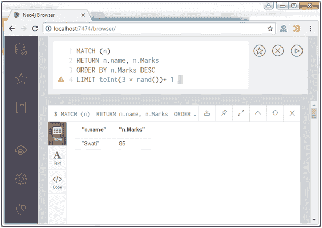

# Neo4j 限制子句

> 原文：<https://www.javatpoint.com/neo4j-limit-clause>

Neo4j LIMIT 子句用于限制输出中的行数。

**语法:**

```sql
MATCH (n) 
RETURN n 
ORDER BY n.name 
LIMIT i

```

在这里，我可能是 1，2，3？等等。

**示例:**

让我们从 LIMIT 设置为 3 的数据库中获取记录。

```sql
MATCH (n)  
RETURN n.name, n.Marks 
ORDER BY n.Marks DESC 
LIMIT 3 

```

输出:


* * *

## 用表达式限制

LIMIT 子句也可以与表达式一起使用。

**示例:**

在 LIMIT 子句中使用“rand”表达式。

```sql
MATCH (n) 
RETURN n.name, n.Marks 
ORDER BY n.Marks DESC 
LIMIT toInt(3 * rand())+ 1 

```

输出:

