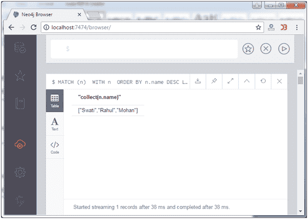

# 带子句的 Neo4j

> 原文：<https://www.javatpoint.com/neo4j-with-clause>

在 Neo4j 中，WITH 子句用于将查询链接在一起。它也可以和其他子句一起使用。

**语法:**

```
MATCH (n) 
WITH n 
ORDER BY n.property 
RETURN collect(n.property) 

```

**示例:**

让我们举个例子来演示 WITH 子句的用法。

```
MATCH (n) 
WITH n 
ORDER BY n.name DESC LIMIT 3 
RETURN collect(n.name) 

```

输出:

