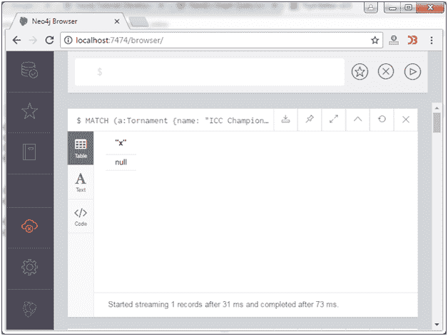

# Neo4j 可选匹配子句

> 原文：<https://www.javatpoint.com/neo4j-optional-match-clause>

Neo4j 可选 MATCH 子句用于搜索其中描述的模式，而对模式中缺失的部分使用空值。

它类似于 MATCH 子句；唯一的区别是，如果它找到了模式中缺失的部分，那么它将返回 null 作为结果。

**语法:**

```sql
MATCH (node:label {properties. . . . . . . . . . . . . .}) 
OPTIONAL MATCH (node)-->(x) 
RETURN x 

```

**示例:**

让我们以可选匹配为例，从节点 ICCT2013 中检索关系。因为没有这样的节点，所以它返回 null。

```sql
MATCH (a:Tornament {name: "ICC Champions Trophy"}) 
OPTIONAL MATCH (a)-->(x) 
RETURN x 

```

输出:

