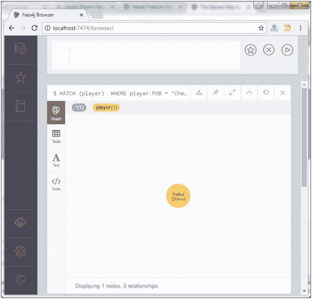
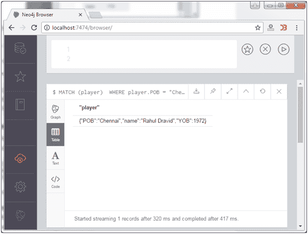

# Neo4j WHERE 子句

> 原文：<https://www.javatpoint.com/neo4j-where-clause>

在 Neo4j CQL 中，WHERE 子句用于指定检索我们想要检索的确切数据的条件。

**语法:**

```
MATCH (label)  
WHERE label.country = "property" 
RETURN label 

```

**示例:**

让我们使用 WHERE 子句返回 Neo4j 数据库中的所有节点，其中节点(播放器)的 POB 是“Chennai”。

```
MATCH (player)  
WHERE player.POB = "Chennai" 
RETURN player 

```

输出:



您可以用表格的形式来验证:



* * *

## 多条件 WHERE 子句

可以在多个条件下使用“WHERE”子句。

**语法:**

```
MATCH (stu:Student)  
WHERE stu.name = 'Abc' AND stu.name = 'Xyz' 
RETURN stu 

```

**示例:**

使用以下查询，使用两个条件筛选 Neo4j 数据库中的节点。

```
MATCH (player)  
WHERE player.name = "Sachin Tendulakar" AND player.YOB = 1968 
RETURN player

```

输出:


在上面的例子中，我们使用了“与”子句来指定多个条件。