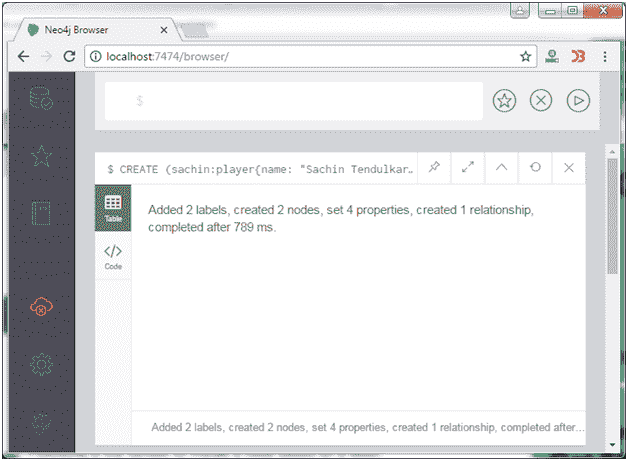
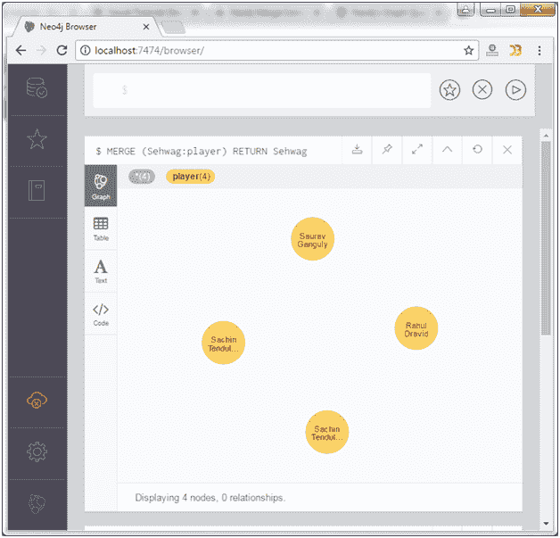

# Neo4j 合并命令

> 原文：<https://www.javatpoint.com/neo4j-merge-clause>

Neo4j MERGE 命令是 CREATE 和 MATCH 命令的组合。该命令用于在图形中搜索给定的模式。如果它存在于图中，那么它将返回结果，否则，它将创建一个新的节点/关系并返回结果。

使用 MERGE 命令，您可以执行以下操作:

*   将节点与标签合并。
*   将节点与属性合并。
*   OnCreate 和 OnMatch。
*   合并关系。

**语法:**

```sql
MERGE (node: label {properties . . . . . . . }) 

```

**示例:**

首先在 Neo4j 数据库中创建两个节点，标签为 sachin 和 Ind。创建从萨钦到 Ind 的“勤务兵 _OF”类型的关系。

```sql
CREATE (sachin:player{name: "Sachin Tendulkar", YOB: 1968, POB: "Mumbai"}) 
CREATE (Ind:Country {name: "India"}) 
CREATE (sachin)-[r:BATSMAN_OF]->(Ind)

```



* * *

## 将节点与标签合并

MERGE 子句用于根据标签合并数据库中的节点。如果尝试根据标签合并节点，Neo4j 会验证是否存在具有给定标签的节点。否则，将创建当前节点。

**语法:**

```sql
MERGE (node:label) RETURN node 

```

**示例 1:**

让我们将节点“Sehwag”合并到一个标签播放器中。Neo4j 验证标签播放器是否有任何节点。如果没有，它会创建一个名为“Sehwag”的节点并返回它。

如果存在任何具有给定标签的节点，Neo4j 会将它们全部返回。

```sql
MERGE (Sehwag:player) RETURN Sehwag  

```

输出:



标签播放器已经有很多节点了。所以不需要再创建一个节点进行合并。

**示例 2:**

将名为“CT”的节点与名为“Tornament”的标签合并。由于没有带有此标签的节点，Neo4j 用给定的名称创建一个节点并返回它。

```sql
MERGE (CT:Tornament{name: "ICC Champions Trophy"}) 
RETURN CT, labels(CT)

```

输出:


* * *

## 将节点与属性合并

您可以使用合并的节点添加属性。

**语法:**

```sql
MERGE (node:label {key1:value, key2:value, key3:value . . . . . . . . }) 

```

**示例:**

```sql
MERGE (Sehwag:player {name: "Virendra Sehwag", YOB: 1978, POB: "Najafgarh"}) 
RETURN Sehwag

```

输出:


* * *

## OnCreate 和 OnMatch

OnCreate 和 OnMatch 命令用于指示节点是已创建还是已匹配。每当我们执行合并查询时，都会匹配或创建一个节点。

**语法:**

```sql
MERGE (node:label {properties . . . . . . . . . . .}) 
ON CREATE SET property.isCreated ="true" 
ON MATCH SET property.isFound ="true" 

```

**示例:**

```sql
MERGE (Sehwag:player {name: "Virendra Sehwag", YOB: 1978, POB: "Najafgarh"}) 
ON CREATE SET Sehwag.isCreated = "true" 
ON MATCH SET Sehwag.isFound = "true" 
RETURN Sehwag 

```

以下示例演示了 Neo4j 中 OnCreate 和 OnMatch 子句的用法。如果数据库中已经存在指定的节点，则将匹配该节点，并将在该节点中创建键值对为 isFound = "true "的属性。如果数据库中不存在指定的节点，则将创建该节点，并在其中创建一个键值对为 isCreated ="true "的属性。

输出:


* * *

## 合并关系

MERGE 子句也可以像节点一样用于合并关系。

请参见这个使用 Neo4j 中的 MATCH 子句合并关系的示例。这个查询试图在节点之间合并一个名为 WINNERS _ OF 的关系？ind？(标签:国家&名称:印度)和国际商会(标签:托纳蒙特&名称:国际商会冠军奖杯)。

```sql
MATCH (a:Country), (b:Tournament) 
   WHERE a.name = "India" AND b.name = "ICC Champions Trophy" 
   MERGE (a)-[r:WINNERS_OF]->(b) 
RETURN a, b

```