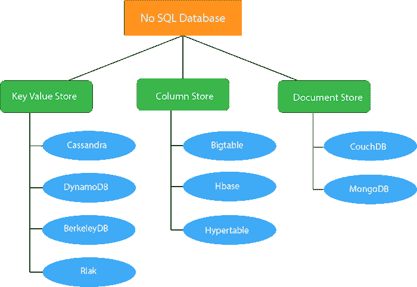
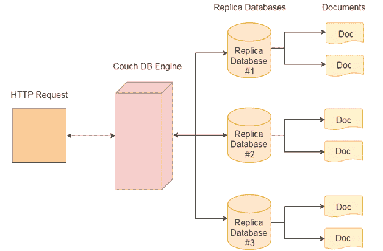

# CouchDB 教程

> 原文：<https://www.javatpoint.com/couchdb-tutorial>

CouchDB 教程提供了 CouchDB 的基本和高级概念。我们的 CouchDB 教程是为初学者和专业人士设计的。

CouchDB 是由 Apache 软件基金会开发的开源 NoSQL 数据库。它是用 Erlang 编程语言编写的。

我们的 CouchDB 教程包含了 CouchDB 的所有主题，比如 Couchdb 与 couchdb fauxton 的教程、http api、安装、couchdb vs mongodb、创建数据库、创建文档、特性、简介、更新文档、为什么是 couchdb 等。

* * *

## CouchDB 简介

CouchDB 是由 Apache 软件基金会开发的开源 NoSQL 数据库。它是用 Erlang 编程语言编写的。

有两种类型的数据库:

*   关系数据库管理系统(遵循 SQL)
*   NoSQL

## 关系数据库管理系统

关系数据库管理系统是基于 E.F. Codd 提出的关系模型。它是 SQL 的基础，大多数数据库系统都遵循关系数据库管理系统。这些数据库是:甲骨文、MySQL、微软 SQL Server、IBM DB2、微软 Access 等。

在关系数据库管理系统中，数据存储在像表这样的数据库对象中。表是相关数据项的集合，它包含列和行。它只存储结构化数据。

## NoSQL 数据库

NoSQL 数据库是其他类型的数据库，它提供了一种存储和检索数据的机制，而不是关系数据库管理系统中使用的表格形式。

NoSQL 数据库是无模式的，一致的，支持简单的复制，有简单的 API，可以处理大量的数据。

NoSQL 数据库的主要目标是:

*   设计简单。
*   水平缩放。
*   对可用性的更好控制。

NoSQL 数据库比关系数据库快，因为它使用了与关系数据库不同的数据结构。NoSQL 数据库可以存储结构化和非结构化数据，如音频文件、视频文件、文档等。

NoSQL 数据库根据其数据存储性质可分为三种类型:

*   键值存储
*   列存储
*   文档存储

## 键值存储

这些数据库旨在以键值对的形式存储数据。这些数据库不？t 没有任何模式，每个数据值都包含一个索引键和该键的一个值。

键值存储数据库的常见例子有:**卡珊德拉、DynamoDB、BerkeleyDB、Riak 等。**

### 列存储

这些数据库用于在单元格中存储数据。这些单元格分组在数据列中，这些列进一步分组到列族中。这些柱族可以包含任意数量的柱。

列存储数据库的常见例子有:**大表、HBase 和 HyperTable 等。**

### 文档存储

这些数据库遵循键值存储的基本思想，在键值存储中，“文档”包含复杂的数据，每个文档都被分配一个唯一的键，用于检索文档。

这些数据库用于存储、检索和管理面向文档的信息，也称为半结构化数据。

文档存储数据库的流行例子有:CouchDB、MongoDb 等。

* * *

## 什么是 CouchDB

CouchDB 是一个开源的 NoSQL 数据库，主要关注易用性。它由 Apache 开发。它与 web 完全兼容。CouchDB 使用 JSON 存储数据，JavaScript 作为其查询语言来转换文档，使用 MapReduce，HTTP 作为 API。

CouchDB 是 2005 年发布的多主应用程序，2008 年成为 apache 项目。

* * *

## 为什么是 CouchDB

Apache CouchDB 是最新类型的数据库之一。CouchDB 有一个无模式的文档模型，更适合普通应用。查询你的数据是非常强大的。

**使用 CouchDB 背后的主要原因是什么？**

*   CouchDB 很容易使用。有一个词可以形容 CouchDB“放松”。这也是 CouchDB 官方标志的署名。

**“Apache couch db 已经启动。是时候放松一下了。”**

*   CouchDB 有一个基于 HTTP 的 REST API，这使得与数据库的通信变得非常容易。
*   CouchDB 具有简单的 HTTP 资源和方法结构(GET、PUT、DELETE)，易于理解和使用。
*   在 CouchDB 中，数据存储在灵活的基于文档的结构中，因此无需担心数据的结构。
*   CouchDB 为用户提供了强大的数据映射，允许查询、组合和过滤信息。
*   CouchDB 提供了易于使用的复制，使用它可以在数据库和机器之间复制、共享和同步数据。

* * *

## CouchDB 数据模型

*   数据库是 CouchDB 中最外层的数据结构/容器。
*   每个数据库都是独立文档的集合。
*   每个文档都负责维护自己的数据和独立的模式。
*   文档元数据包含修订信息，这使得可以合并数据库断开时出现的差异。
*   CouchDB 实现了多版本并发控制，避免了写入时锁定数据库字段的需要。

**CouchDB 架构:**

* * *

## CouchDB 索引

**CouchDB 教程**

*   [CouchDB 教程](couchdb-tutorial)
*   [CouchDB vs MongoDB](couchdb-vs-mongodb)
*   [couch db 的特性](features-of-couchdb)
*   [CouchDB 安装](couchdb-installation)
*   couch db faut xton
*   [CouchDB Curl](couchdb-curl)
*   [运行 CouchDB 芒果](run-couchdb-query-with-mango)
*   [创建数据库用户](couchdb-create-a-database-user)
*   couch db http API

**CouchDB 数据库**

*   [创建数据库](couchdb-create-database)
*   [删除数据库](couchdb-delete-database)

**库文档**

*   [创建文档](couchdb-create-document)
*   [更新文档](couchdb-update-document)
*   [删除文件](couchdb-delete-document)
*   [创建视图](couchdb-create-view)

**CouchDB 连接**

*   Java couch db
*   PHP couch db
*   [Python CouchDB](python-couchdb)
*   [Node.js CouchDB](nodejs-couchdb)

**面试问题**

*   [CouchDB 面试问题](couchdb-interview-questions)

* * *

## 先决条件

在学习 CouchDB 之前，必须具备基本的 Sql 和 MySql 数据库的基础知识。

## 观众

我们的 CouchDB 教程旨在帮助初学者和专业人士。

## 问题

我们向您保证，在本 CouchDB 教程中，您不会发现任何问题。但是如果有任何错误，请在联系表格中发布问题。