# CouchDB 安装

> 原文：<https://www.javatpoint.com/couchdb-installation>

* * *

## 在 Windows 上安装 CouchDB

**下载 CouchDB:**

前往 CouchDB 官方网站:[http://couchdb.apache.org/](https://couchdb.apache.org/)

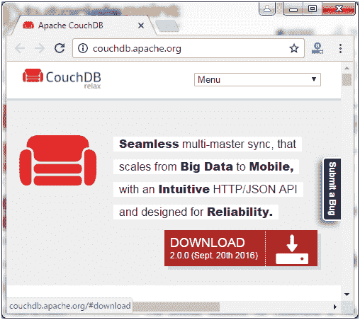

点击下载按钮，你会得到一个页面，有各种格式的文件来下载 CouchDB。

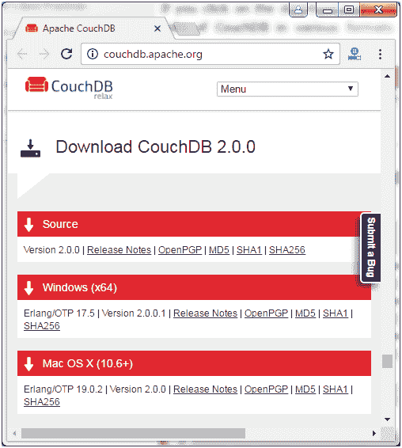

根据您的操作系统下载 CouchDB。

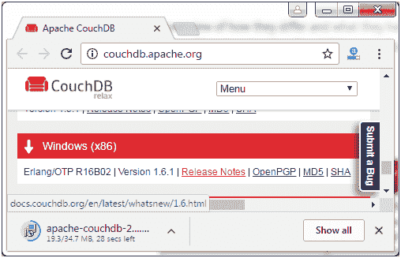

**运行下载的 apache 文件。**

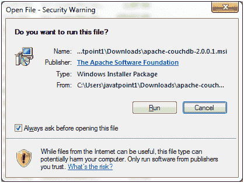
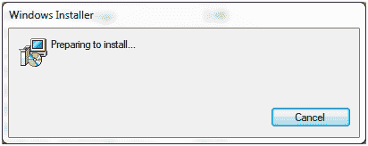 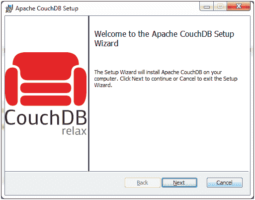 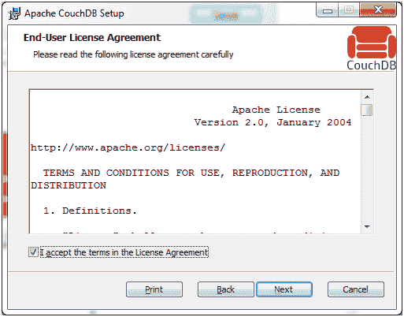 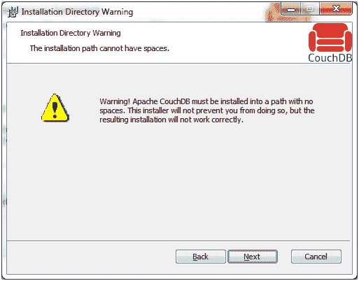  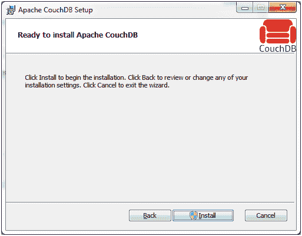 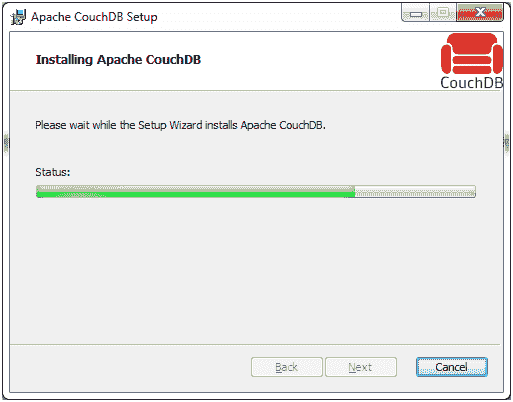 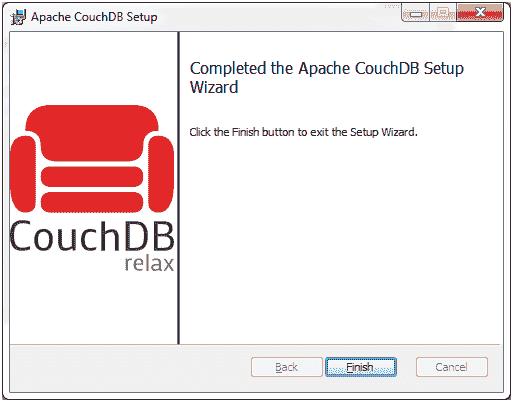

安装完成后，打开浏览器，打开如下链接: **http://127.0.0.1:5984/** 。

该网页将具有以下输出:


您可以使用以下网址与 CouchDB 网络界面进行交互:

**http://127.0.0.1:5984/_utils**

现在转到验证选项卡并验证安装:

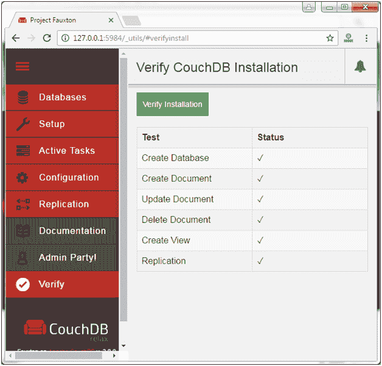

验证后，您会收到一条验证消息。

现在转到设置选项卡，您会看到两个选项“配置集群”和“配置单个节点”。

集群用于多台服务器和大型设置。对于一个简单的数据库应用程序，我们必须选择“配置单节点”。

当你点击“配置单个节点”时，你必须填写一些凭证。

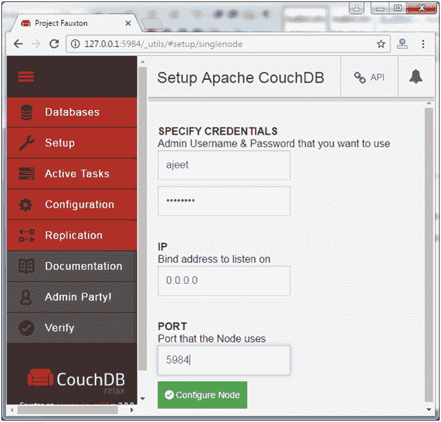

您可以通过单击管理选项卡来更改密码或创建另一个管理员。

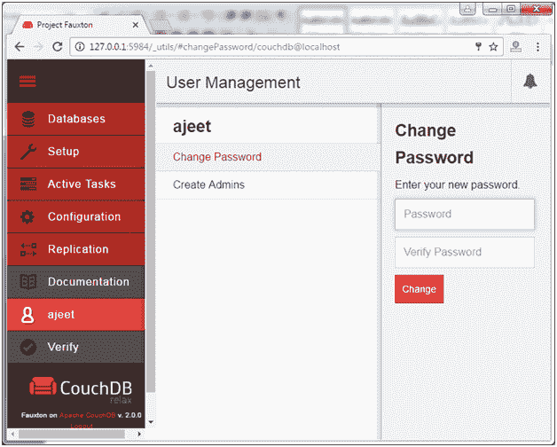

* * *

## 在 Linux 系统上安装 CouchDB

一些基于 Linux 的系统在内部提供了 CouchDB。要在 Ubuntu 和 Debian 上安装 CouchDB，请使用以下说明:

```js
sudo apt install couchdb 

```

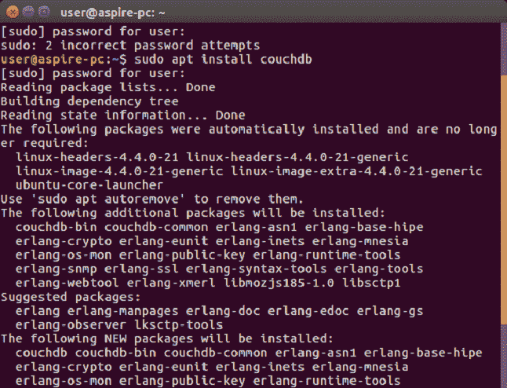 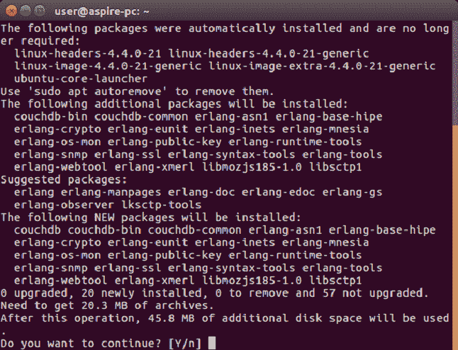 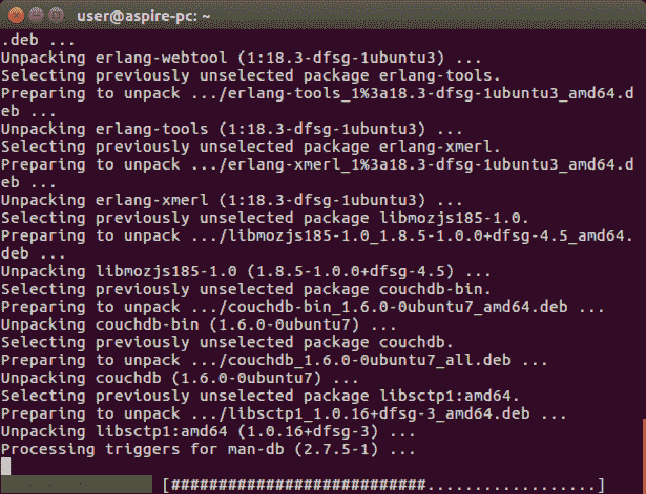 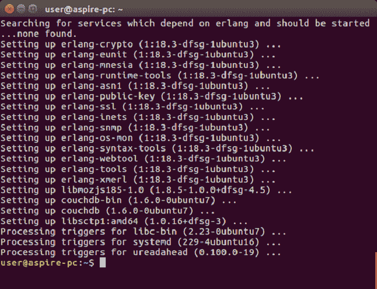

## 验证:

CouchDB 是一个 web 界面，因此您可以在 web 浏览器上验证它。打开以下主页网址:

```js
http://127.0.0.1:5984/

```

它将给出以下输出:

输出:

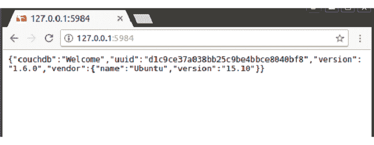

如果 Linux 系统没有 CouchDB，则安装 CouchDB 及其以下依赖项:

*   二郎动态口令
*   重症监护病房
*   心脏出血
*   Mozilla SpiderMonkey
*   项目管理
*   GNU 编译器集合
*   libcurl
*   help2man
*   文档 Python
*   蟒蛇狮身人面像

要安装上述依赖项，请使用以下命令:

```js
$sudo yum install autoconf
$sudo yum install autoconf-archive
$sudo yum install automake
$sudo yum install curl-devel
$sudo yum install erlang-asn1
$sudo yum install erlang-erts
$sudo yum install erlang-eunit
$sudo yum install erlang-os_mon
$sudo yum install erlang-xmerl
$sudo yum install help2man
$sudo yum install js-devel
$sudo yum install libicu-devel
$sudo yum install libtool
$sudo yum install perl-Test-Harness

```

然后配置并启动 CouchDB。您还应该使用以下 url 验证输出:

```js
http://127.0.0.1:5984/

```