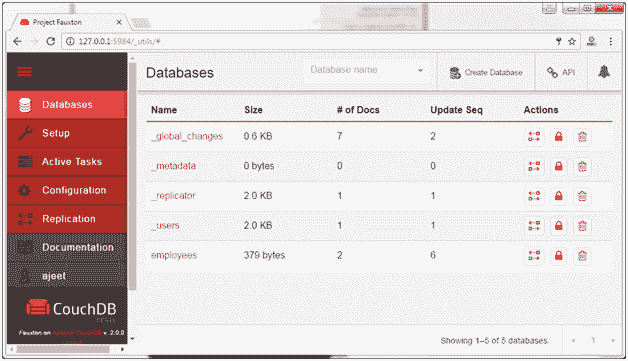

# couchdb fauxton

> 原文：<https://www.javatpoint.com/couchdb-fauxton>

CouchDB Fauxton 是一个基于 web 的内置管理界面。使用起来非常简单。它提供了一个简单的图形界面来与 CouchDB 交互。它提供了对所有 CouchDB 功能的完全访问。

CouchDB Fauxton 便于您执行以下操作:

### 数据库:

*   创建数据库
*   删除数据库

### 文档:

*   创建文档
*   更新文档
*   编辑文档
*   删除文档

* * *

## 如何开始福克斯顿

安装并运行 CouchDB，然后在浏览器中打开以下链接:

**http://127.0.0.1:5984/_utils/**

它将显示福克斯顿主页。

在左侧，您可以看到诸如数据库、设置、活动任务、配置、复制等选项卡。你可以通过点击来查看每个标签的详细信息。

* * *