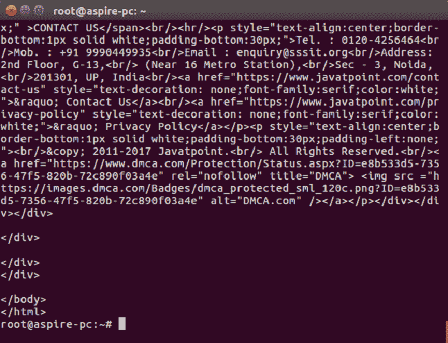
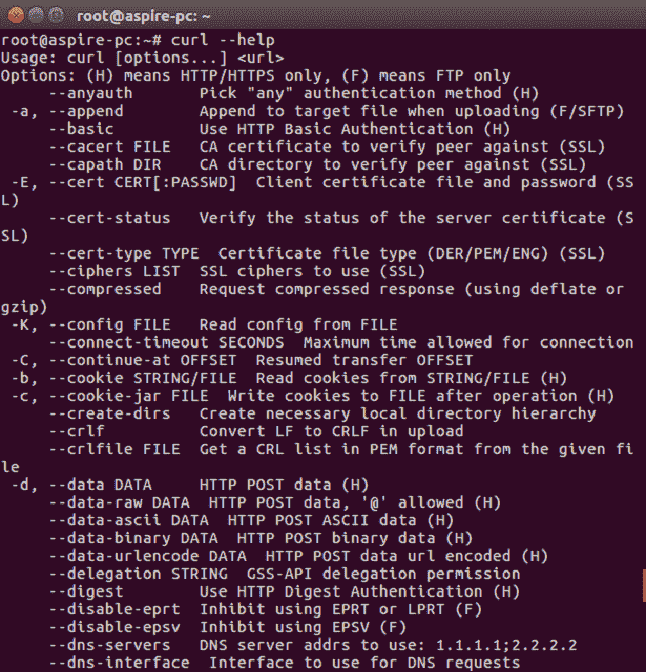
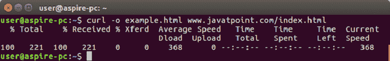
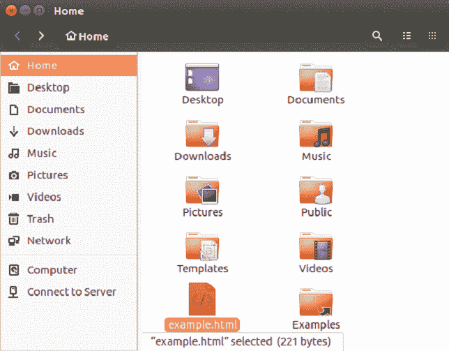
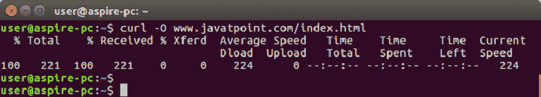
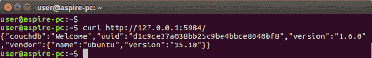

# CouchDB Curl

> 原文：<https://www.javatpoint.com/couchdb-curl>

有两种方式可以与 CouchDB 通信:

*   CouchDB cURL
*   couchdb fauxton

CouchDB cURL 实用程序用于与 CouchDB 数据库通信。此工具用于通过使用支持的协议之一(如 HTTP、HTTPS、FTP、FTPS、TFTP、DICT、TELNET、LDAP 或 FILE)在服务器之间传输数据。该命令旨在无需用户交互即可工作。cURL 提供了大量有用的技巧，如代理支持、用户身份验证、ftp 上传、HTTP post、SSL ( **https:** )连接、cookies、文件传输恢复等。

cURL 实用程序可用于操作系统，如 UNIX、Linux、Mac OS X 和 Windows。它是一个命令行工具，可以直接从命令行访问 HTTP 协议。

* * *

## 使用 cURL 实用程序

您可以使用 CUlR 实用程序通过使用 CUlR 命令后跟网站地址来访问任何网站。

**例如:**

```js
curl https://www.javatpoint.com/ 

```



## 卷曲工具选项

cURL 实用程序提供了各种选项，您可以在 cURL 实用程序帮助中看到它们。

下面的代码显示了 cURL 帮助的一部分。

```js
$ curl ?help

```



以下是 CouchDB 使用的最常用的 cURL 实用程序选项列表:

**-X 标志:**在与 HTTP 服务器通信时，-X 标志便于用户指定请求方法(GET、POST、PUT 等)。)覆盖默认方法(GET)。

在与文件传输协议服务器通信时，-X 标志便于用户指定文件传输协议命令来覆盖默认命令(列表)。

**-H:**H 标志指定要传递给服务器的自定义头。

**例如:**如果向服务器发送文件，则必须使用“内容类型”，定义要上传的文件的内容类型。

**-d 标志:**该标志用于在用户填写表单并提交数据时，将数据与 HTTP POST 请求一起发送到服务器。

**-o 标志:** -o 标志便于 cURL 将请求的输出写入文件。

**例如:**

以下示例指定了 cURL 实用程序的-o 标志的使用。

```js
curl -o example.html www.javatpoint.com/index.html

```



本示例采用 javatpoint.com 主页的源代码，创建一个名为 example.com 的文件，并将输出保存在名为 example.html 的文件中。



**-O:**O 标志类似于？o 标志，但唯一的区别是，创建了一个与请求的 url 同名的新文件，并且请求的 url 的源代码将被复制到其中。

```js
curl -O www.javatpoint.com/index.html

```



* * *

## Hello CouchDB 示例

可以通过两种方式访问 CouchDB 的主页:

*   通过使用浏览器的网址。
*   通过命令提示符。

通过发送 get 请求访问 CouchDB 的主页:首先，确保您已经在您的 Linux 环境中安装了 CouchDB，并且它正在成功运行，使用以下语法向 CouchDB 实例发送 GET 请求。

```js
curl http://127.0.0.1:5984/ 

```

