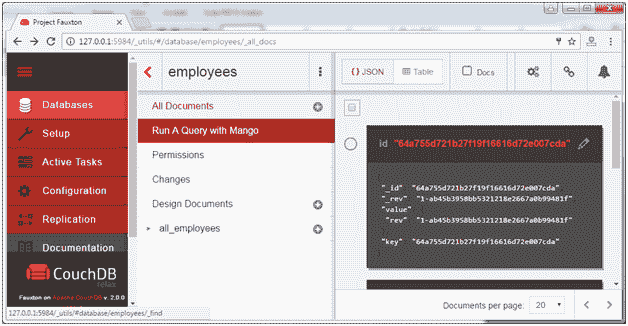
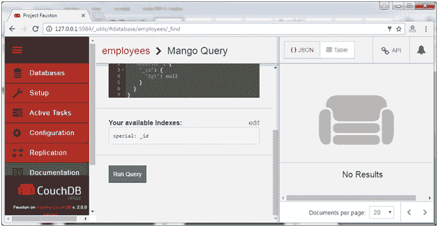
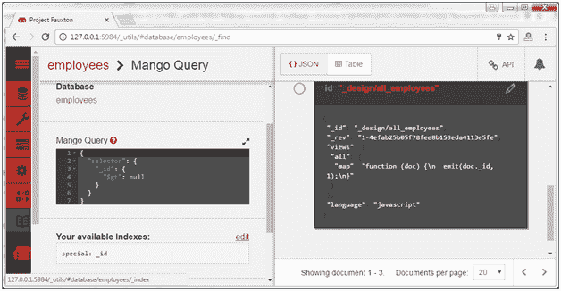
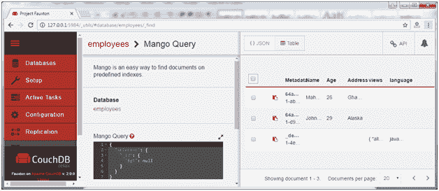

# 使用芒果运行 CouchDB 查询

> 原文：<https://www.javatpoint.com/run-couchdb-query-with-mango>

Mongo 是一种在预定义索引上查找文档的简单方法。

芒果提供了一个单一的 HTTP API 端点，通过 HTTP POST 接受 JSON 主体。这些主体提供了一组指令，以我们指定的相同顺序返回结果。

在表格形式中，它看起来像这样:

