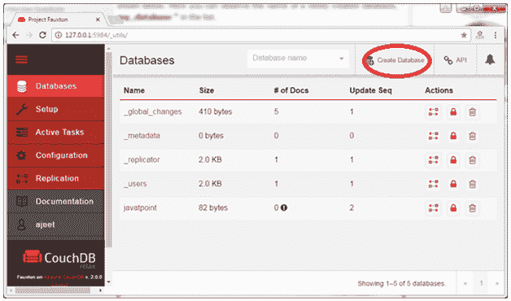
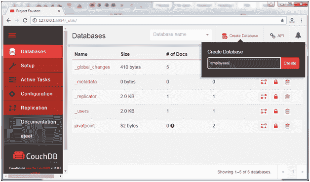
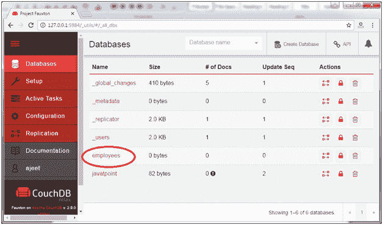
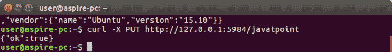
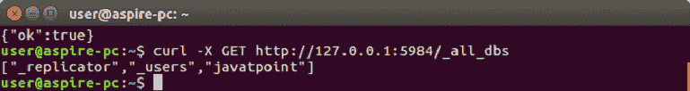
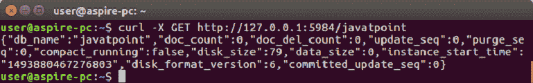

# 创建数据库

> 原文：<https://www.javatpoint.com/couchdb-create-database>

在 CouchDB 中，数据库是存储文档的最外层结构。CouchDB 提供了 cURL 实用程序来创建数据库。也可以使用 CouchDB 的 Futon 网页界面。

## 使用 Fauxton 创建数据库

在网络浏览器中打开以下链接:

**http://127.0.0.1:5984/_utils/。**

你会看到这样一页:



单击红色圆圈中的“创建数据库”选项卡，创建一个名为“员工”的数据库。



它将显示一条消息，表明数据库已成功创建。您可以在数据库选项卡中检查创建的数据库。



* * *

## 使用 cURL 实用程序创建数据库

通过 cURL 实用程序使用 PUT 方法向服务器发送一个 HTTP 请求，使用以下语法在 CouchDB 中创建一个数据库。

**语法:**

```
curl -X PUT http://127.0.0.1:5984/database_name

```

### 示例:

创建一个名为“javatpoint”的数据库。作为响应，服务器将返回一个内容为“ok”的 JSON 文档:true。它指定操作成功。



## 确认

您可以通过使用以下命令列出所有数据库来验证数据库是否已创建:

```
curl -X GET http://127.0.0.1:5984/_all_dbs

```



* * *

## 检查数据库信息

您可以使用 get 请求和数据库名称来获取关于数据库的信息。

**语法:**

```
curl -X GET http://127.0.0.1:5984/database_name

```

### 示例:

请参见下面的示例来获取您的数据库名称“javatpoint”的信息。

输出:

