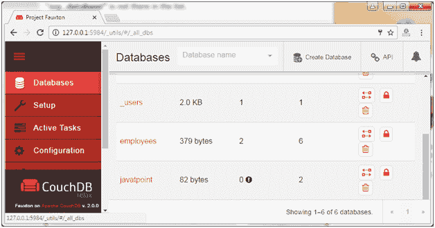
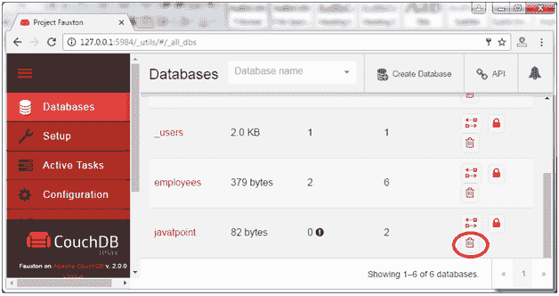
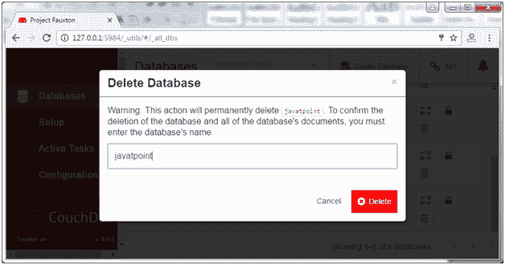
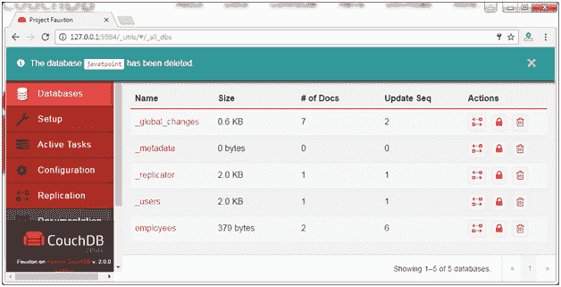
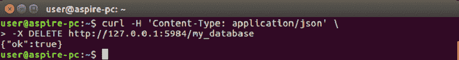
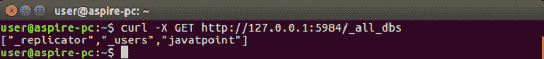

# CouchDB 删除数据库

> 原文：<https://www.javatpoint.com/couchdb-delete-database>

* * *

## 使用 Fauxton 删除数据库

打开 Fauxton 网址:**http://127 . 0 . 0 . 1:5984/_ utils/**

单击“数据库”选项卡，您将看到所有数据库:



在这里，我们要删除“javatpoint”数据库。单击红色圆圈中的删除图标。



它将显示一条弹出消息，要求确认数据库名称。写下数据库的名称。



现在数据库被删除了。



* * *

## 使用 cURL 实用程序删除数据库

CouchDB 通过 cURL 实用程序使用 delete 方法向服务器发送 HTTP 请求，从而方便您删除数据库。

**语法:**

```js
curl -H 'Content-Type: application/json' \
-X DELETE http://127.0.0.1:5984/database_name

```

#### 注意:-X 用于在与 HTTP 服务器通信时指定 HTTP 的自定义请求方法。若要删除数据库，请通过指定数据库将 url 发送到服务器。

### 示例:

让我们删除名为“我的数据库”的数据库。

使用以下命令:

```js
curl -H 'Content-Type: application/json' \
-X DELETE http://127.0.0.1:5984/my_database

```



### 确认

您可以使用以下命令验证数据库是否已删除:



在这里，我们可以看到 my_database 不再在列表中，并且被永久删除。