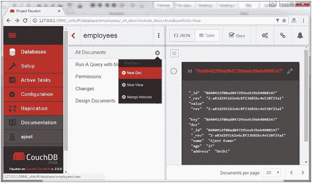
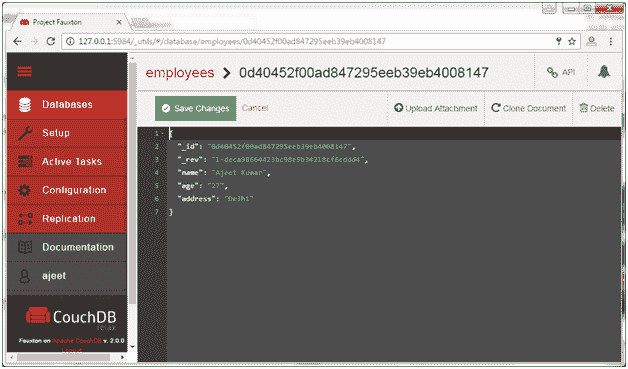
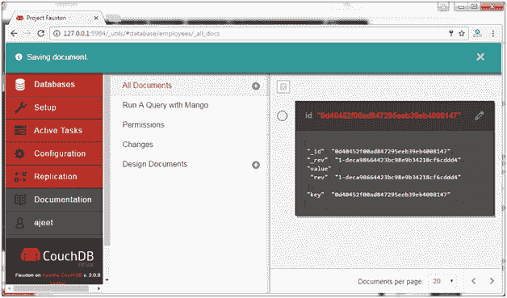
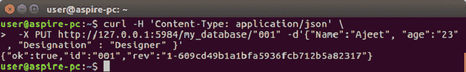
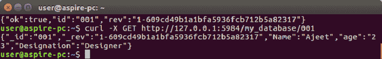

# CouchDB 创建文档

> 原文：<https://www.javatpoint.com/couchdb-create-document>

在 CouchDB 中，数据库的数据以文档的形式而不是表格的形式存储。

## 使用 Fauxton 在 CouchDB 数据库中创建文档

要在 CouchDB 数据库中创建文档，请打开 Fauxton 网址:

**http://127.0.0.1:5984/_utils/**

选择特定的数据库，并将光标放在所有文档选项卡上。点击新文档，如下图所示:



您将看到如下页面:


在文档中填写您想要的条目:



完成所有输入后，单击保存更改选项卡。现在文档被创建了。



* * *

## CouchDB 使用 cURL 实用程序创建文档

要在 CouchDB 中创建文档，通过 cURL 实用程序使用 PUT 方法向服务器发送一个 HTTP 请求。

以下是创建文档的语法。

**语法:**

```
curl -X PUT http://127.0.0.1:5984/database name/"id" -d ' { document} ' 

```

#### 注意:-X 用于指定我们用来与 HTTP 服务器通信的 HTTP 的自定义请求方法。在这种情况下，我们使用 PUT 方法。当我们使用 PUT 方法时，url 的内容指定了我们使用 HTTP 请求创建的对象名。

*   数据库名称指定我们在其中创建文档的数据库的名称。
*   Id 指定文档 id。
*   文档的数据。？d 选项用于通过 HTTP 请求发送数据/文档。

```
{
   Name : Ajeet
   age : 23
   Designation : Designer
}

```

### 示例:

让我们创建一个 id 为“001”的文档，数据库名为 javatpoint。

```
curl -H 'Content-Type: application/json' \
 -X PUT http://127.0.0.1:5984/my_database/"001" -d'{"Name":"Ajeet", "age":"23" , "Designation" : "Designer" }' 

```



CouchDB 对此命令的响应包含 3 个字段:

*   **“ok”:**表示操作成功。
*   **“id”:**存储文档的 id。
*   **“rev”:**表示版本号。每次修改(更新或修改)文档时，CouchDB 都会生成一个 a _rev 值。如果要更新或删除文档，CouchDB 希望您包含要更改的修订的 _rev 字段。当 CouchDB 接受更改时，它将生成一个新的修订号。

### 确认

您可以使用以下命令验证您的文档是否已创建:

```
curl -X GET http://127.0.0.1:5984/my_database/001 

```

