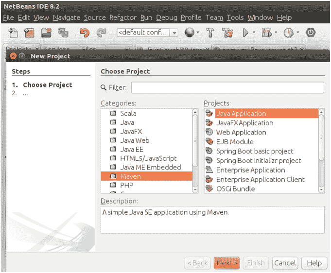
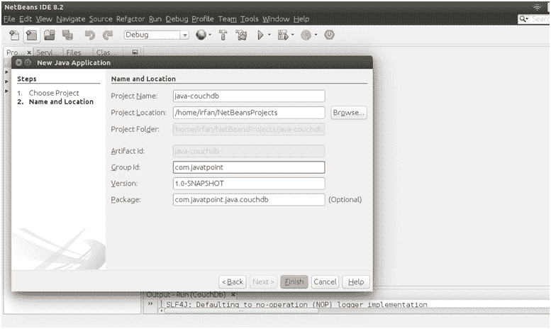
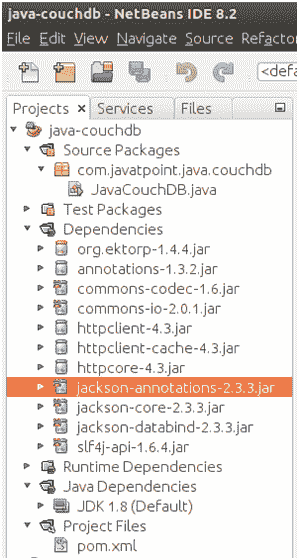
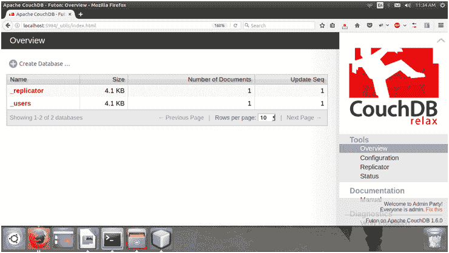
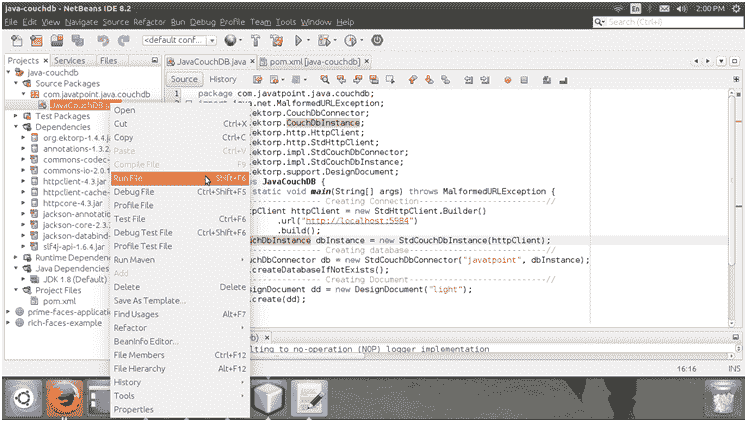
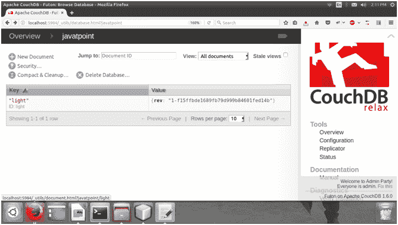

# Java CouchDB 连接性

> 原文：<https://www.javatpoint.com/java-couchdb>

我们可以用 Java 编程语言连接到 CouchDB。为了连接，我们使用了 **Ektorp** 库，它在 CouchDB 的顶部提供了一个持久层。

这里，我们解释一个例子，其中我们正在连接，创建数据库等。

这个例子是在 NetBeans IDE 8.2 中创建的。

首先创建一个 maven 项目，然后按照以下步骤操作。



为我们的项目命名。



完成后，看到，它有一个 **pom.xml** 文件。我们需要在这个文件中添加依赖关系。我们先做吧。

【t0///异位文库依赖】T1

```js
<dependency>
<groupId>org.ektorp</groupId>
<artifactId>org.ektorp</artifactId>
<version>1.4.4</version>
</dependency>

```

//POM . XML

```js
<?xml version="1.0" encoding="UTF-8"?>
<project  xmlns:xsi="http://www.w3.org/2001/XMLSchema-instance" xsi:schemaLocation="http://maven.apache.org/POM/4.0.0 http://maven.apache.org/xsd/maven-4.0.0.xsd">
<modelVersion>4.0.0</modelVersion>
<groupId>com.javatpoint</groupId>
<artifactId>java-couchdb</artifactId>
<version>1.0-SNAPSHOT</version>
<packaging>jar</packaging>
<properties>
<project.build.sourceEncoding>UTF-8</project.build.sourceEncoding>
<maven.compiler.source>1.8</maven.compiler.source>
<maven.compiler.target>1.8</maven.compiler.target>
</properties>
<dependencies>
<dependency>
<groupId>org.ektorp</groupId>
<artifactId>org.ektorp</artifactId>
<version>1.4.4</version>
</dependency>
</dependencies>
</project>

```

添加依赖项后，创建一个用于连接的 Java 文件。我们的 Java 文件包含必要的连接代码。

// JavaCouchDB.java

```js
package com.javatpoint.java.couchdb;
import java.net.MalformedURLException;
import org.ektorp.CouchDbConnector;
import org.ektorp.CouchDbInstance;
import org.ektorp.http.HttpClient;
import org.ektorp.http.StdHttpClient;
import org.ektorp.impl.StdCouchDbConnector;
import org.ektorp.impl.StdCouchDbInstance;
import org.ektorp.support.DesignDocument;
public class JavaCouchDB {
public static void main(String[] args) throws MalformedURLException {
//--------------- Creating Connection--------------------------//
HttpClient httpClient = new StdHttpClient.Builder()
.url("http://localhost:5984")
.build();
CouchDbInstance dbInstance = new StdCouchDbInstance(httpClient);
//--------------- Creating database----------------------------//
CouchDbConnector db = new StdCouchDbConnector("javatpoint", dbInstance);
db.createDatabaseIfNotExists();
//--------------- Creating Document----------------------------//
DesignDocument dd = new DesignDocument("light");
db.create(dd);
}
}

```

我们的项目是这样的:



现在，在执行 Java 代码之前，检查 CouchDB 连接是否工作。要检查它，请按照以下网址**http://localhost:5984/_ utils/**。它将显示所有可用的数据库。



这个屏幕截图显示了 CouchDB 索引网页。

现在，执行将创建数据库的 Java 代码。我们可以在索引网页上显示的数据库列表中看到该数据库。



查看 CouchDB 索引网页。


看，有三个数据库包括 **javatpoint** 新数据库。它包含一个文档**灯**，如下图所示。



嗯，我们已经看到了，如何连接和创建数据库。现在，我们还可以执行其他数据库操作。