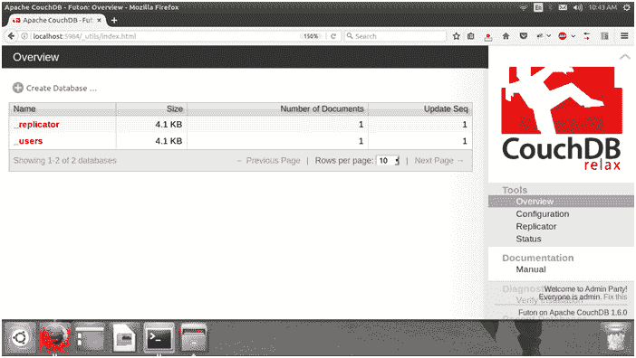
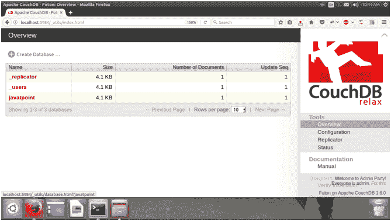
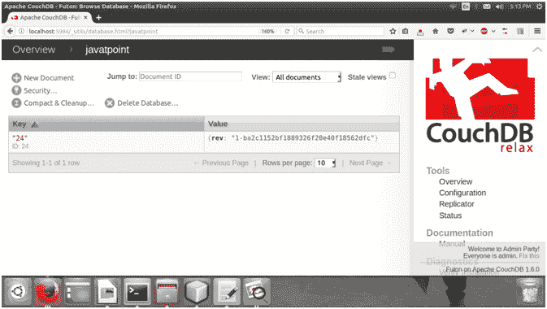
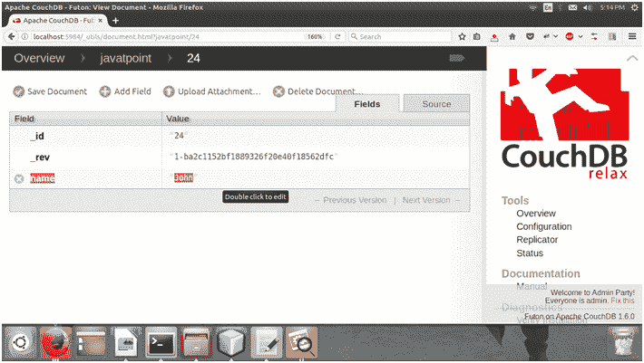
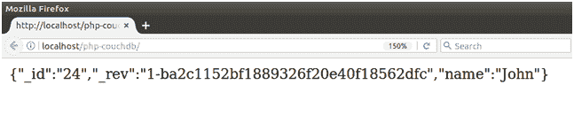

# Php CouchDB 连接性

> 原文：<https://www.javatpoint.com/php-couchdb>

在本教程中，我们将解释一个 php CouchDb 连接的例子。Php 提供了简单的连接方式。我们只需要执行下面给出的 Php 脚本。

默认情况下，CouchDB 在 5984 端口上执行。

1)创建一个 Php 文件

**//index.php**

```
<?php
$options['host'] = "localhost"; 
$options['port'] = 5984;
// Creating connection
$couch = new CouchSimple($options); 
$couch->send("GET", "/"); 
// Create a new database "javatpoint".
$couch->send("PUT", "/javatpoint"); 
// Create a new document in the database.
$couch->send("PUT", "/javatpoint/24", '{"_id":"24","name":"John"}'); 
// Fetching document
$resp = $couch->send("GET", "/javatpoint/24"); 
echo $resp; 
class CouchSimple {
function CouchSimple($options) {
foreach($options AS $key => $value) {
$this->$key = $value;
}
} 
function send($method, $url, $post_data = NULL) {
$s = fsockopen($this->host, $this->port, $errno, $errstr); 
if(!$s) {
echo "$errno: $errstr\n"; 
return false;
} 
$request = "$method $url HTTP/1.0\r\nHost: $this->host\r\n"; 
if ($this->user) {
$request .= "Authorization: Basic ".base64_encode("$this->user:$this->pass")."\r\n"; 
}
if($post_data) {
$request .= "Content-Length: ".strlen($post_data)."\r\n\r\n"; 
$request .= "$post_data\r\n";
} 
else {
$request .= "\r\n";
}
fwrite($s, $request); 
$response = ""; 
while(!feof($s)) {
$response .= fgets($s);
}
list($this->headers, $this->body) = explode("\r\n\r\n", $response); 
return $this->body;
}
}
?>

```

2)访问 CouchDB

我们可以使用**http://localhost:5984/_ utils**查看可用的数据库。



3)执行 Php 脚本

现在在本地主机服务器上执行 Php 文件。之后再次访问 CouchDB。



看，我们的脚本已经创建了一个数据库 **javatpoint** 。它还包含一个带有值的文档。



文件被称为 ID 24。我们可以通过点击它来查看存储在文档中的值。价值观是这样显示的:



4)获取数据

