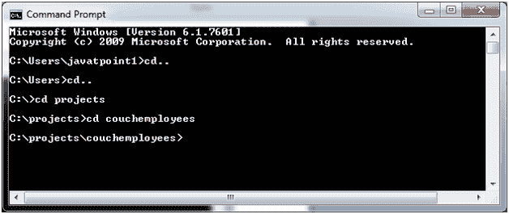
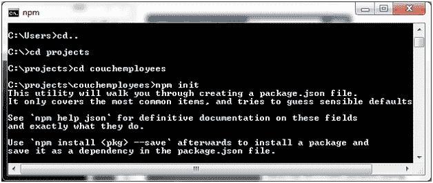
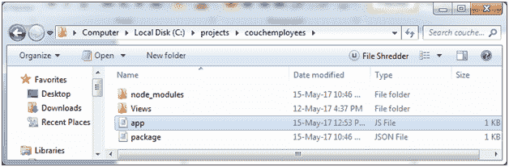
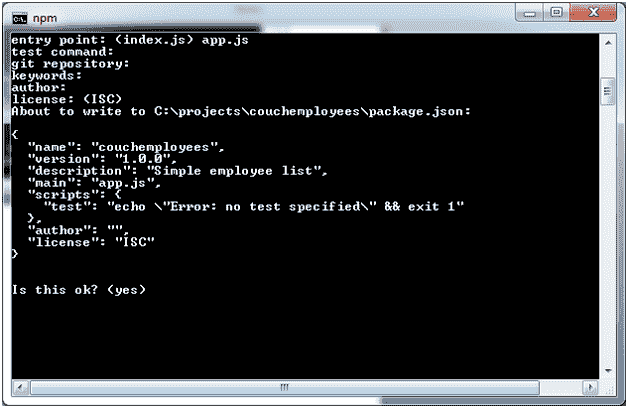
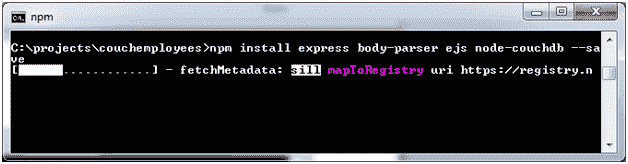
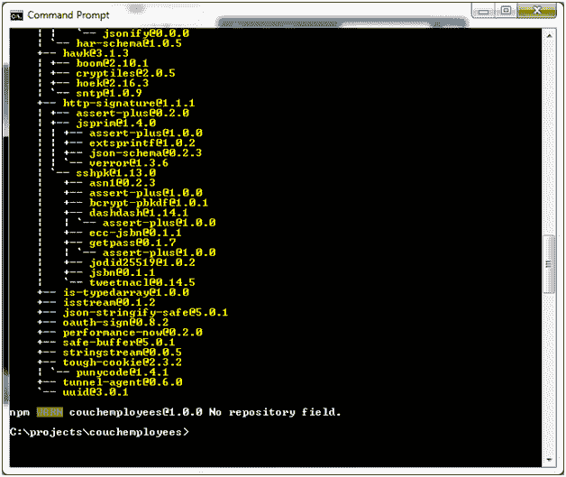
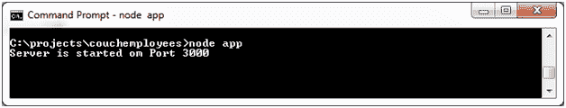
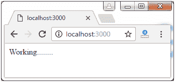

# 用 CouchDB 连接 Node.js

> 哎哎哎:# t0]https://www . javatppoint . com/nodejs-couch db

转到 C 文件夹。在已创建的文件夹“项目”中创建名为“couchemployees”的文件夹。

打开命令提示符并转到该位置。



```js
Start npm init

```



创建一个名为“app.js”的文件，包含以下代码:

现在入口点将是 app.json

```js
const express = require('express');
const bodyParser = require('body-parser');
const path = require('path');
const NodeCouchdb = require('node-couchdb');
const app = express();
app.set('view engine', 'ejs');
app.set('views', path.join(__dirname, 'views'));
app.use (bodyParser.json());
app.use(bodyParser.urlencoded({extended: false}));
app.get('/', function(req,res){
 res.send('Working........');
});
app.listen(3000, function(){
 console.log('Server is started om Port 3000');
});

```




现在使用以下命令:

**npm 安装 express body-解析器 ejs 节点-couchdb -保存**




执行以下代码启动本地服务器:

```js
node app  

```



**现在服务器启动:**

打开本地浏览器:localhost:3000



* * *

## 列出数据库

**编辑 app.js 文件，代码如下:**

```js
const express = require('express');
const bodyParser = require('body-parser');
const path = require('path');
const NodeCouchdb = require('node-couchdb');

const couch = NodeCouchdb({
auth:{
user: 'ajeet'
password: '12345'
}
});
couch.listDatabases().then(function(dbs){
console.log(dbs);
});

const app = express();
app.set('view engine', 'ejs');
app.set('views', path.join(__dirname, 'views'));
app.use (bodyParser.json());
app.use(bodyParser.urlencoded({extended: false}));
app.get('/', function(req,res){
 res.send('Working........');
});
app.listen(3000, function(){
 console.log('Server is started on Port 3000');
});

```


创建一个文件夹“视图”，然后在其中创建一个文件“index.ejs”，代码如下:

```js
Hello World!

```

**现在在【app.js】文件中修改:**

```js
const express = require('express');
const bodyParser = require('body-parser');
const path = require('path');
const NodeCouchdb = require('node-couchdb');

const couch = NodeCouchdb({
auth:{
user: 'ajeet'
password: '12345'
}
});
couch.listDatabases().then(function(dbs){
console.log(dbs);
});

const app = express();
app.set('view engine', 'ejs');
app.set('views', path.join(__dirname, 'views'));
app.use (bodyParser.json());
app.use(bodyParser.urlencoded({extended: false}));
app.get('/', function(req,res){
 res.render('index');
});
app.listen(3000, function(){
 console.log('Server is started on Port 3000');
})

```


