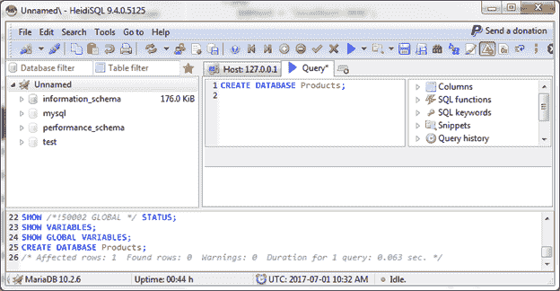
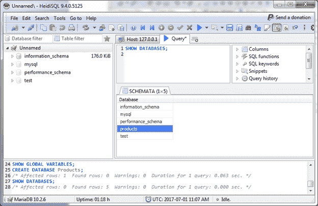

# 创建数据库

> 原文：<https://www.javatpoint.com/mariadb-create-database>

创建一个名为“产品”的数据库。

**语法:**

```sql
CREATE DATABASE Database_name;

```

**示例:**

```sql
CREATE DATABASE Products;

```



* * *

## 显示数据库

SHOW DATABASES 命令用于查看我们创建的数据库。

**语法:**

```sql
SHOW DATABASES;

```

输出:



您可以看到创建的数据库“产品”。