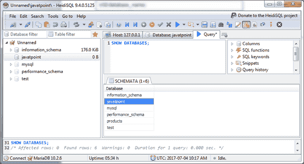
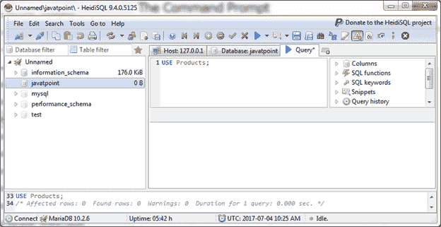

# 选择数据库

> 原文：<https://www.javatpoint.com/mariadb-select-database>

使用数据库命令用于选择您想要使用的数据库，并在其中创建表。

**语法:**

```

USE database_name; 

```

**示例:**

假设我们在数据库列表中有多个数据库，我们必须选择一个特定的数据库。

例如，我们有多个数据库，如下图所示:



这里我们将使用“Javatpoint”数据库来创建表格等..所以你必须使用 use 命令。

```

USE Products; 

```

输出:



现在，选择“javatpoint”数据库。您可以在其中创建表格。