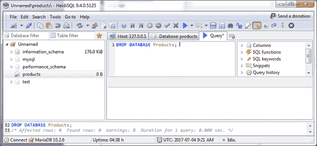
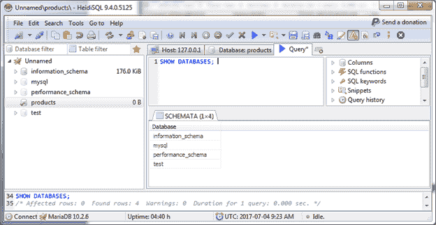
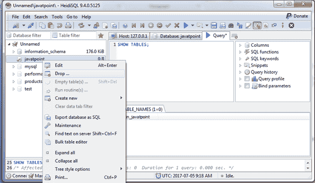
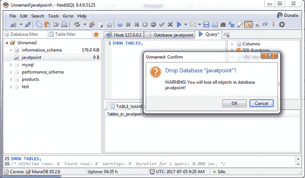
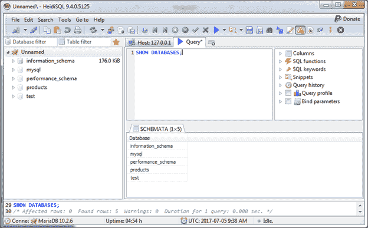

# 删除数据库

> 原文：<https://www.javatpoint.com/mariadb-drop-database>

DROP DATABASE 命令用于删除您创建的数据库。

**语法:**

```sql

DROP DATABASE Database_name;

```

**示例:**

在前面的示例中，我们创建了一个名为“产品”的数据库。让我们放弃数据库。

```sql

DROP DATABASE Products;

```

输出:



数据库“产品”现已删除。您可以使用 SHOW 命令进行验证。

```sql

SHOW DATABASES; 

```

输出:



您可以看到“产品”数据库在数据库列表中不可用。

* * *

## 使用管理工作室删除数据库

您可以使用 management studio 工具删除数据库。选择要删除的数据库，然后右键单击该数据库。您将看到这样的页面:

这里我们删除了一个名为“Javatpoint”的数据库。



点击“删除”。它将生成如下弹出框:



点击确定。

现在数据库“Javatpoint”被删除。您可以使用 SHOW 语句进行验证。

```sql

SHOW DATABASES;

```

输出:



您可以看到列表中没有“Javatpoint”。它将被永久删除。