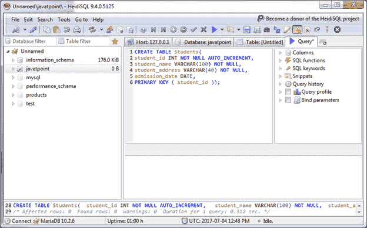
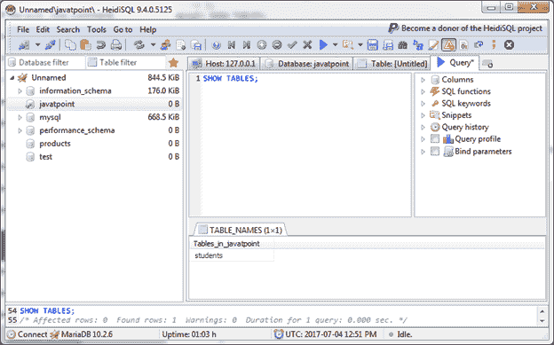
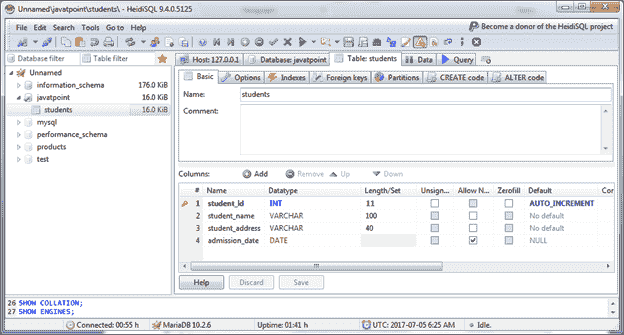
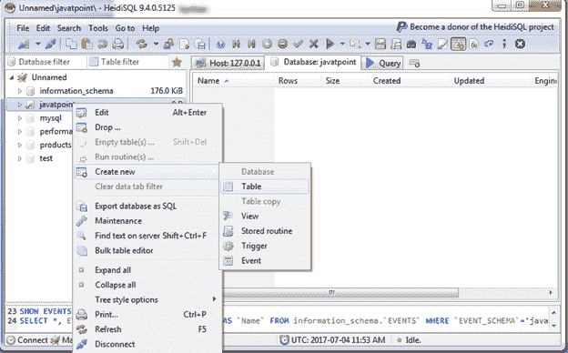
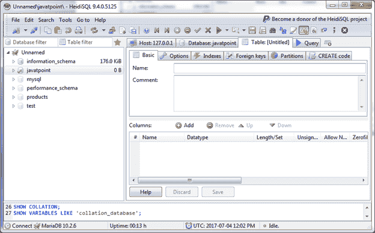
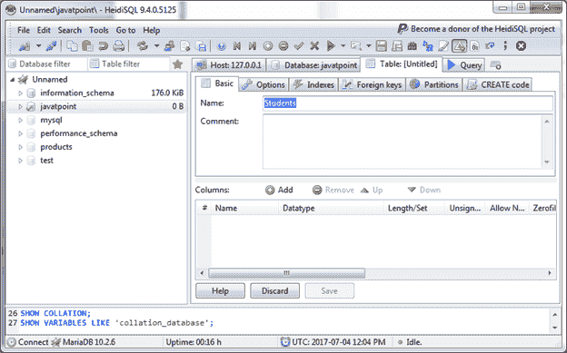
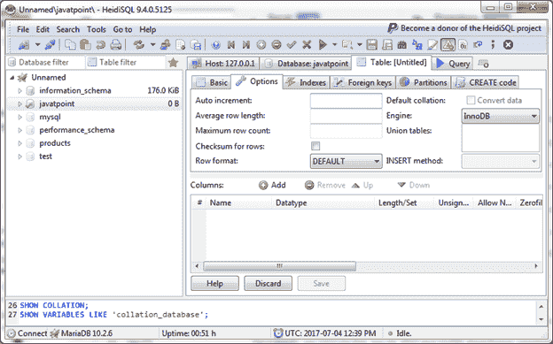
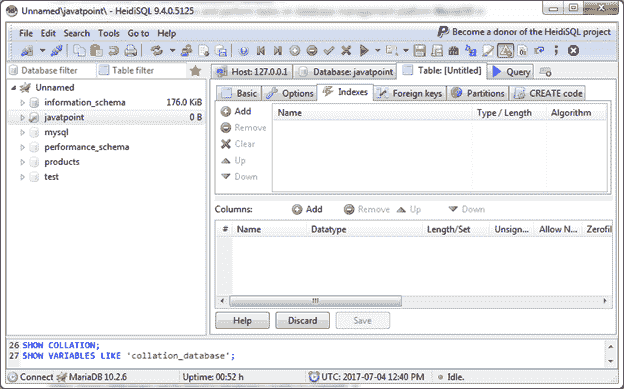
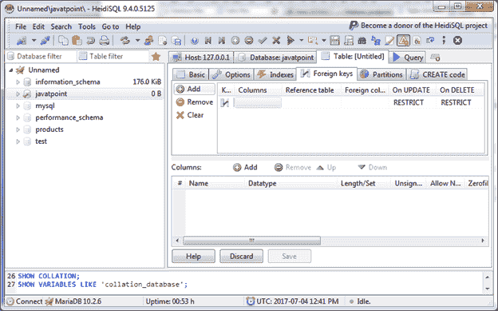
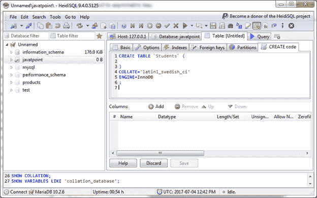

# 创建表格

> 原文：<https://www.javatpoint.com/mariadb-create-table>

在 MariaDB 中，CREATE TABLE 语句用于在选定的数据库中创建表。

**语法:**

```sql

CREATE TABLE table_name (column_name column_type);

```

也可以将列名指定为主键，主键必须为非空。

**示例:**

在“Javatpoint”数据库中创建一个“学生”表。

```sql

CREATE TABLE Students(
student_id INT NOT NULL AUTO_INCREMENT,
student_name VARCHAR(100) NOT NULL,
student_address VARCHAR(40) NOT NULL,
admission_date DATE,
PRIMARY KEY ( student_id ));

```



* * *

## 显示表格

您可以使用 SHOW TABLES 命令验证该表是否已创建。

```sql

SHOW TABLES; 

```

输出:



这里可以看到创建的表“学生”。

**见表结构:**



* * *

## 创建表格的另一种方法

转到选定的数据库并右键单击。



点击表格，你会看到这样:



创建一个“学生”表。



您可以添加其他选项，例如:



要添加索引:



要添加外键:



**创建代码:**

