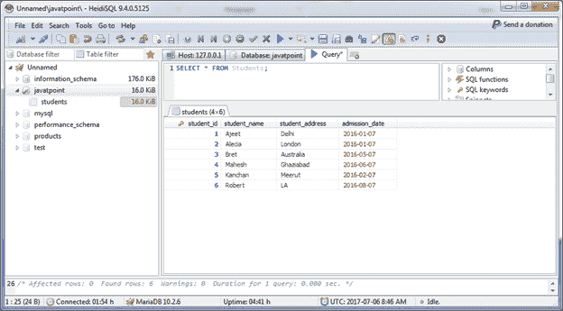
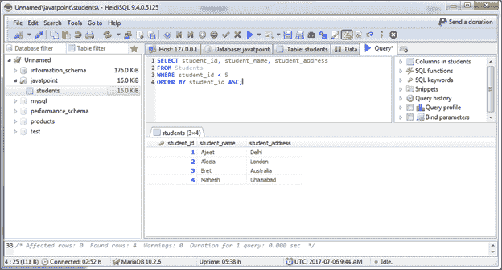

# 选择数据

> 原文：<https://www.javatpoint.com/mariadb-select>

SELECT 语句用于从单个或多个表中检索记录。

**语法:**

```

SELECT expressions
FROM tables
[WHERE conditions]; 

```

SELECT 语句可以与 UNION 语句、ORDER BY 子句、LIMIT 子句、WHERE 子句、GROUP BY 子句、HAVING 子句等一起使用。

```

SELECT [ ALL | DISTINCT ]
expressions
FROM tables
[WHERE conditions]
[GROUP BY expressions]
[HAVING condition]
[ORDER BY expression [ ASC | DESC ]]; 

```

* * *

## 从表中选择所有列

**示例:**

我们有一个“学生”表，有一些数据。所以检索“学生”的所有记录。

```

SELECT * FROM Students; 

```

输出:



* * *

## 从表中选择单个列

您可以使用 SELECT 语句从表中检索单个列。它便于您只检索那些您需要的列。

**示例:**

```

SELECT student_id, student_name, student_address
FROM Students
WHERE student_id < 5
ORDER BY student_id ASC;

```

输出:



在这里，我们从“学生”表中选择学生标识、学生姓名、学生地址，其中学生标识小于 5，我们根据学生标识按升序对记录进行排序。