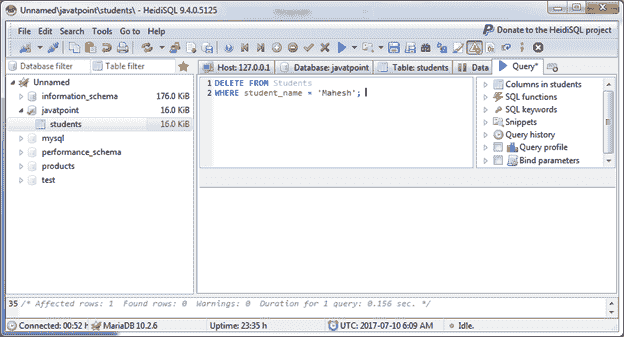
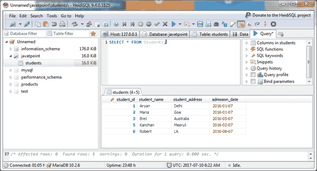
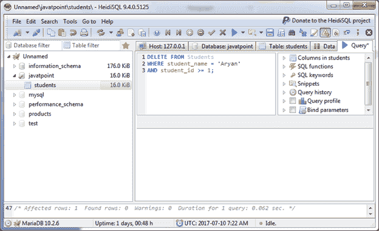
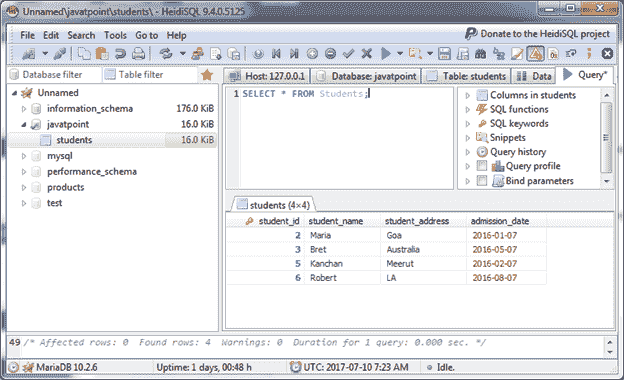

# MariaDB 删除数据

> 原文：<https://www.javatpoint.com/mariadb-delete>

MariaDB DELETE 语句用于从 MariaDB 数据库的表中删除一条或多条记录。

**语法:**

```
DELETE FROM table
[WHERE conditions]
[ORDER BY expression [ ASC | DESC ]]
[LIMIT number_rows]; 

```

## 使用一个条件删除数据

让我们使用一个条件来删除数据。

**示例:**

```
DELETE FROM Students
WHERE student_name = 'Mahesh'; 

```



查询成功执行。您现在可以看到所选数据已被删除。

```
SELECT * FROM Students;

```

输出:



你可以看到表中没有“Mahesh”。

* * *

## 使用多个条件删除数据

```
DELETE FROM Students
WHERE student_name = 'Aryan'
AND student_id >= 1; 

```



查询成功执行。您现在可以看到所选数据已被删除。

```
SELECT * FROM Students;

```

输出:



你可以看到“雅利安人”在表中是没有的。