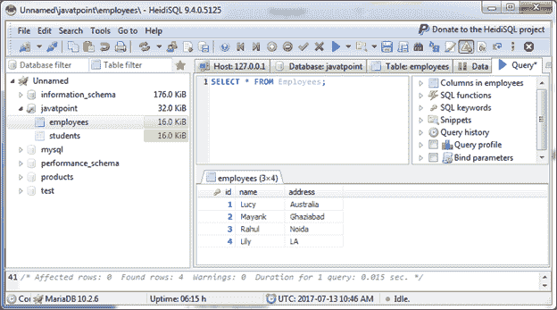
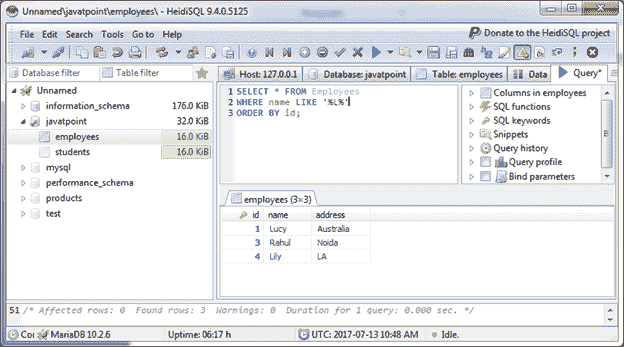
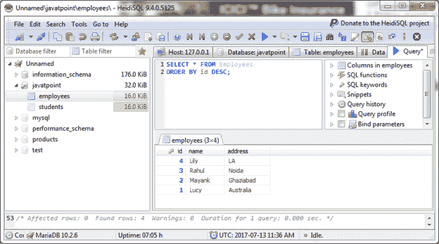
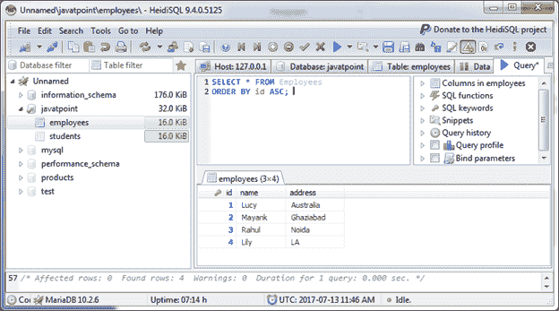

# MariaDB 订单子句

> 原文：<https://www.javatpoint.com/mariadb-order-by>

在 MariaDB 中，ORDER BY 子句用于按升序或降序对结果集中的记录进行排序。

**语法:**

```

SELECT expressions
FROM tables
[WHERE conditions]
ORDER BY expression [ ASC | DESC ]; 

```

#### 注意:您可以不使用 ASC/DESC 属性对结果进行排序。默认情况下，结果将按升序排序。

* * *

## 不使用美国标准协会/DESC 属性的订单子句

使用“员工”表，包含以下数据:



**示例:**

```

SELECT * FROM Employees
WHERE name LIKE '%L%'
ORDER BY id; 

```

输出:



* * *

## 具有 DESC 属性的 ORDER BY 子句

```

SELECT * FROM Employees
ORDER BY id DESC; 

```

输出:



* * *

## 带有美国标准协会属性的订单子句

```

SELECT * FROM Employees
ORDER BY id DESC; 

```

输出:

