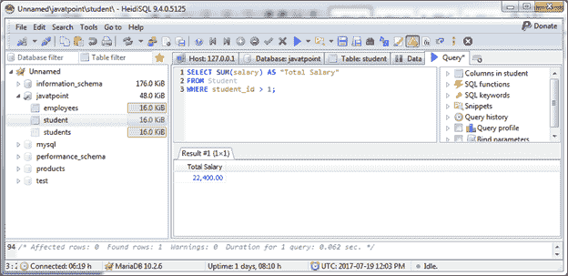
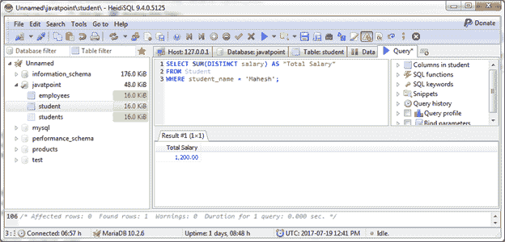

# MariaDB 求和函数

> 原文：<https://www.javatpoint.com/mariadb-sum-function>

MariaDB SUM 函数用于返回表达式的求和值。

**语法:**

```sql

SELECT SUM(aggregate_expression)
FROM tables
[WHERE conditions]; 

```

* * *

## 单表达式 SUM()函数

**示例:**

计算“student_id”大于 1 的“Student”表的总薪资。

```sql

SELECT SUM(salary) AS "Total Salary"
FROM Student
WHERE student_id > 1; 

```

输出:



* * *

## 带 DISTINCT 子句的 SUM()函数

您可以将 DISTINCT 子句与 SUM 函数一起使用，以避免重复的值求和。

**示例:**

```sql

SELECT SUM(DISTINCT salary) AS "Total Salary"
FROM Student
WHERE student_name = 'Mahesh'; 

```

输出:

