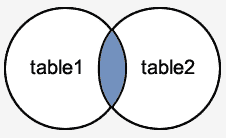
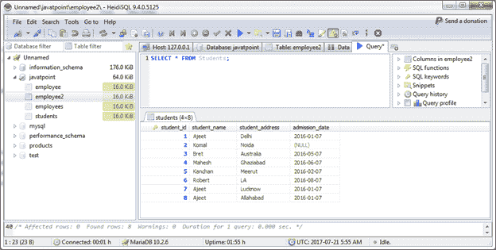
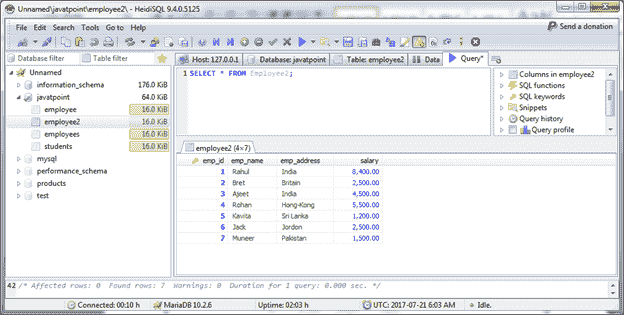
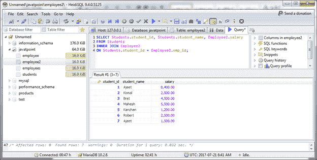
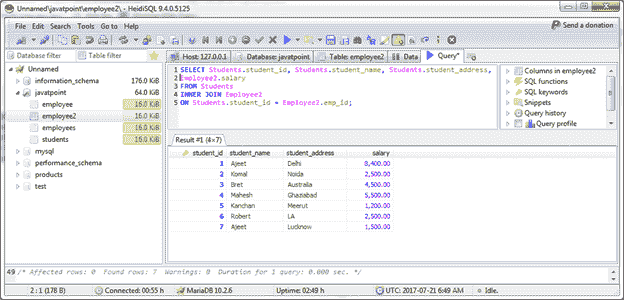

# MariaDB 连接

> 原文：<https://www.javatpoint.com/mariadb-inner-join>

在 MariaDB 数据库中，JOINS 用于从多个表中检索数据。当我们有两张或两张以上的桌子时，它就会被执行。

MariaDB 中有三种类型的连接:

*   MariaDB 内部连接(也称为简单连接)
*   MariaDB 左外部连接(也称为左连接)
*   MariaDB 右外连接(也称为右连接)

* * *

## MariaDB INNER JOIN

MariaDB INNER JOIN 是最常见的连接类型，它返回多个表中满足连接条件的所有行。

**语法:**

```
SELECT columns
FROM table1 
INNER JOIN table2
ON table1.column = table2.column;

```

**图像表示:**



**示例:**

我们有两张桌子“学生”和“员工 2”。

**学生表:**



**员工 2 表:**



根据给定的参数，使用以下语法连接两个表:

```
SELECT Students.student_id, Students.student_name, Employee2.salary
FROM Students 
INNER JOIN Employee2
ON Students.student_id = Employee2.emp_id; 

```

输出:



您可以组合任意多个字段。让？让我们再添加一些字段:

```
SELECT Students.student_id, Students.student_name, Students.student_address, Employee2.salary
FROM Students 
INNER JOIN Employee2
ON Students.student_id = Employee2.emp_id; 

```

输出:

