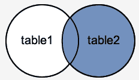
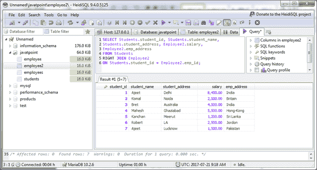

# MariaDB 德右外连接

> 原文：<https://www.javatpoint.com/mariadb-right-outer-join>

MariaDB RIGHT OUTER JOIN 用于返回在 ON 条件中指定的右表中的所有行，并且只返回另一个表中连接字段满足条件的那些行。

MariaDB 右外连接也称为右连接。

**语法:**

```sql
SELECT columns
FROM table1
RIGHT [OUTER] JOIN table2
ON table1.column = table2.column; 

```

**图像表示:**



**示例:**

```sql
SELECT Students.student_id, Students.student_name, 
Students.student_address, Employee2.salary, 
Employee2.emp_address
FROM Students 
RIGHT JOIN Employee2
ON Students.student_id = Employee2.emp_id;

```

输出:

