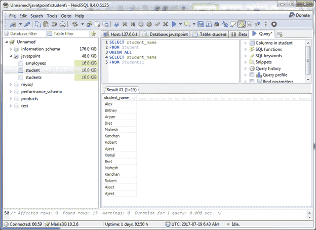
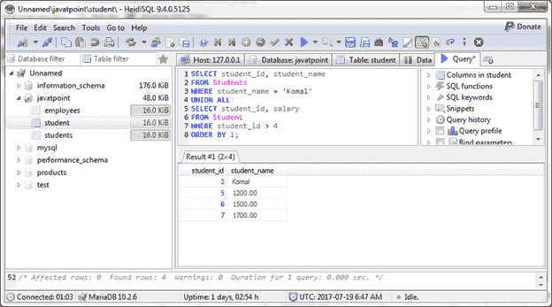

# 马里亚银行联合所有运营商

> 原文：<https://www.javatpoint.com/mariadb-union-all-operator>

马里亚数据库联合所有运算符与联合运算符相同，但它不会删除重复记录。它返回查询中的所有行，并且不删除各种 SELECT 语句之间的重复行。

**语法:**

```
SELECT expression1, expression2, ... expression_n
FROM tables
[WHERE conditions]
UNION ALL
SELECT expression1, expression2, ... expression_n
FROM tables
[WHERE conditions]; 

```

#### 注意:在 MariaDB UNION ALL 运算符中，每个 SELECT 语句在具有相似数据类型的结果集中必须具有相同数量的字段。

* * *

## 使用联合所有运算符返回单个字段

```
SELECT student_name
FROM Student
UNION ALL 
SELECT student_name
FROM Students; 

```

输出:



您可以看到它不会删除重复的记录。

* * *

## 将所有运算符与 ORDER BY 子句合并

使用带有 ORDER BY 子句的 UNION ALL 运算符从两个表中检索多列。

```
SELECT student_id, student_name
FROM Students
WHERE student_name = 'Komal'
UNION ALL 
SELECT student_id, salary
FROM Student
WHERE student_id > 4
ORDER BY 1;

```

输出:

