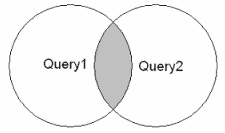
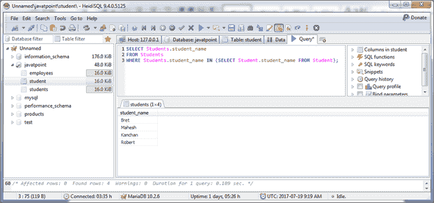
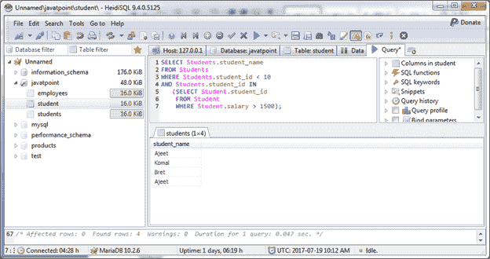

# MariaDB 相交运算符

> 原文：<https://www.javatpoint.com/mariadb-intersect-operator>

INTERSECT 运算符用于返回两个或多个表的交集。如果两个表中都存在一条记录，它将包含在 INTERSECT 结果中。否则，它将从 INTERSECT 结果中省略。

**语法:**

```
SELECT expression1, expression2, ... expression_n
FROM tables
[WHERE conditions]
INTERSECT
SELECT expression1, expression2, ... expression_n
FROM tables
[WHERE conditions];

```

**图像表示**



#### 注意:MariaDB 不支持 INTERSECT 运算符，但是通过使用 IN 运算符模拟 INTERSECT 查询，您可以看到同样的情况，如下所示:

* * *

## 使用交集运算符返回单个字段

以下是对 INTERSECT 运算符的一般查询，但不会在 MariaDB 中提供。

```
SELECT student_name
FROM Student
INTERSECT
SELECT student_name
FROM Students;

```

**使用以下一个:**

```
SELECT Students.student_name
FROM Students
WHERE Students.student_name IN (SELECT Student.student_name FROM Student);

```

输出:



它只显示“学生”和“学生”两个表之间的通用名称。

* * *

## 带 WHERE 子句的交集运算符

以下是对 INTERSECT 运算符的一般查询，但不会在 MariaDB 中提供。

```
SELECT student_name
FROM Student
INTERSECT
SELECT student_name
FROM Students, 
WHERE salary > 1500;

```

**使用以下语法:**

```
SELECT Students.student_name
FROM Students
WHERE Students.student_id < 10
AND Students.student_id IN
(SELECT Student.student_id
FROM Student
WHERE Student.salary > 1500);

```

输出:



#### 注意:您也可以在多个表达式中使用 INTERSECT 运算符。