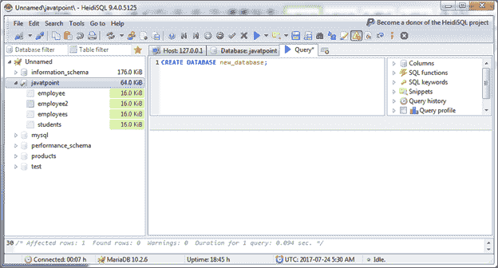
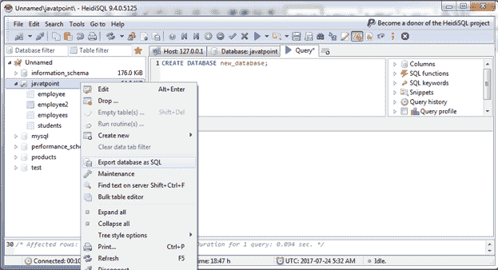
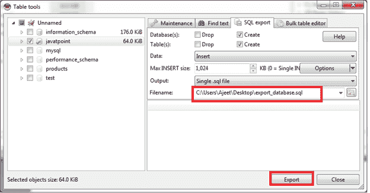
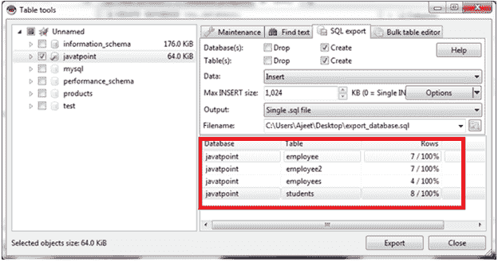
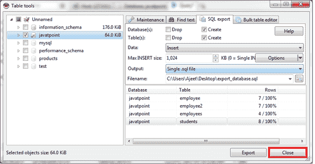
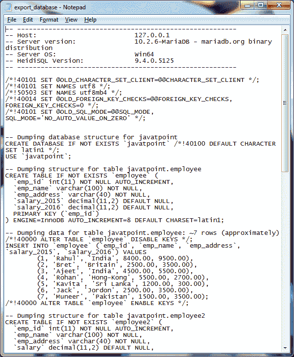

# MariaDB 导出

> 原文：<https://www.javatpoint.com/mariadb-export>

* * *

## 使用 HeidiSQL 导出一个 MariaDB 数据库

我们有一个名为“javatpoint”的数据库，里面有一些表。

右键单击左列中的数据库名称“javatpoint”，然后选择“将数据库导出为 SQL”:

当您单击“将数据库导出为 SQL”时，它将创建如下屏幕:

选择您要导出数据库的位置，并指定一个与上图类似的名称。现在点击导出按钮。

它将创建一个如下所示的屏幕:

数据库现已导出。现在点击关闭按钮关闭屏幕。

* * *

## 确认

检查您指定的位置，您将找到导出的数据库。

您可以看到所有数据都导出到新数据库中:

