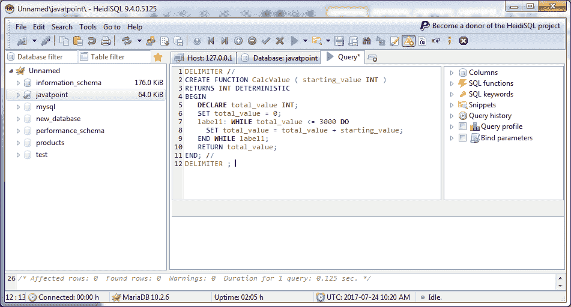
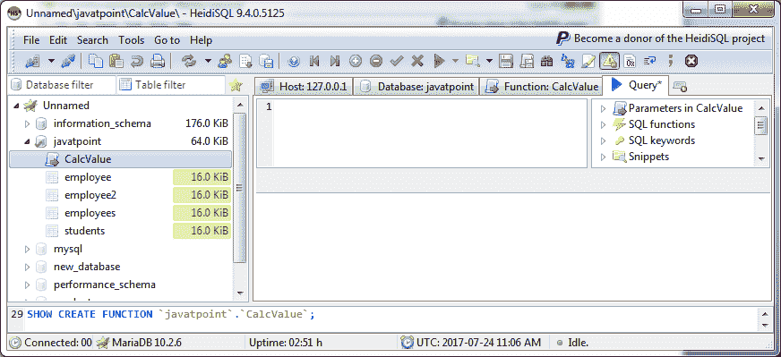
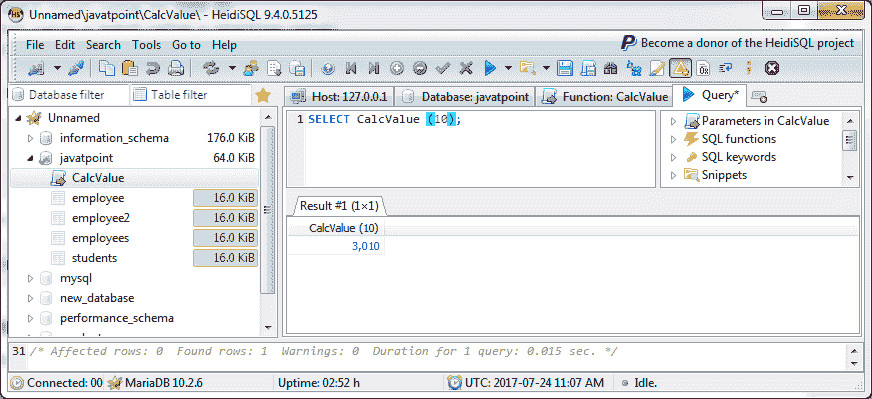
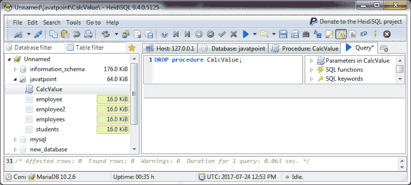
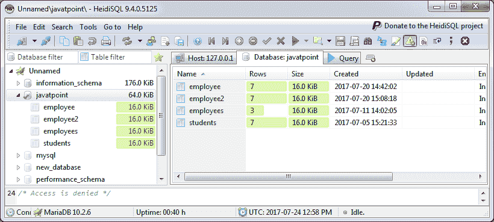

# 马里亚数据库函数

> 原文：<https://www.javatpoint.com/mariadb-function>

MariaDB 函数是一个存储的程序，用于将参数传递给它们并返回值。

我们可以在 MariaDB 中创建和删除函数。

* * *

## 马里亚数据库创建函数

您可以在 MariaDB 中创建自己的函数:

**语法:**

```
CREATE 
[ DEFINER = { CURRENT_USER | user_name } ] 
FUNCTION function_name [ (parameter datatype [, parameter datatype]) ]
RETURNS return_datatype [ LANGUAGE SQL
| DETERMINISTIC
| NOT DETERMINISTIC
| { CONTAINS SQL 
| NO SQL
| READS SQL DATA
| MODIFIES SQL DATA }
| SQL SECURITY { DEFINER | INVOKER }
| COMMENT 'comment_value'
BEGIN
   declaration_section
   executable_section
END; 

```

### 参数说明

**示例:**

在 MariaDB 数据库中创建一个函数 CalcValue。

```
DELIMITER //
CREATE FUNCTION CalcValue ( starting_value INT )
RETURNS INT DETERMINISTIC
BEGIN
   DECLARE total_value INT;
   SET total_value = 0;
   label1: WHILE total_value <= 3000 DO
     SET total_value = total_value + starting_value;
   END WHILE label1;
   RETURN total_value;
END; //
DELIMITER ; 

```

**DEFINER 子句:**是可选子句。如果未指定，定义者是创建函数的用户。如果您希望指定一个不同的定义者，您必须包含 definer 子句，其中 user_name 是函数的定义者。

**function_name:** 它指定要在 MariaDB 中分配给该函数的名称。

**return_datatype:** 指定函数返回值的数据类型。

**LANGUAGE SQL:** 它在语法上是为了移植性，但不会对函数产生影响。

**决定性的:**这意味着给定一组输入参数，函数将总是返回一个结果。

**不确定:**这意味着给定一组输入参数，函数可能会返回不同的结果。结果可能会受到表数据、随机数或服务器变量的影响。

**包含 SQL:** 默认。它是一个信息子句，告诉 MariaDB 函数包含 SQL，但是数据库并不验证这是真的。

**NO SQL:** 不使用且不会对函数产生影响的信息子句。

**READS SQL DATA:** 一个信息子句，告知 MariaDB 函数将使用 SELECT 语句读取数据，但不修改任何数据。

**修改 SQL 数据:**一个信息子句，告诉 MariaDB 该函数将使用 INSERT、UPDATE、DELETE 或其他 DDL 语句修改 SQL 数据。

**声明 _section:** 函数中声明局部变量的地方。

**可执行部分:**函数中输入函数代码的地方。



* * *

## 确认

您可以看到程序成功执行并创建了一个新函数。



现在，您可以引用新函数如下:



* * *

## 马里亚数据库删除功能

您可以很容易地从数据库中删除您创建的函数。

**语法:**

```
DROP FUNCTION [ IF EXISTS ] function_name; 

```

### 参数说明

**函数名:**指定要删除的函数的名称。

**示例:**

我们已经创建了一个函数名“CalcValue”。现在放弃这个功能。

```
DROP FUNCTION CalcValue; 

```



现在，您可以看到该函数已被删除，不再出现在列表中。

