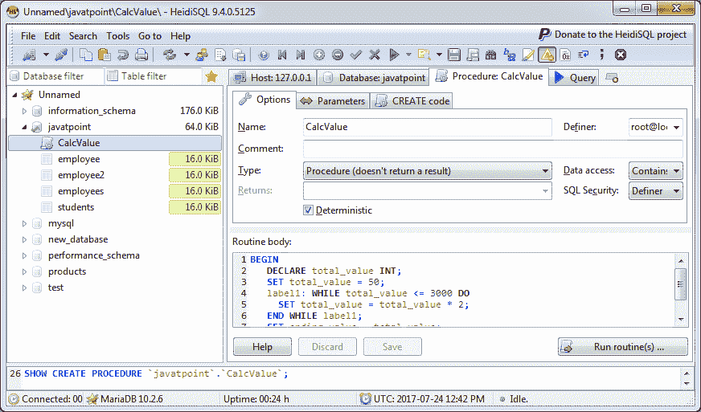
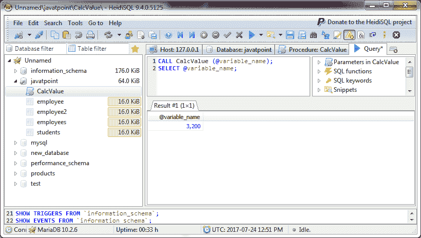
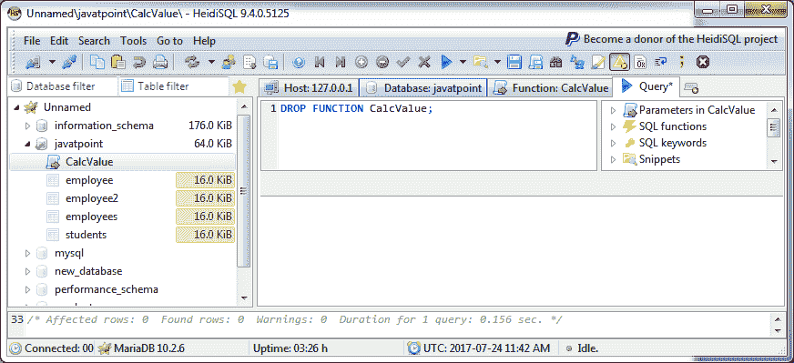
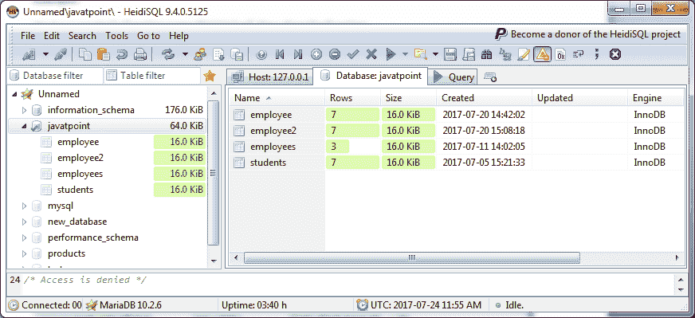

# 马里亚数据库程序

> 原文：<https://www.javatpoint.com/mariadb-procedure>

MariaDB 过程是一个存储程序，用于向其中传递参数。它不像函数那样返回值。

您可以像创建函数一样创建和删除过程。

* * *

## 创建过程

您可以像在 MariaDB 中创建函数一样创建过程。

**语法:**

```
CREATE 
[ DEFINER = { CURRENT_USER | user_name } ] 
PROCEDURE procedure_name 
[ (parameter datatype [, parameter datatype]) ]
[ LANGUAGE SQL
| DETERMINISTIC
| NOT DETERMINISTIC
| { CONTAINS SQL 
  | NO SQL
  | READS SQL DATA
  | MODIFIES SQL DATA }
| SQL SECURITY { DEFINER | INVOKER }
| COMMENT 'comment_value'
BEGIN
   declaration_section
   executable_section
END; 

```

### 参数说明

**DEFINER 子句:**可选。

**过程名:**在 MariaDB 中分配给该过程的名称。

**参数:**传递到程序中的一个或多个参数。创建过程时，可以声明三种类型的参数:

**IN:** 该参数可以被程序引用。过程不能覆盖参数的值。

**OUT:** 参数不能被过程引用，但参数的值可以被过程覆盖。

**输入输出:**参数可以被程序引用，参数值可以被程序覆盖。

**LANGUAGE SQL:** 它在语法上是为了移植性，但不会对函数产生影响。

**决定性的:**这意味着给定一组输入参数，函数将总是返回一个结果。

**不确定:**这意味着给定一组输入参数，函数可能会返回不同的结果。结果可能会受到表数据、随机数或服务器变量的影响。

**包含 SQL:** 默认。它是一个信息子句，告诉 MariaDB 函数包含 SQL，但是数据库并不验证这是真的。

**NO SQL:** 是不使用的信息子句，不会对函数产生影响。

**READS SQL DATA:** 它是一个信息子句，告诉 MariaDB 函数将使用 SELECT 语句读取数据，但不修改任何数据。

**modified SQL DATA:**这是一个信息子句，告诉 MariaDB 该函数将使用 INSERT、UPDATE、DELETE 或其他 DDL 语句修改 SQL 数据。

**声明 _ 节:**过程中声明局部变量的地方。

**可执行部分:**程序中输入程序代码的地方。

**示例:**

在 MariaDB 数据库中创建一个名为“CalcValue”的过程。

```
DELIMITER //
CREATE procedure CalcValue ( OUT ending_value INT )
DETERMINISTIC
BEGIN
   DECLARE total_value INT;
   SET total_value = 50;
   label1: WHILE total_value <= 3000 DO
     SET total_value = total_value * 2;
   END WHILE label1;
   SET ending_value = total_value;
END; //
DELIMITER ; 

```


* * *

## 验证程序

现在，您可以看到创建了名为“CalcValue”的过程。



您可以参考以下新程序:



* * *

## 马里亚数据库删除程序

您可以使用以下命令删除过程:

**语法:**

```
DROP procedure [ IF EXISTS ] procedure_name; 

```

**参数说明:**

**过程名:**指定要删除的过程名。

**示例:**

```
DROP procedure CalcValue; 

```



您可以看到该过程现在已被删除，并且在列表中不可用。

