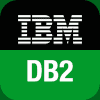

# DB2 教程

> 原文：<https://www.javatpoint.com/db2-tutorial>

DB2 教程提供了 DB2 的基本和高级概念。我们的 DB2 教程是为初学者和专业人士设计的。

DB2 是由 IBM 开发的数据库服务器。它是一个关系数据库管理系统，旨在高效地存储、分析和检索数据。

我们的 DB2 教程包括 DB2 的所有主题，例如 DB2 教程附带 DB2 教程，什么是 DB2，安装 DB2，DB2 实例，DB2 数据库，创建数据库，激活数据库，停用数据库，连接到数据库，验证数据库，配置数据库管理器，删除数据库，DB2 缓冲池，删除缓冲池，DB2 表，创建表，列表表，在表中插入数据，DB2 别名，DB2 约束，DB2 索引，DB2 触发器，DB2 序列，DB2 视图等。

* * *

## DB2 索引

**DB2 教程**

*   [DB2 教程](db2-tutorial)
*   [什么是 DB2](what-is-db2)
*   [安装 DB2](install-db2)
*   [DB2 特性](db2-features)
*   [DB2 实例](db2-instances)

**DB2 数据库**

*   [DB2 创建数据库](db2-create-database)
*   [DB2 激活数据库](db2-activate-database)
*   [DB2 停用数据库](db2-deactivate-database)
*   [DB2 连接到数据库](db2-connect-to-database)
*   [DB2 验证数据库](db2-verify-database)
*   [DB2 检查数据库权限](db2-check-database-authority)
*   [DB2 删除数据库](db2-drop-database)

DB2 缓冲池

*   DB2 缓冲池
*   [DB2 创建缓冲池](db2-create-bufferpool)
*   [DB2 验证缓冲池](db2-verify-bufferpool)
*   DB2 drop buffer pool
*   [DB2 表空间](db2-tablespaces)
*   DB2 模式
*   [DB2 数据类型](db2-data-types)

**DB2 RazorSQL 工具**

*   [RazorSQL GUI](db2-razorsql-gui)
*   [功能](db2-razorsql-functionalities)
*   [查看内容](db2-razorsql-view-contents)
*   [查看内容](db2-razorsql-view-contents-fetch-all-rows)
*   [查看内容限制](db2-razorsql-view-contents-limit-result)
*   编辑
*   [描述](db2-razorsql-describe)
*   [表关系](db2-razorsql-table-relationships)
*   [搜索](db2-razorsql-search)
*   [复制](db2-razorsql-copy)
*   [复制到另一个数据库](db2-razorsql-copy-to-another-database)
*   [复制到本地数据库](db2-razorsql-copy-to-local-database)
*   [备份](db2-razorsql-backup)
*   [显示信息](db2-razorsql-show-info)
*   [行数](db2-razorsql-row-count)
*   [生成 SQL](db2-razorsql-generate-sql)
*   [生成 DDL](db2-razorsql-generate-ddl)
*   [数据库转换](db2-razorsql-database-conversion)
*   [创建表格](db2-razorsql-create-table)
*   [创建视图](db2-razorsql-create-view)
*   [创建索引](db2-razorsql-create-index)
*   年龄
*   [下降](db2-razorsql-drop)
*   [放下表格](db2-razorsql-drop-tables)
*   [导出数据](db2-razorsql-export-data)
*   [导入数据](db2-razorsql-import-data)
*   [导出表格](db2-razorsql-export-tables)
*   [查询生成器](db2-razorsql-query-builder)
*   [比较工具](db2-razorsql-compare-tool)

**面试问题**

*   [DB2 面试](db2-interview-questions)

* * *

## 先决条件

在学习 DB2 之前，您必须具备用于拥有 DB2 表的 SQL、COBOL 和 JCL 语言的基本知识。

## 观众

我们的 DB2 教程旨在帮助初学者和专业人士。

## 问题

我们保证您在这个 DB2 教程中不会发现任何问题。但是如果有任何错误，请在联系表格中发布问题。