# 安装 DB2

> 原文：<https://www.javatpoint.com/install-db2>

下载 DB2 服务器试用版或从[www.ibm.com](www.ibm.com)购买产品许可证在这里，您可以看到两个独立的 DB2 服务器可供下载:

*   32 位 Linux 或 Unix 的 DB2 服务器
*   64 位 Linux 或 Unix 的 DB2 服务器

您可以根据您的操作系统的适应性下载其中任何一个。

## 硬件要求

*   **处理器:**最小核心 2 度
*   **Ram:** 最低 1GB
*   **硬盘:**最低 30GB

## 软件要求

在安装 DB2 服务器之前，您的系统需要准备好所需的软件。对于 Linux，您需要在安装 DB2 服务器之前安装“libstdc++6.0”。

## 检查系统兼容性

在安装 DB2 服务器之前，验证您的系统是否与 DB2 服务器兼容。

使用命令控制台上的以下命令“db2prereqcheck”检查系统兼容性。

# 在 Linux 上安装 DB2

### 首先从[www.ibm.com](www.ibm.com)下载 DB2。

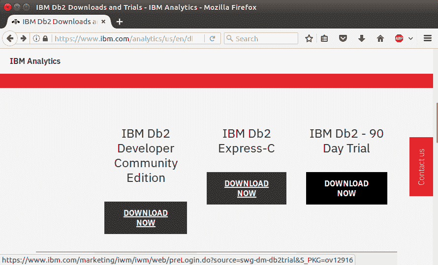

### 根据您的操作系统选择版本

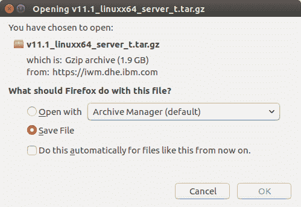

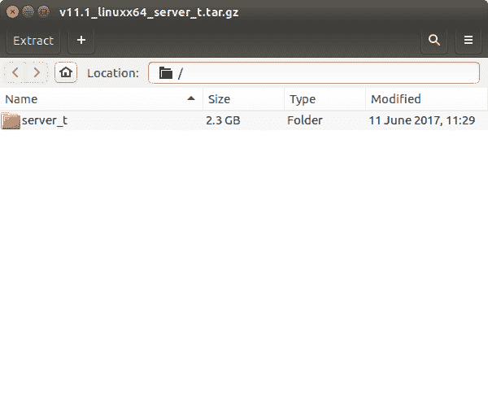

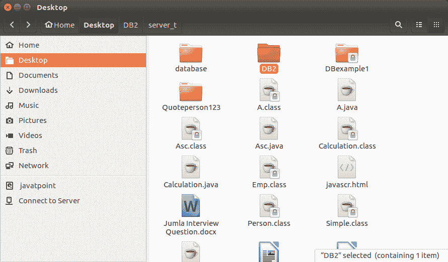

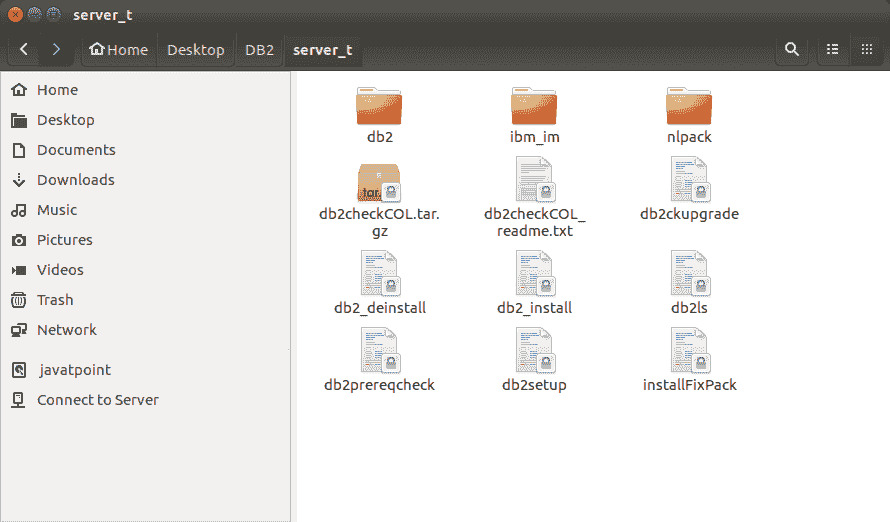

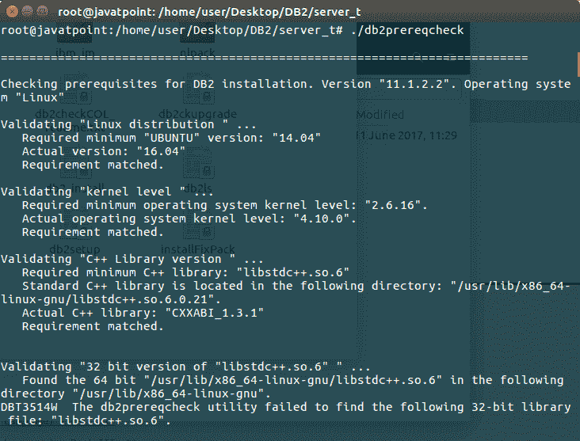

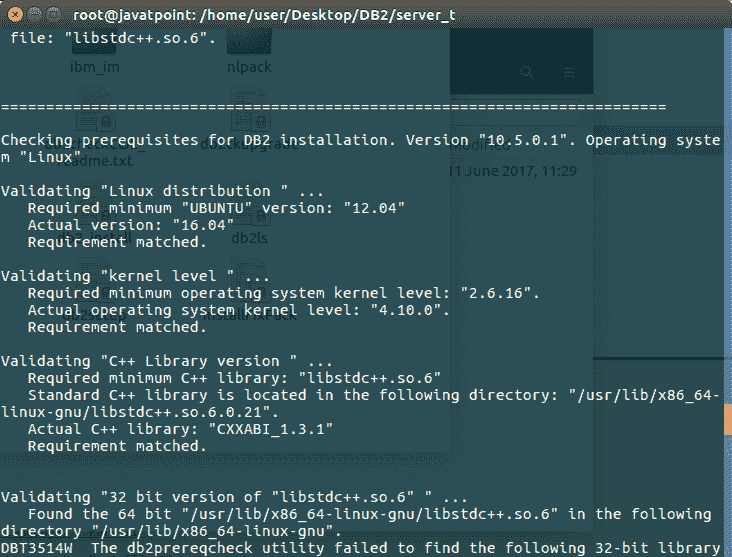

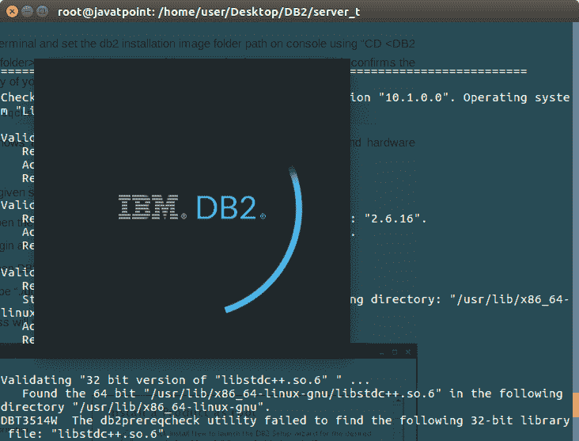

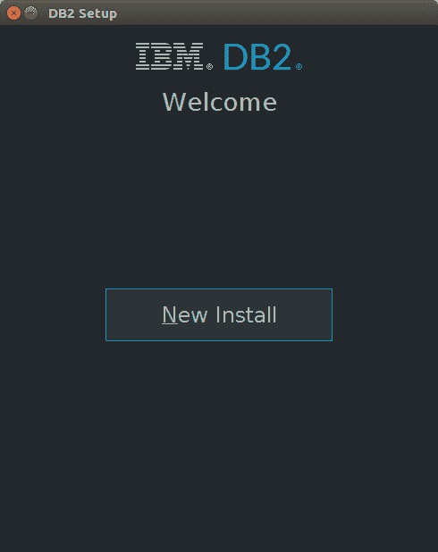

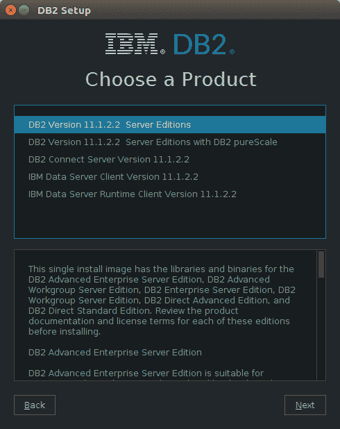

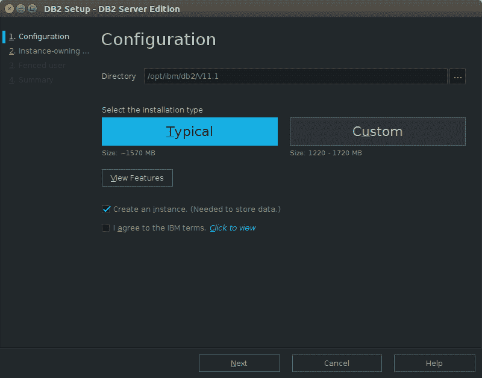

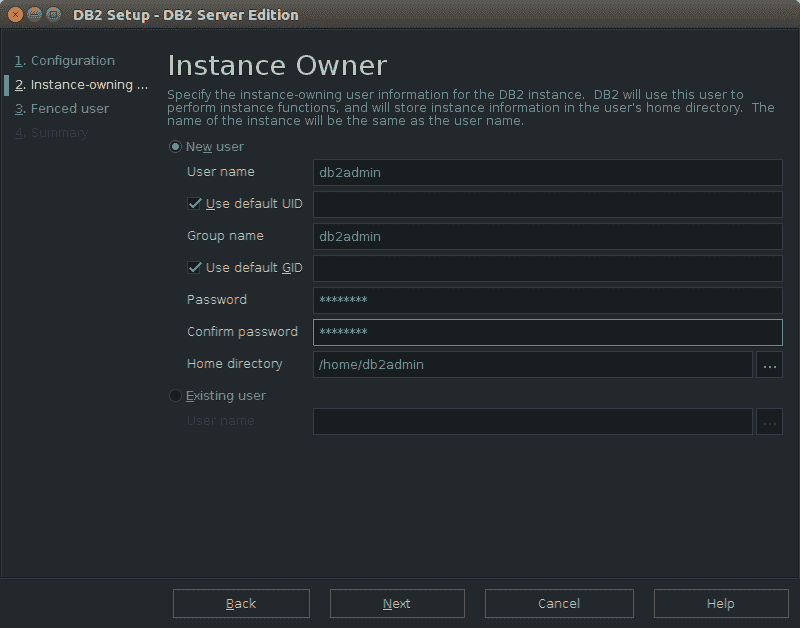

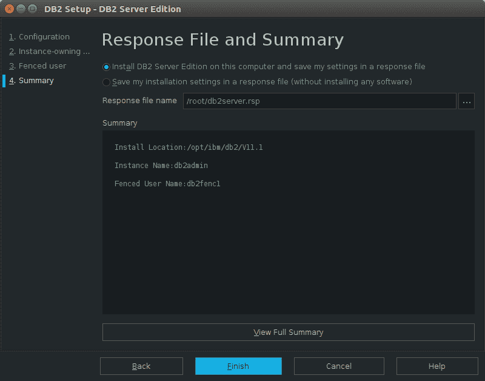

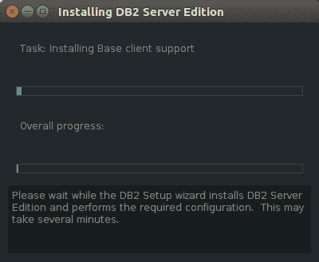

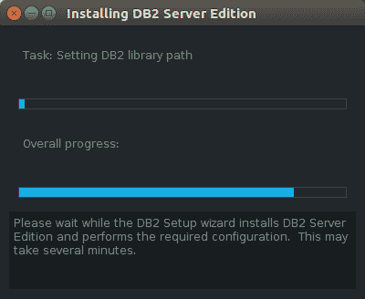

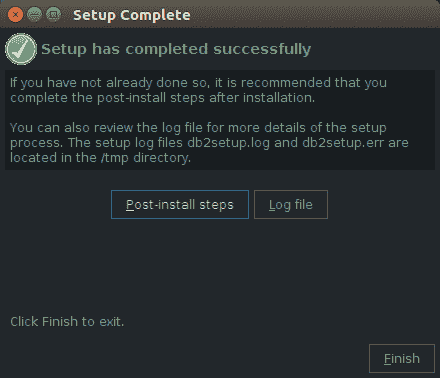

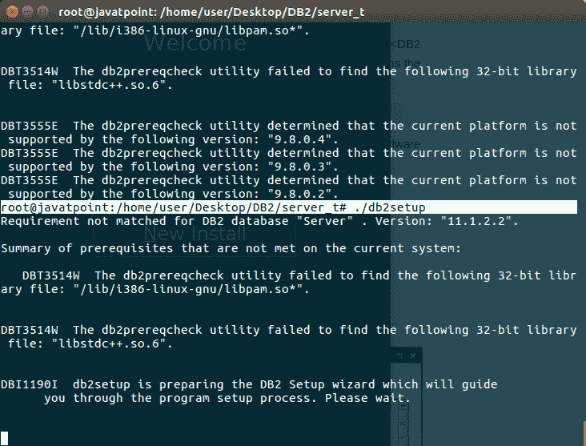

# 验证 DB2 安装

您可以使用命令来验证 DB2 服务器的安装。完成 DB2 服务器安装后，从当前用户模式注销并登录到“db2admin”用户。(安装时创建的用户)。在“db2admin”用户环境中，您可以打开 terminal 并执行以下命令来验证您的 db2 产品是否安装正确。

```
db2level 

```

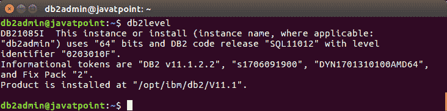