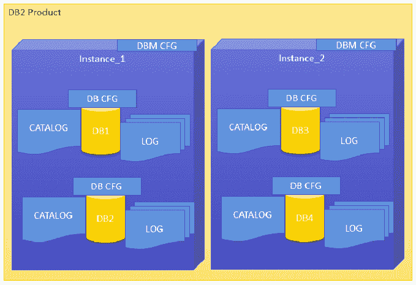
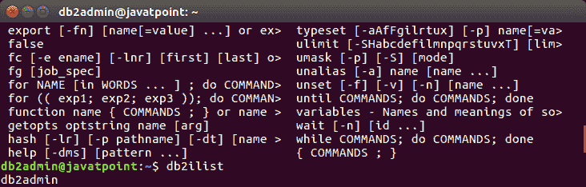
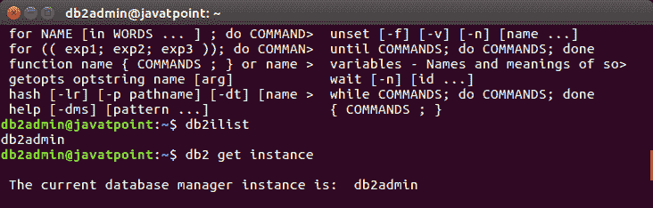
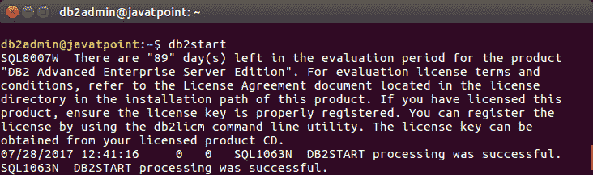
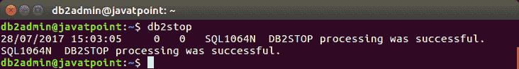
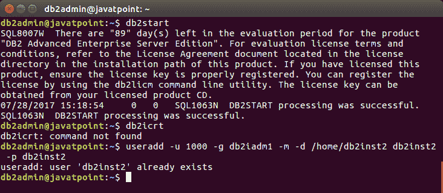
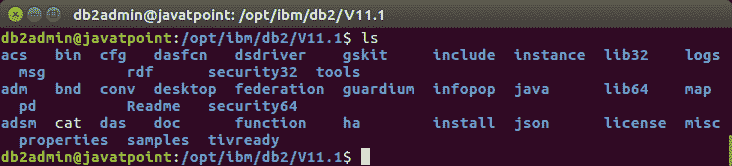
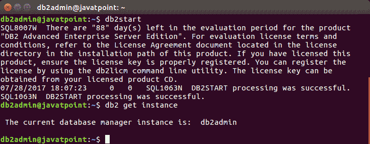
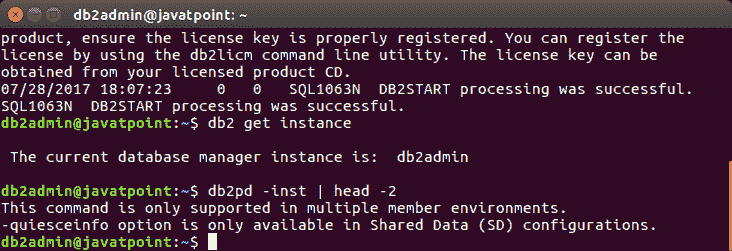
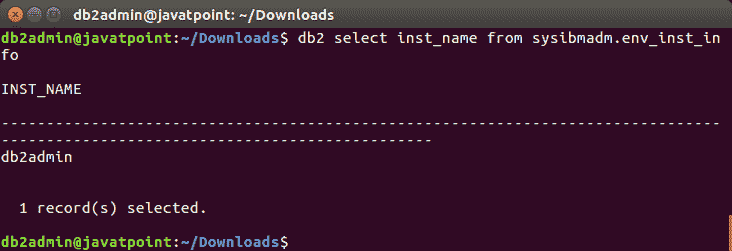

# DB2 实例

> 原文：<https://www.javatpoint.com/db2-instances>

DB2 实例是 DB2 的逻辑数据库管理器环境。它用于管理数据库。您可以根据自己的需求创建多个实例。

#### 实例目录包含:

*   数据库管理器配置文件
*   系统数据库目录
*   节点目录
*   节点配置文件
*   调试文件、转储文件

DB2 数据库服务器的默认实例是“DB2”。创建实例目录后，不能更改其位置。一个实例可以管理多个数据库。在一个实例中，每个数据库都有一个唯一的名称、它自己的一组目录表、配置文件、权限和特权。

# DB2 产品中的实例架构



#### 注意:您可以在 Linux、UNIX 和 Windows 上的一个 DB2 服务器中创建多个实例。您也可以在一台物理机上安装多个 DB2 服务器。

# 在 Linux 上创建实例

如果 DB2 服务器作为根用户安装，那么您可以在 Linux 和 UNIX 上创建多个实例。一个实例可以在 Linux 和 UNIX 上同时独立运行。您可以一次在数据库管理器的单个实例中工作。

实例文件夹包含数据库配置文件和文件夹。实例目录根据操作系统版本存储在 Windows 上的不同位置。

# 如何列出实例

**db 2 list**命令用于列出系统上所有可用的实例。

**语法:**

```sql

db2ilist  

```

**例如:**



# 实例环境命令

## 要获取实例:

**db2 get instance 命令**用于查看当前正在运行的实例的详细信息。

**语法:**

```sql

db2 get instance

```



## 要设置实例:

如果您想要启动或停止 DB2 UDB 上的一个实例的数据库管理器，将对当前实例执行以下命令。

**语法:**

```sql

set db2instance=<instance_name>

```

**例如:**给当前用户安排“db2admin”环境:

```sql

set db2instance=db2admin

```

## 启动 DB2 服务器

**db2start** 命令用于启动一个实例。在此之前，您需要运行“set instance”。

**语法:**

```sql

db2start

```



## 停止 DB2 服务器

**db2stop** 命令用于停止正在运行的实例。

**语法:**

```sql

db2stop  

```



## 创建实例

```sql

db2icrt

```

要创建新实例，您必须以 root 用户身份登录。实例 id 不是根 id 或根名称。按照以下步骤创建新实例。

**语法:**

```sql

useradd -u <ID> -g <group name> -m -d <user location> <user name>
-p <password>  

```

**例如**

在组“db2iadm1”中创建名为“db2inst2”且密码为“db2inst2”的实例的用户



可以看到 db2inst2 已经存在。你可以看到

步骤 2:转到 root 用户中的 DB2 实例目录，创建新实例。

**地点:**

```sql

cd /opt/ibm/db2/v10.1/instance  

```



## 更新实例

**db 2 updt**命令用于更新同一版本发行版内的现有实例。

在执行此命令之前，您需要使用“db2stop”命令停止实例数据库管理器。

“inst_name”下面的语法表示以前发布或安装的 db2 服务器实例名，您希望将其更新到较新的发布或安装的 db2 服务器版本。

**语法 1:(在正常模式下更新实例)**

```sql

db2iupdt  
```

**语法 2:(在调试模式下更新实例)**

```sql

db2iupdt -D  
```

## 实例使用的其他命令

命令找出我们现在正在处理的 DB2 实例。

**语法 1:【检查数据库管理器激活的当前实例】**

```sql

db2 get instance  

```

**输出:**



**语法 2:【查看带有操作位和发布版本的当前实例】**

```sql

db2pd -inst | head -2  

```

**示例:**

```sql

db2pd -inst | head -2  

```



**语法 3:【检查当前工作实例的名称】**

```sql

db2 select inst_name from sysibmadm.env_inst_info  

```

**示例:**

```sql

db2 select inst_name from sysibmadm.env_inst_info  

```

**输出:**

