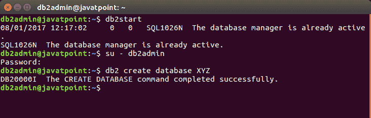

# DB2 创建数据库

> 原文：<https://www.javatpoint.com/db2-create-database>

CREATE DATABASE 命令用于在实例中创建数据库。所有数据库都是使用默认存储组“IBMSTOGROUP”创建的，该组是在创建实例时创建的。

在 DB2 中，所有的数据库表都存储在“表空间”中，它们使用各自的存储组。

* * *

## 创建非限制性数据库

**db2 创建数据库**命令用于创建非限制性数据库。

**语法:**

```sql

db2 create database  
```

**示例:**

```sql

let's create a database named "XYZ"

```

安装后，您必须切换到该用户，才能拥有创建新数据库的权限。根据您安装的版本，该用户名可能会更改。但是默认情况下，DB2 使用 db2inst1 作为管理员用户。

请查看您的/home 目录。您将看到一个新用户(很可能是 db2inst1)。然后用以下命令切换到该用户:

```sql

su - db2inst1

```

然后发出:

```sql

db2 CREATE DATABASE XYZ

```



* * *

## 创建限制性数据库

可以使用以下命令创建限制性数据库:

```sql

db2 create database restrictive 
```

让我们创建一个名为“XYZ2”的限制性数据库

