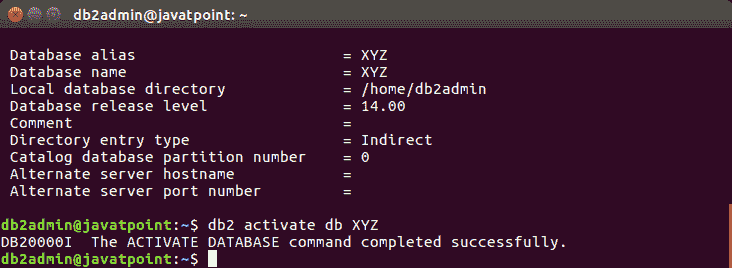

# 激活数据库

> 原文：<https://www.javatpoint.com/db2-activate-database>

“激活数据库”命令用于激活您曾经创建的数据库。它使数据库对应用程序可用。

**语法:**

```sql

db2 activate db  
```

这里，db_name 指定数据库的名称。

**示例:**

让我们激活数据库“XYZ”:

```sql

db2 activate db XYZ

```

