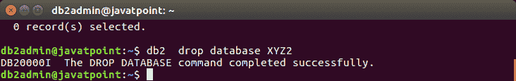
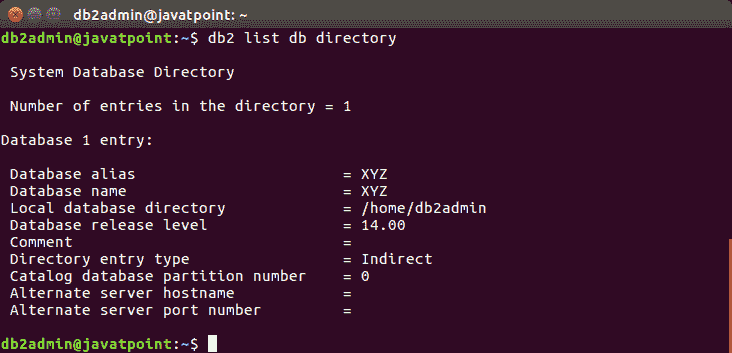

# 删除数据库

> 原文：<https://www.javatpoint.com/db2-drop-database>

drop database 命令用于从即时数据库目录中删除数据库。它将删除所有对象、表、空间、容器和相关文件。

**语法:**

```

db2 drop database  
```

在这里，db_name 指定要删除的数据库的名称。

**示例:**

让我们从实例中删除数据库名“XYZ2”。

使用以下命令:

```

db2  drop database XYZ2

```

输出:



您可以看到，现在使用以下命令删除了数据库 XYZ2:

```

db2 list db directory

```

输出:

