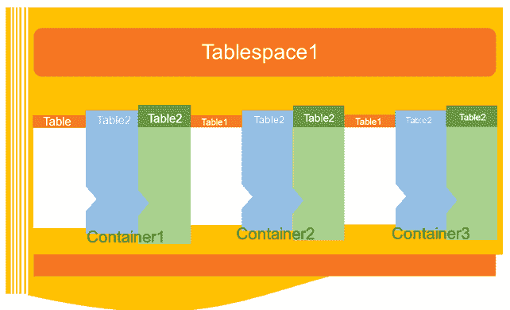

# DB2 表空间

> 原文：<https://www.javatpoint.com/db2-tablespaces>

DB2 表空间是包含表、索引、大对象和长数据的存储结构。它可用于将数据库中的数据组织到逻辑存储组中，逻辑存储组与数据在系统中的存储位置相关。

表空间存储在数据库分区组中。

* * *

## 数据库中表空间的优势

表空间提供了各种优势:

**可恢复性:**表空间使备份和恢复操作更加方便。使用单个命令，您可以备份或恢复表空间中的所有数据库对象。

**自动存储管理:**数据库管理器根据需要创建和扩展容器。

**内存利用率:**单个缓冲池可以管理多个表空间。您可以将临时表空间分配给它们自己的缓冲池，以提高排序或连接等活动的性能。

## 容器

表空间由一个或多个容器组成。容器可以是目录名、设备名或文件名。

在数据库中，一个表空间可以在同一个物理存储设备上有几个容器。如果使用自动存储表空间选项创建表空间，容器的创建和管理将由数据库管理器自动处理。如果它不是使用自动存储表空间选项创建的，您需要自己定义和管理容器。

## 默认表空间

创建新数据库时，数据库管理器会为数据库创建一些默认表空间。这些表空间用作用户和临时数据的存储。每个数据库必须包含至少三个表空间，如下所示:

*   目录表空间
*   用户表空间
*   临时表空间

**目录表空间:**它包含数据库的系统目录表。它被命名为 SYSCATSPACE，不能删除。

**用户表空间:**该表空间包含用户定义的表。在数据库中，我们有一个默认的用户表空间，名为 USERSPACE1。如果在创建表时没有为表指定用户定义的表空间，则数据库管理器会为您选择默认的用户表空间。

**临时表空间:**临时表空间包含临时表数据。该表空间包含系统临时表空间或用户临时表空间。

系统临时表空间保存数据库管理器在执行排序或联接等操作时所需的临时数据。一个数据库必须至少有一个系统临时表空间，并且它被命名为 TEMPSPACE1。它是在创建数据库时创建的。用户临时表空间保存表中的临时数据。它是用声明全局临时表或创建全局临时表语句创建的。默认情况下，在创建数据库时不会创建该临时表空间。

**表空间和存储管理:**

表空间可以以不同的方式设置，具体取决于您想要如何使用它们。您可以设置操作系统来管理表空间分配，您可以让数据库管理器分配空间，或者您可以为数据选择自动分配表空间。

**以下三种类型的托管空间可用:**

**系统管理空间(SMS):** 操作系统的文件系统管理器分配和管理存储表的空间。存储空间按需分配。该模型由表示数据库对象的文件组成。对于用户定义的表空间，此表空间类型在 10.1 版中已被弃用，对于目录表空间和临时表空间，它未被弃用。

**数据库管理空间(DMS):** 数据库服务器控制存储空间。存储空间是根据创建 DMS 表空间时指定的容器定义在文件系统上预先分配的。对于用户定义的表空间，10.1 版修复包 1 不推荐使用它，但是对于系统表空间和临时表空间，不推荐使用它。

**自动存储表空间:**可以自动管理数据库服务器。数据库服务器根据数据库上的数据创建和扩展容器。使用自动存储管理，不需要提供容器定义。数据库服务器负责创建和扩展容器，以利用分配给数据库的存储。如果向存储组添加存储空间，当现有容器达到其最大容量时，会自动创建新容器。如果您想立即使用新添加的存储，可以重新平衡表空间。

**页面、表和表空间大小:**

临时 DMS 和自动存储表空间，您为数据库选择的页面大小决定了表空间大小的最大限制。对于表短信和临时自动存储表空间，页面大小限制了表本身的大小。页面大小可以是 4kb、8kb、16kb 或 32kb。