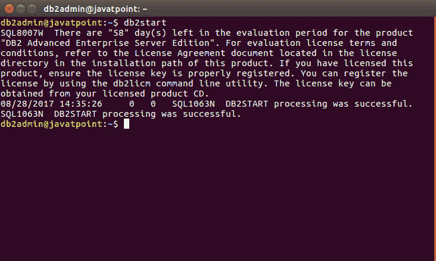
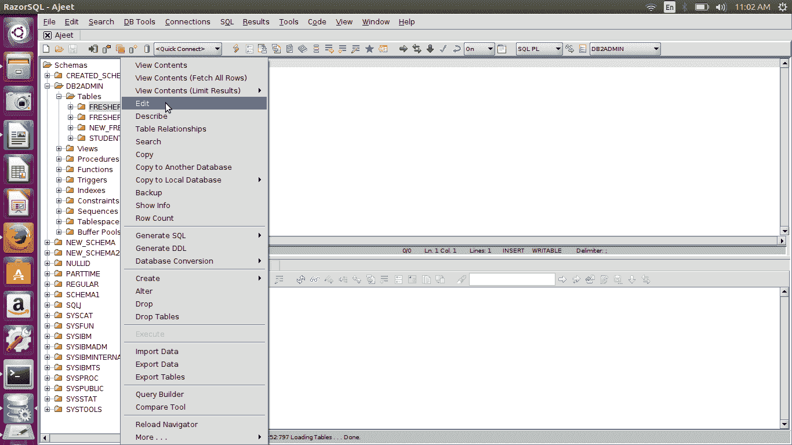
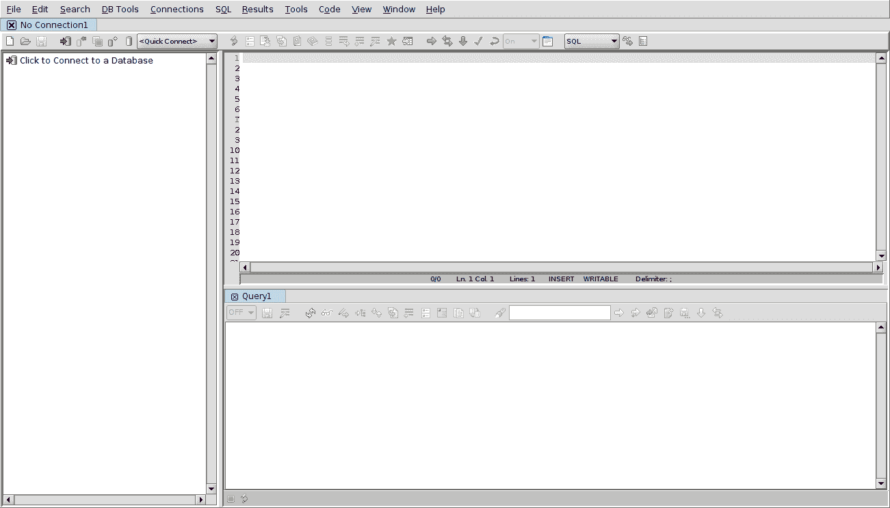
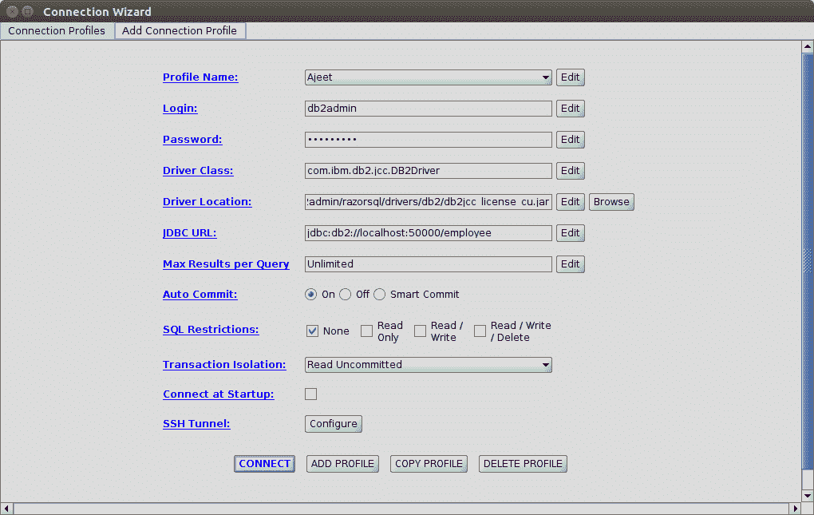
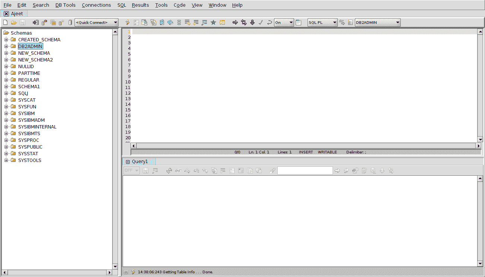
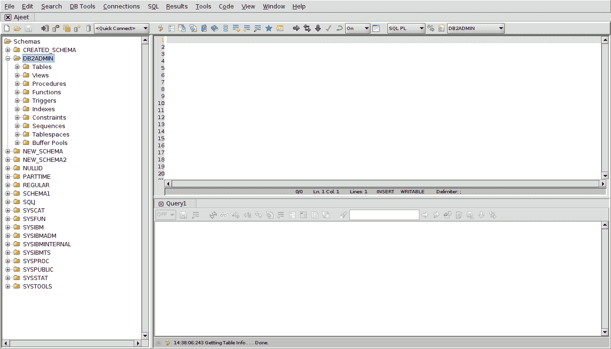
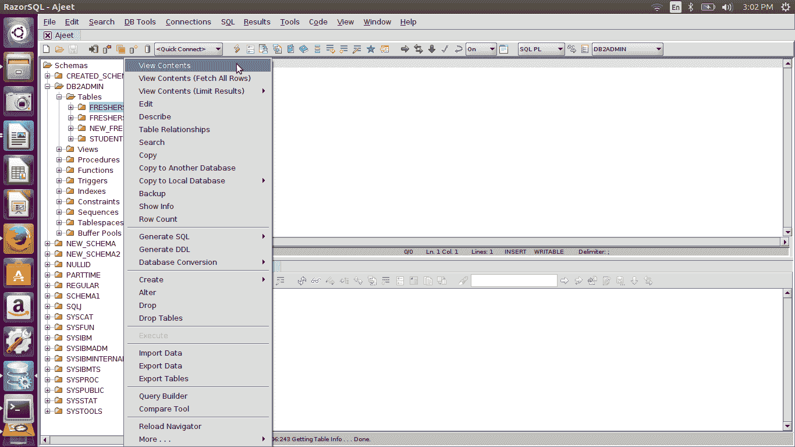

# DB2 RazorSQL 图形用户界面

> 原文：<https://www.javatpoint.com/db2-razorsql-gui>

DB2 在命令行使用起来有点复杂。你可以通过下载 RazorSQL 来使用它。

* * *

## 什么是 RazorSQL

RazorSQL 是一个 SQL 查询工具、数据库浏览器、SQL 编辑器和数据库管理工具，适用于 Windows、Mac OS X、Mac OS、Linux 和 Solaris。这是一个十字架

## 如何使用 DB2 RazorSQL 图形用户界面

从其官网下载 RazorSQL:[https://razorsql.com/](https://razorsql.com/)安装。它是运行许多数据库的非常有用的工具。DB2 就是其中之一。

现在按照以下说明操作:

首先打开命令提示符，运行 db2start 命令启动数据库。

然后打开 RazorSQL 工具。

  

根据您安装的 DB2 工具填写所有条目，然后单击连接。

您现在已连接。

现在点击 DB2admin 并浏览你创建的所有表、视图、函数等。

现在你可以做所有的操作了。

