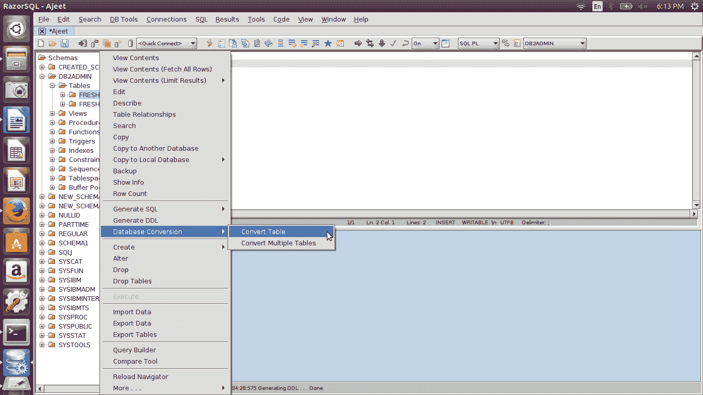
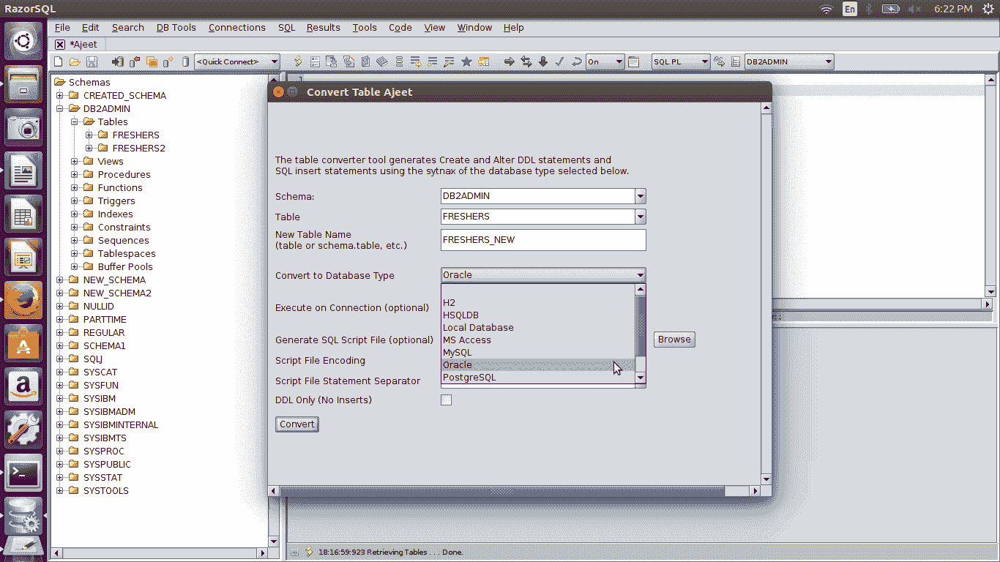
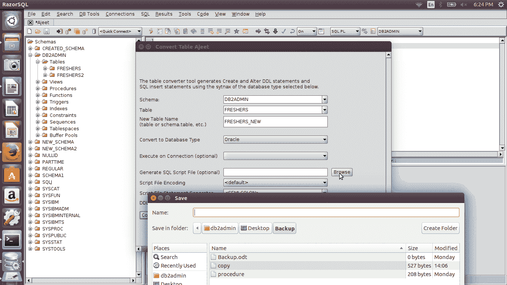
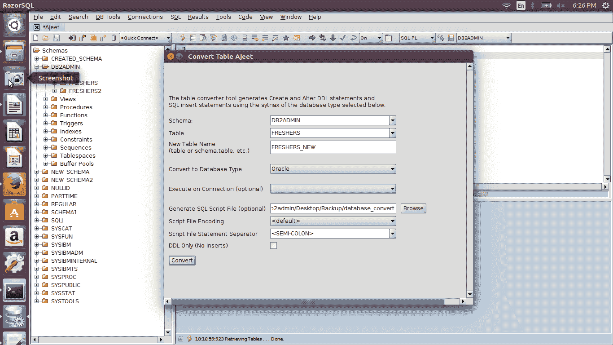
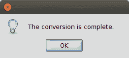
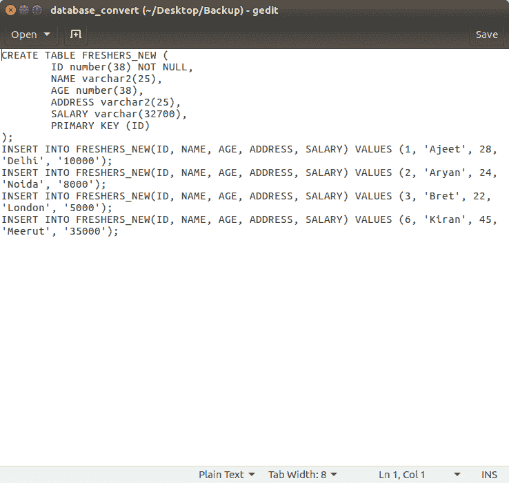

# DB2 剃刀数据库转换

> 原文：<https://www.javatpoint.com/db2-razorsql-database-conversion>

数据库转换用于以其他格式更改数据库。

**例如:**可以在 H2、MS Access、MySQL、Oracle、PostgreSQL 等中更改 DB2 数据库表。您可以更改单个表以及多个表。

**见下图:**

让我们在 Oracle 表中更改 DB2 表“更新器”。

现在设置一个输出文件进行转换。

现在，您可以看到转换后的表格。

