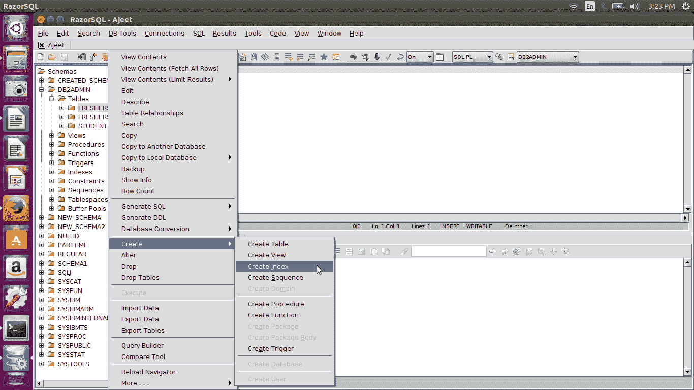
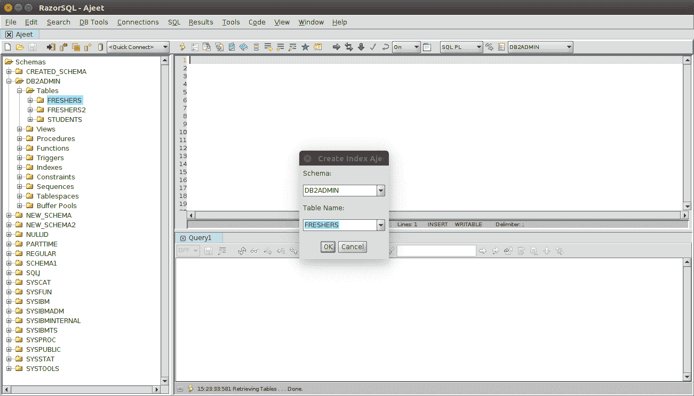
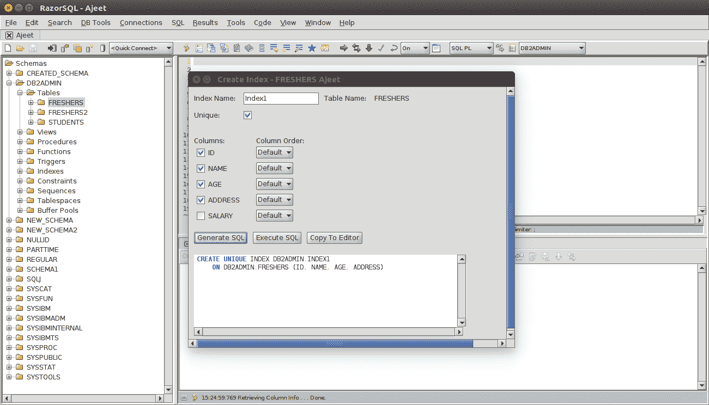
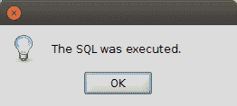
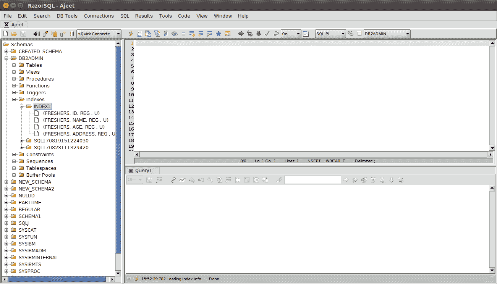

# DB2 剃刀 SQL 创建索引

> 原文：<https://www.javatpoint.com/db2-razorsql-create-index>

创建索引用于为表创建索引。索引是一组指针，这些指针指向 MDC 或 ITC 表中的表块中的行、XML 存储对象中的 XML 数据，这些数据按照一个或多个键的值进行逻辑排序。索引用于提高查询数据的速度，并有效地对数据进行群集和分区。

索引可以提高视图操作的性能。具有唯一索引的表可以包含具有唯一键的行。

您可以根据表的要求创建不同类型的索引。

**指标类型**

*   唯一和非唯一索引
*   聚集索引和非聚集索引

点击创建索引，它会创建这样一条消息:

现在输入一个索引名，选择列，然后点击生成 SQL。

现在执行查询:

屏幕上将出现一条消息，提示成功完成。

您可以检查创建索引:

创建过程已经完成。