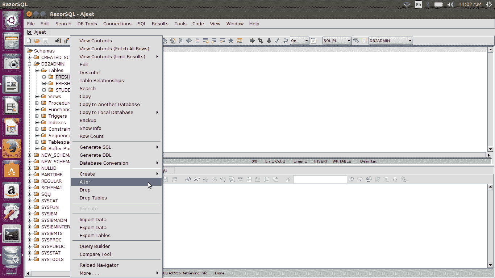
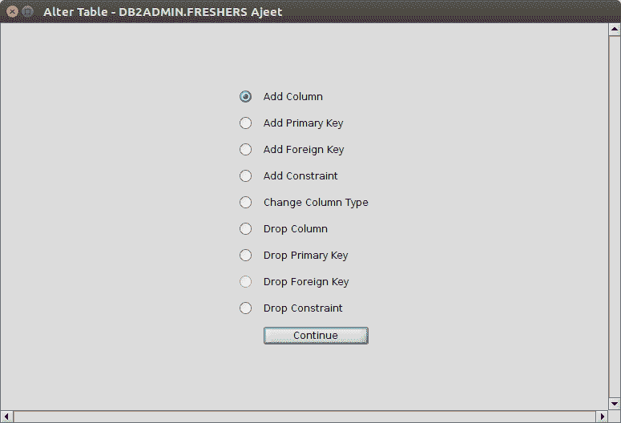
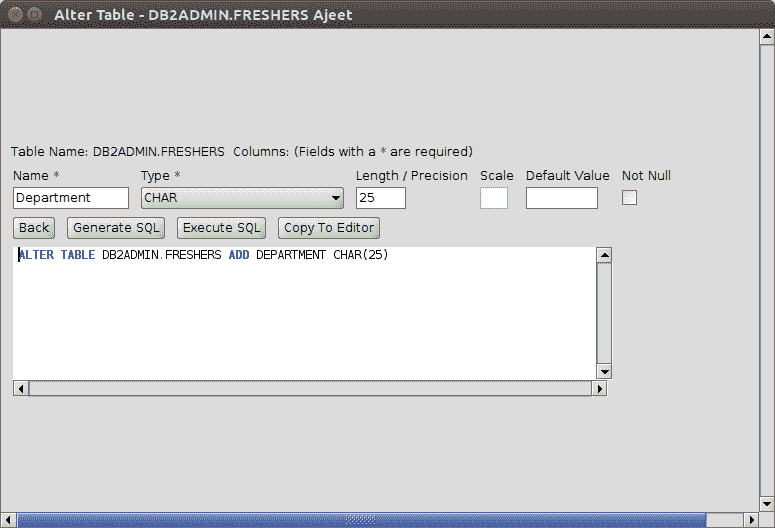
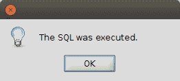
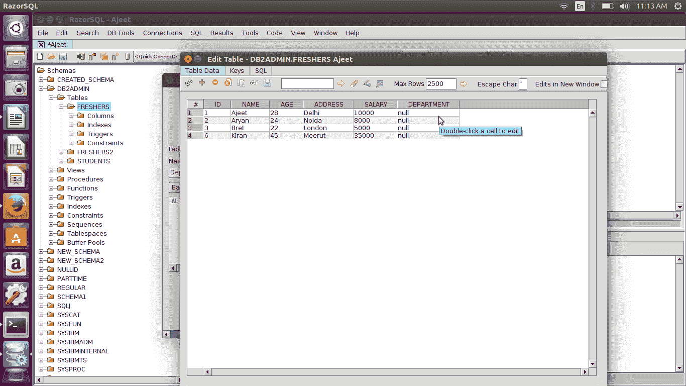

# DB2 RazorSQL Alter

> 原文：<https://www.javatpoint.com/db2-razorsql-alter>

Alter 命令用于对表进行更改。

**例如:**

*   添加新列
*   添加主键
*   添加外键
*   添加约束
*   更改列的类型
*   拖放列
*   删除主键
*   删除外键
*   删除约束

让我们在“新生”表中添加一个新列“部门”

您可以看到表格被更改，并添加了一个新列“部门”。

同样，您可以添加主键

*   添加外键
*   添加约束
*   更改列的类型
*   拖放列
*   删除主键
*   删除外键
*   删除约束