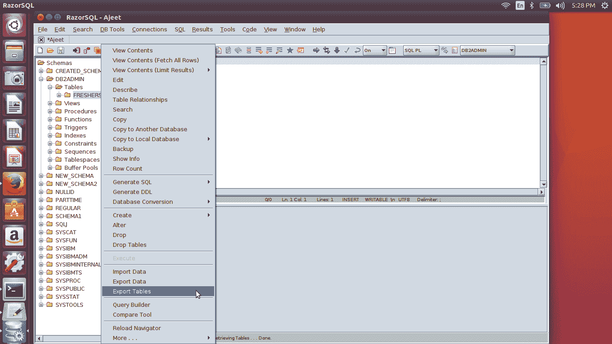
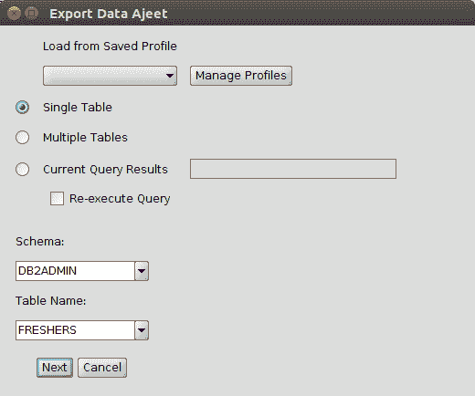
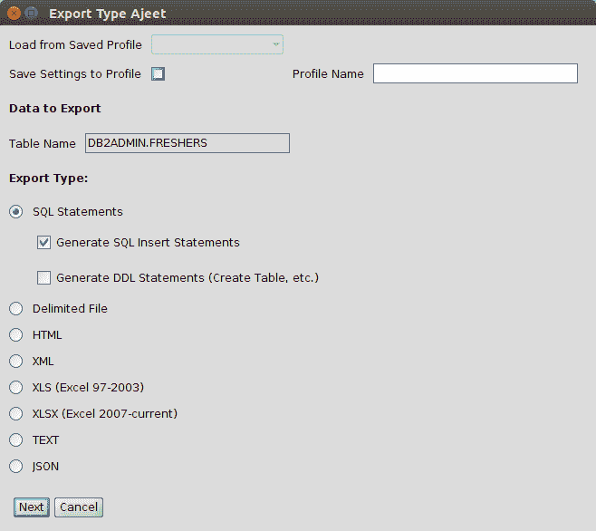
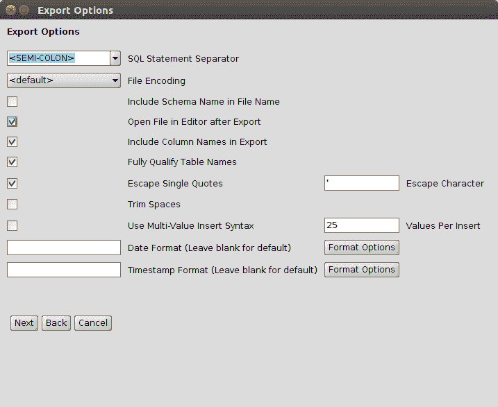
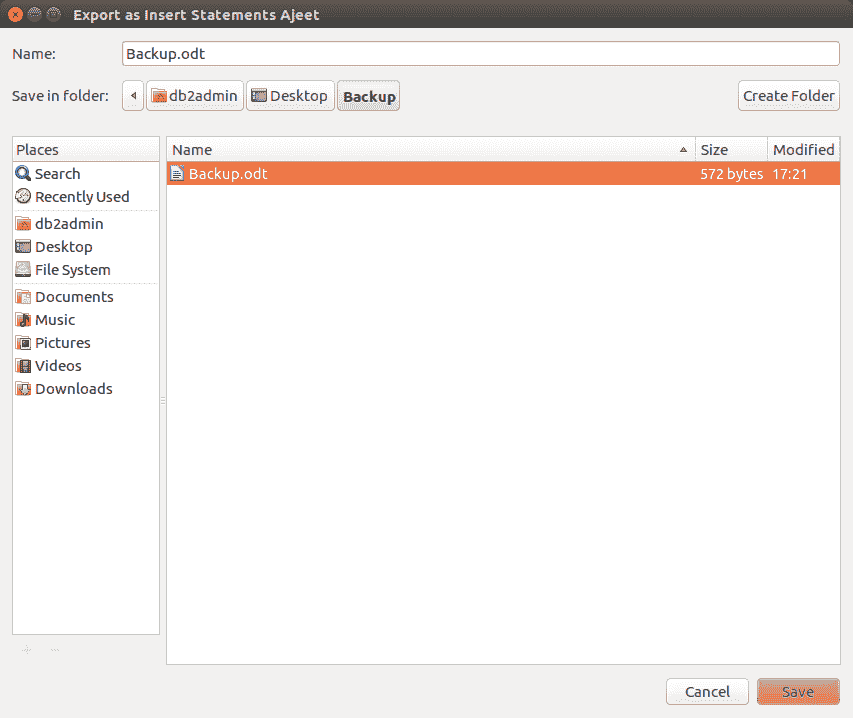
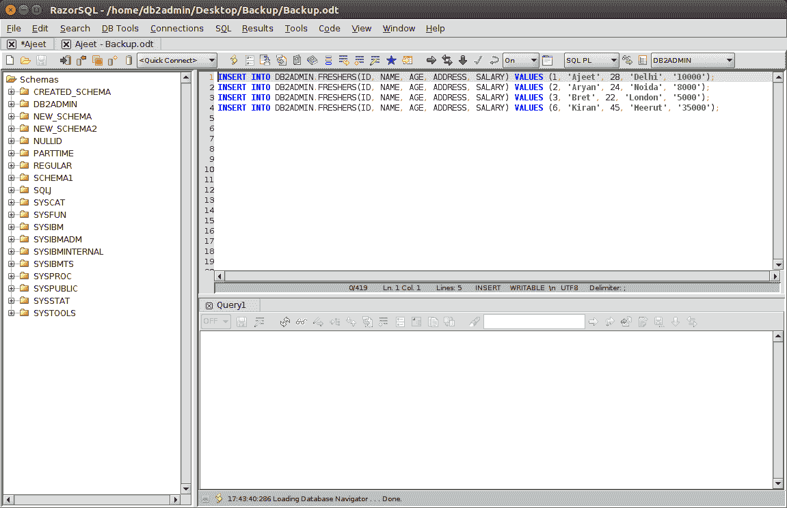

# DB2 剃刀 SQL 导出表

> 原文：<https://www.javatpoint.com/db2-razorsql-export-tables>

DB2 导出实用程序用于以下列不同的文件格式导出表数据。

**DEL :** 分隔的 ASCII 格式

**WSF:** 工作表格式

**IXF:** 集成交换格式，PC 版。

二进制格式等。

让我们看看如何在 RazorSQL 中导出表。

     