# DB2 razzorsql query builder

> 原文：<https://www.javatpoint.com/db2-razorsql-query-builder>

打开 RazorSQL，然后连接到数据库。

现在右键单击选定的表格。您将看到查询生成器。

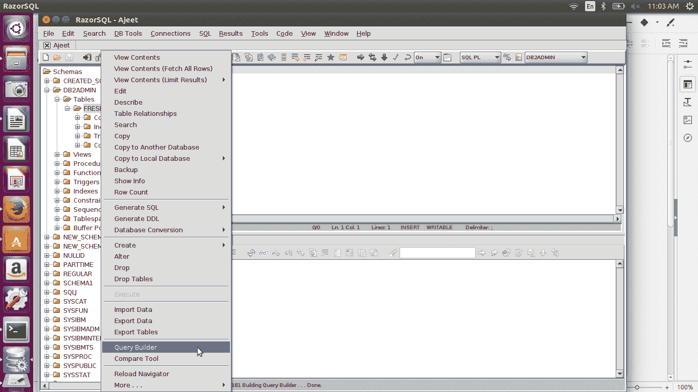

QueryBuilder 可用于选择、搜索、插入、更新和删除目的。您可以将它用于上述所有操作来构建查询并执行它。

## 选择查询

选择选项便于您使用所有选择查询。

**例如:**可以使用 SELECT *从表中检索所有记录，也可以使用 SELECT 个别列检索个别记录。

**示例:**

### 检索所有记录

单击选择*选项从表中检索所有记录。现在点击生成 SQL，您将看到生成的查询。

```

SELECT
	*
FROM
	DB2ADMIN.FRESHERS

```

单击执行 SQL 按钮。

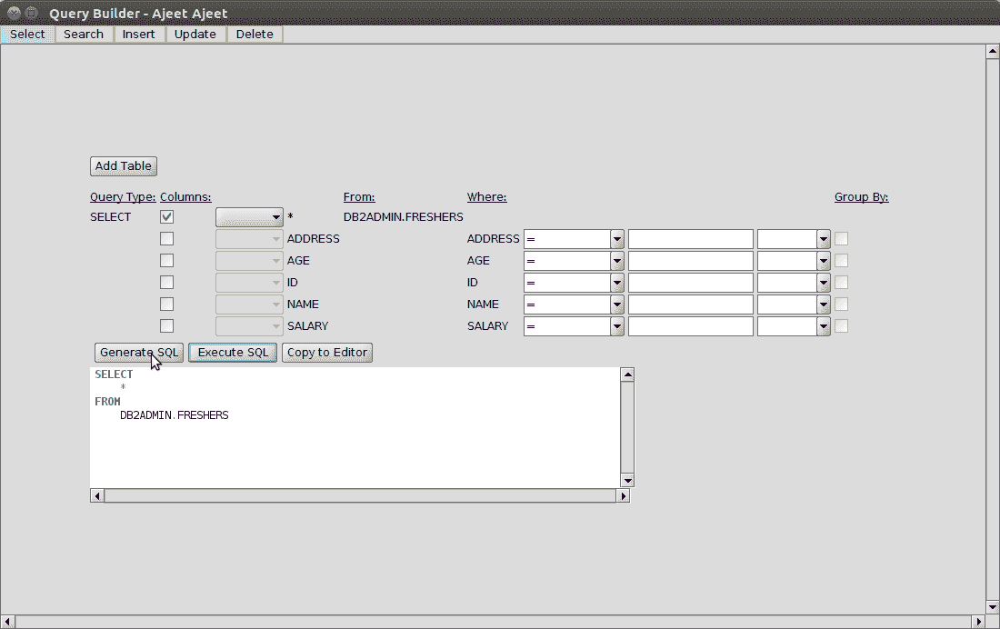

请参见 RazorSQL 主页上的结果。

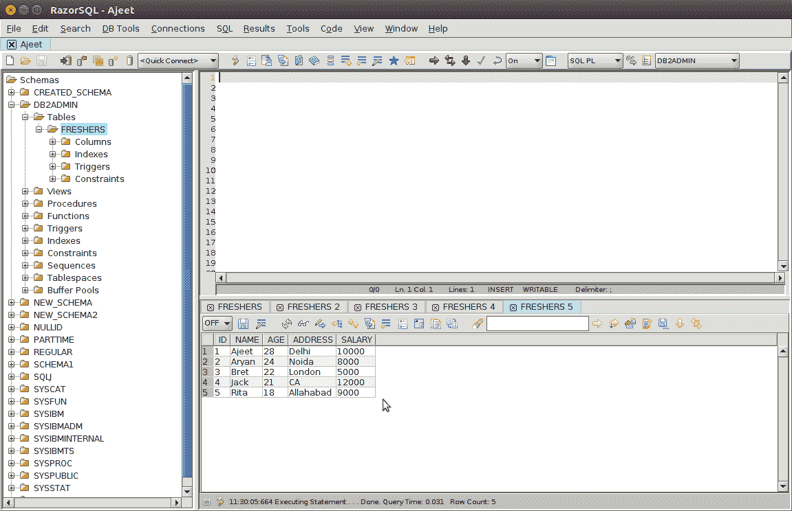

您可以在选择查询中使用 WHERE 和 GROUP BY 子句。也可以使用、<=, > =、=、<>、【喜欢】、【不喜欢】等条件。

**例如:**

让我们从“新生”表中选择地址，其中地址像“阿拉哈巴德”。

```

SELECT
	ADDRESS
FROM
	DB2ADMIN.FRESHERS
WHERE
	ADDRESS LIKE '%Allahabad%'

```

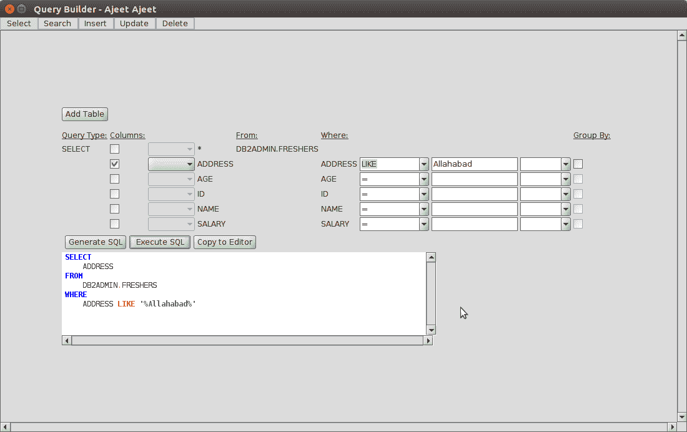 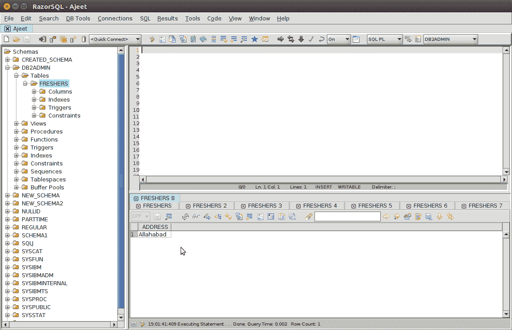

同样，您可以检索单个记录。

* * *

## 搜索查询

查询生成器的下一个选项是搜索查询。您可以使用此查询方法从表“Fresher”中检索记录。

让我们从“新生”表中检索记录，地址！= Allahabad 且 ID 大于 1。

```

SELECT
	*
FROM
	DB2ADMIN.FRESHERS FRESHERS
WHERE
	FRESHERS.ADDRESS != 'Allahabad' AND
	FRESHERS.ID > 1

```

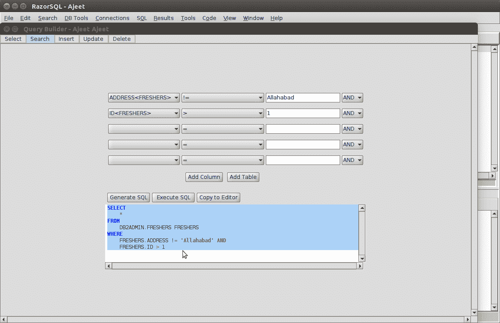

* * *

## 插入查询

您可以使用 insert 块在表中插入一条记录和一整行。

**例如:**

让我们插入以下记录作为新行。

```

INSERT INTO DB2ADMIN.FRESHERS
	(ADDRESS, AGE, ID, NAME, SALARY)
VALUES
	('Meerut', 25, 6, 'Babita', '35000')

```

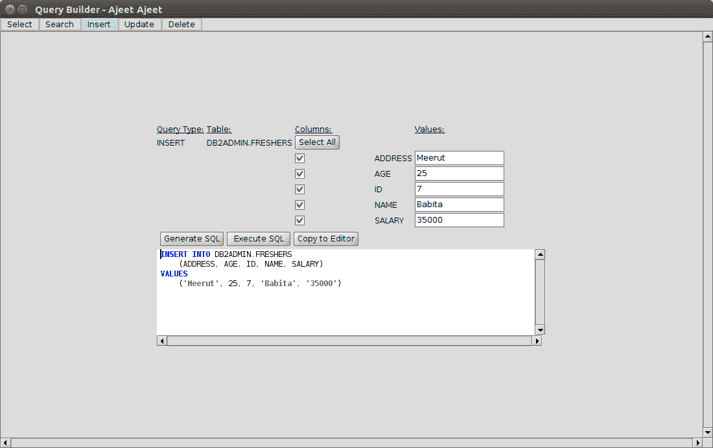 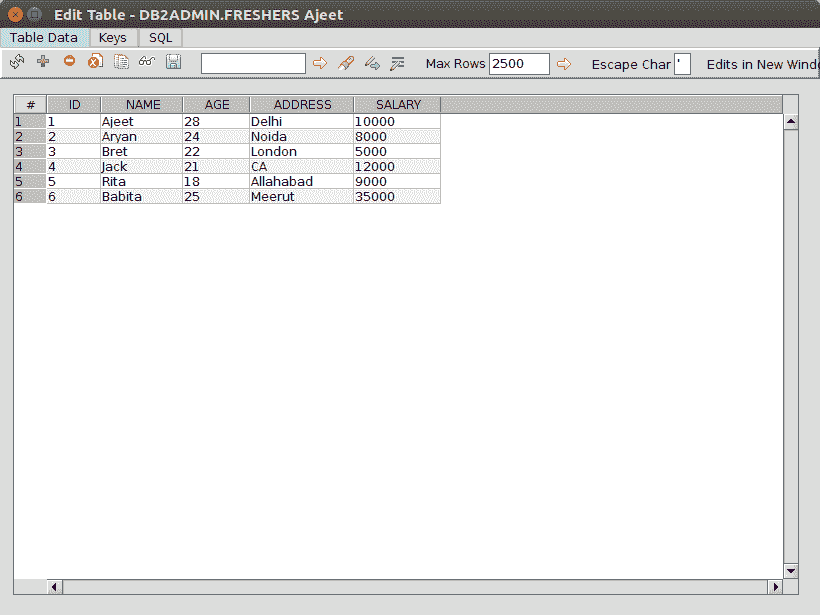

* * *

## 更新查询

更新块用于更新表中已经插入的记录。让我们更新一下表，其中名字是“Babita”，“Age”是 25，以命名“Kiran”和 age 45。

```

UPDATE
	DB2ADMIN.FRESHERS
SET
	NAME = 'Kiran',
	AGE = 45
WHERE
	NAME = 'Babita' AND
	AGE = 25

```

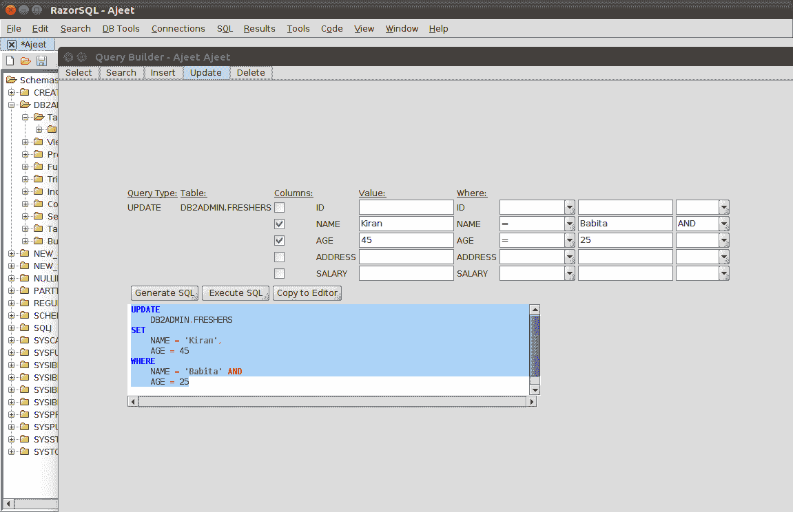

Twelve

* * *

## 删除查询

删除块用于删除指定的记录。

让我们从“新生”表中删除 id >= 4 且年龄< = 30 的记录。

```

DELETE
FROM
	DB2ADMIN.FRESHERS
WHERE
	ID >= 4 AND
	AGE <= 30

```

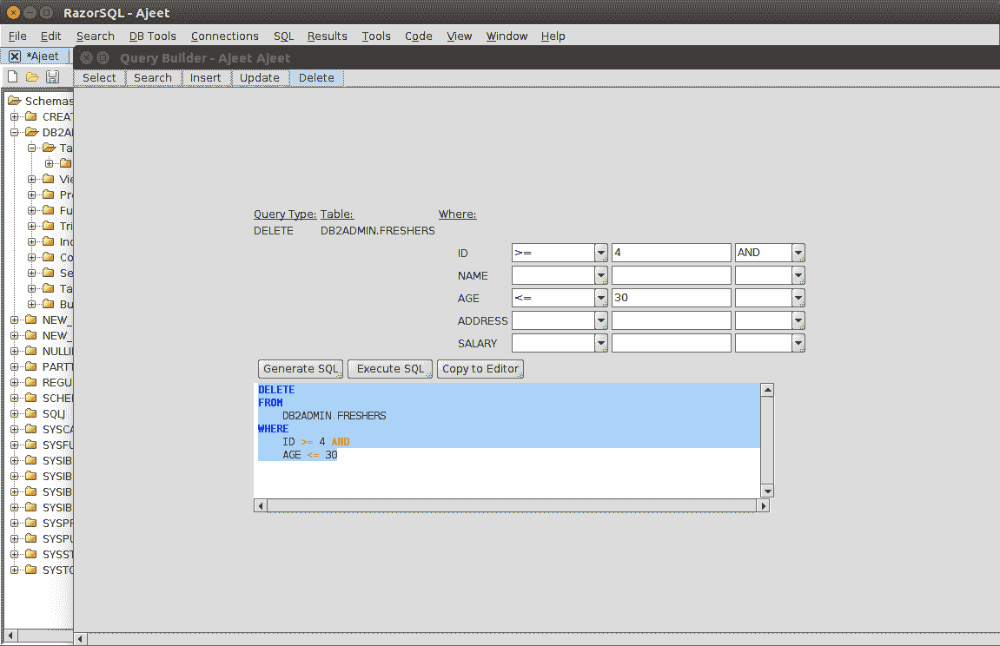 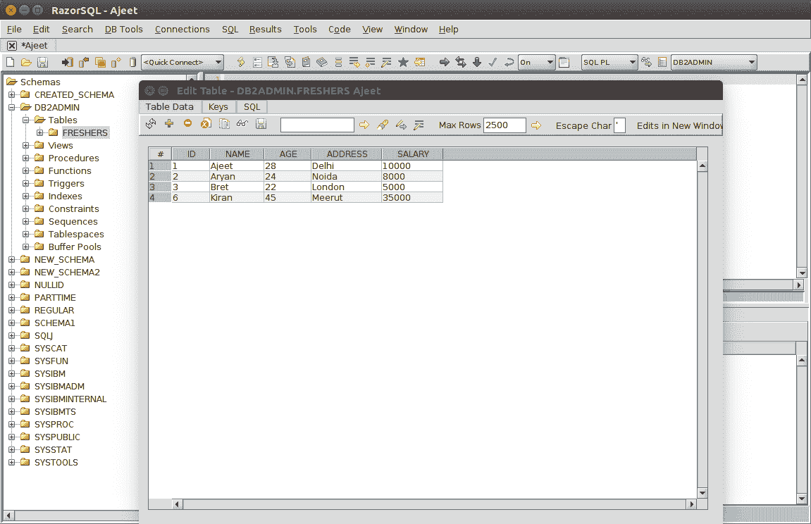

您可以看到现在表中只剩下 id < 4。