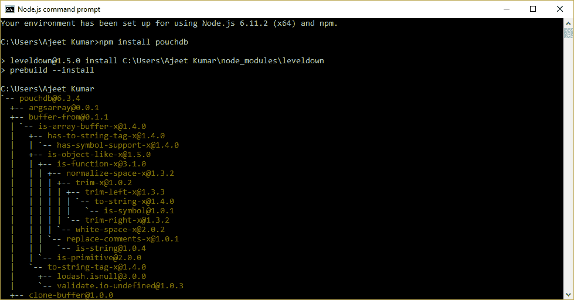
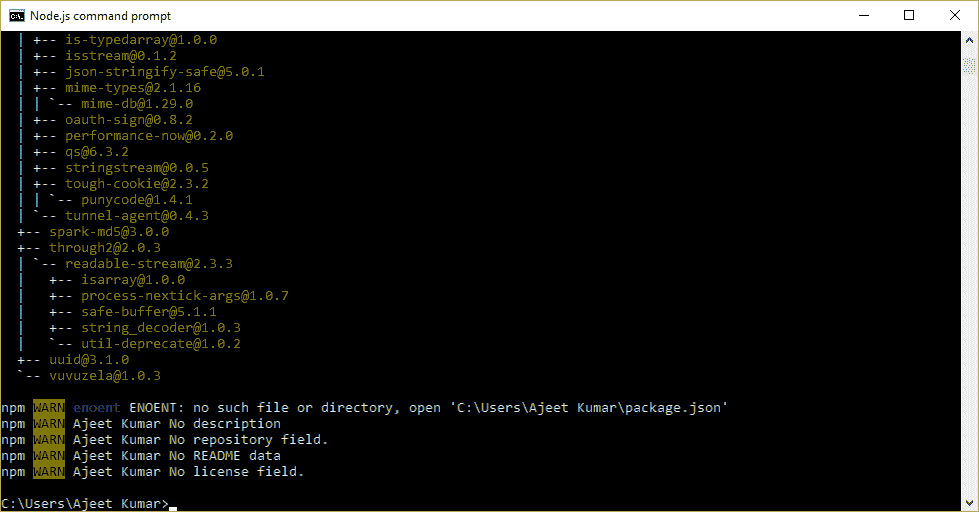
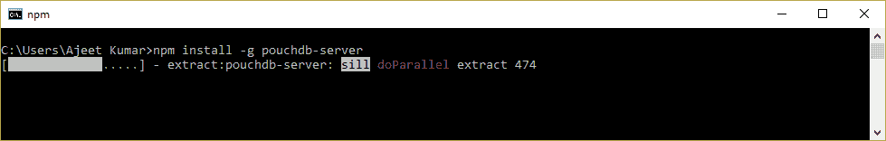
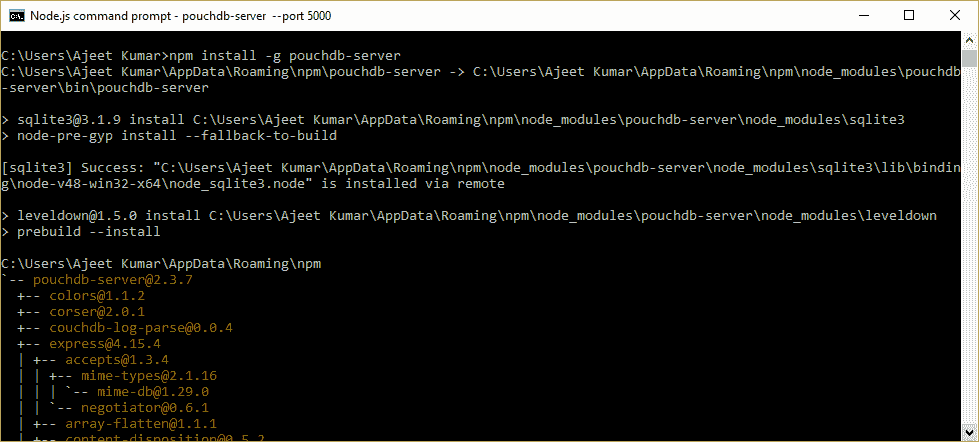
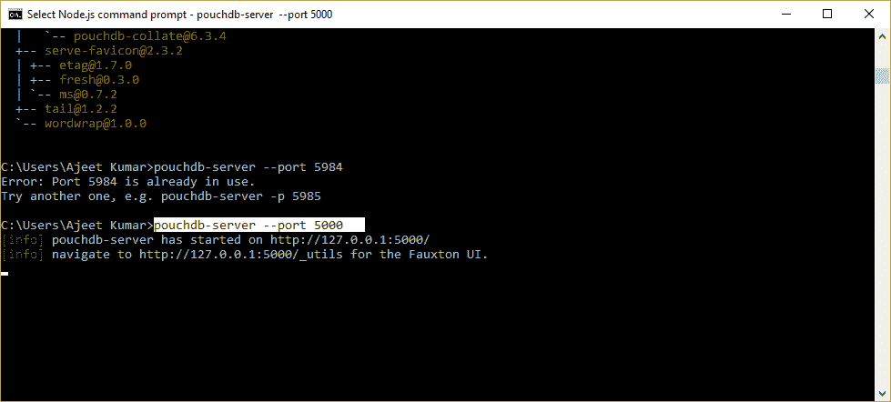
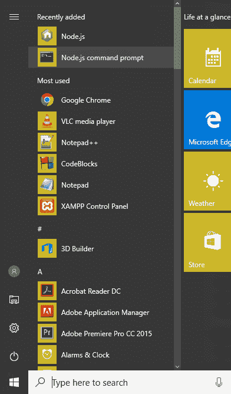
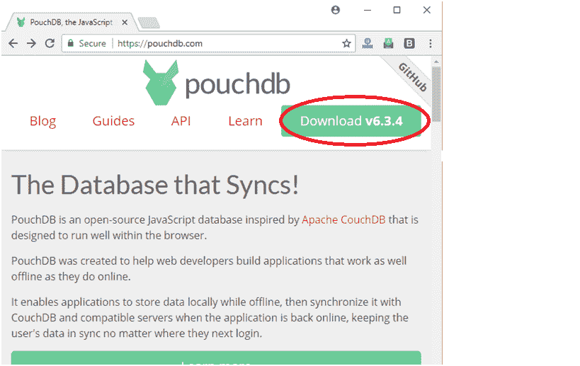
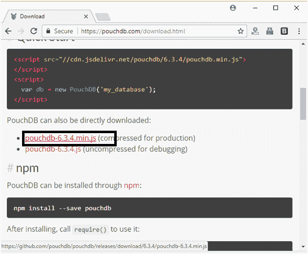
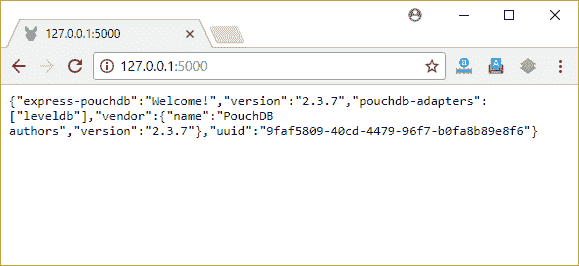
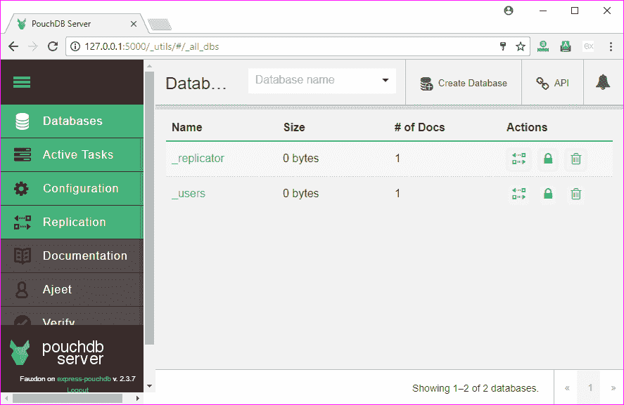

# 安装 PouchDB

> 原文：<https://www.javatpoint.com/pouchdb-installation>

**下载并安装 Node.js**

首先，您必须安装 Node.js，以便在 Node 控制台上使用 PouchDB。参见以下链接了解如何安装 node . js:[https://www.javatpoint.com/install-nodejs](https://www.javatpoint.com/install-nodejs)

**下载 npm**

现在安装 npm。参见以下链接，了解如何安装 NPM:[https://www.javatpoint.com/nodejs-package-manager](https://www.javatpoint.com/nodejs-package-manager)

**安装 PouchDB**

在 Node.js 命令提示符下执行以下代码来安装 PouchDB:

```

npm install pouchdb

```




**安装 PouchDB 服务器**

在 Node.js 命令提示符下执行以下代码来安装 PouchDB:

```

npm install -g pouchdb-server

```




**设置本地端口号**

现在设置一个端口来运行 PouchDB:

```

pouchdb-server --port 5000 

```



您已经准备好在 Node.js 命令提示符下使用 PouchDB 了。打开 Node.js 命令提示符，使用以下命令启动服务器:

```

pouchdb-server --port 5000 

```

并完成 PouchDB 的所有操作。



* * *

## 安装 PouchDB 图形用户界面

去它的官网[https://pouchdb.com/](https://pouchdb.com/)下载 PouchDB。



将 pouchdb-6.3.4.min.js 下载到您的工作目录中，并将其包含在您的 JavaScript 中，如下命令所示。

```

<script src="pouchdb-6.3.4.min.js"></script> 

```



安装 PouchDB 后，打开本地端口 [http://127.0.0.1:5000](http://127.0.0.1:5000) 查看欢迎消息。



可以打开[http://127 . 0 . 0 . 1:5000/_ utils/](http://127.0.0.1:5000/_utils/)查看 PouchDB 的完整 GUI。您可以像在 CouchDB 数据库中一样轻松地完成所有操作。

