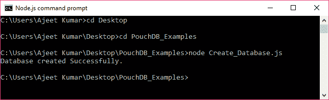
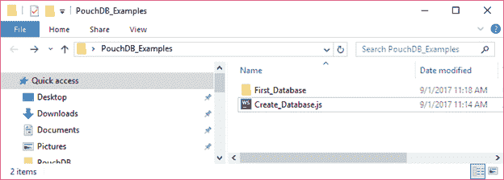

# 创建数据库

> 原文：<https://www.javatpoint.com/pouchdb-create-database>

我们可以通过使用 Node.js 命令提示符中的 PouchDB 构造函数，在 PouchDB 中创建一个数据库。您必须将数据库的名称作为参数传递。

**语法:**

```
new PouchDB(Database_name)

```

* * *

## 创建数据库示例

首先打开 Node.js 命令提示符。现在，您需要使用 require()方法来请求 PouchDB 包，然后您就可以创建一个数据库了。

**见本例:**

```
//Requiring the package
var PouchDB = require('PouchDB');
//Creating the database object
var db = new PouchDB('First_Database');
console.log ("Database created Successfully.");

```

将上述代码保存在名为“创建数据库. js”的文件中，该文件位于名为“PouchDB_Examples”的文件夹中。打开命令提示符，并使用节点执行 JavaScript 文件:

```
node Create_Database.js

```



您可以在控制台上看到“数据库创建成功”消息。您可以在当前目录中看到本地创建的数据库文件夹。

