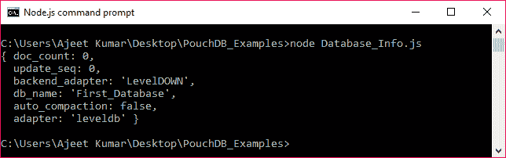
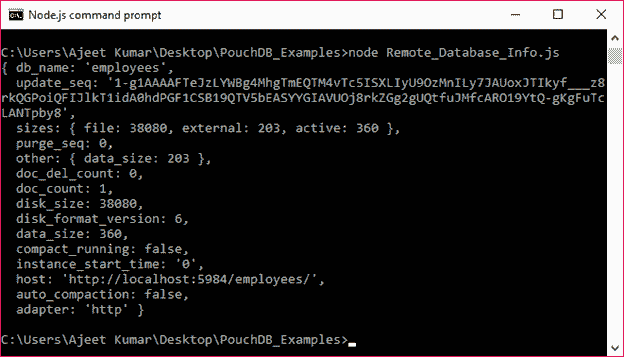

# 数据库信息

> 原文：<https://www.javatpoint.com/pouchdb-database-info>

PouchDB info()方法用于获取数据库的基本信息。

**语法:**

```

db.info([callback]) 

```

* * *

## 数据库信息()示例

下面的示例显示了如何使用 info()方法检索数据库信息。让我们以前面例子中创建的数据库“First_Database”为例。

```

//Requiring the package
var PouchDB = require('PouchDB');
//Creating the database object
var db = new PouchDB('First_Database');
//Database information
db.info(function(err, info) {
   if (err) {
      return console.log(err);
   } else {
      console.log(info);
   }
});

```

将上述代码保存在名为“数据库 _ 信息. js”的文件中，该文件位于名为“PouchDB_Examples”的文件夹中。打开命令提示符，并使用节点执行 JavaScript 文件:

```

node Database_Info.js

```



* * *

## 远程数据库信息

PouchDB 便于您获取位于服务器远程的数据库(即 CouchDB)的信息。您只需要在 CouchDB 中传递所需数据库的路径，而不是数据库名称。

## 远程数据库信息示例

以下示例将检索保存在 CouchDB 服务器中的数据库信息。这段代码提供了一个名为“雇员”的数据库的信息。

```

//Requiring the package
var PouchDB = require('PouchDB');
//Creating the database object
var db = new PouchDB('http://localhost:5984/employees');
//Database information
db.info(function(err, info) {
   if (err) {
      return console.log(err);
   } else {
      console.log(info);
   }
});

```

将上述代码保存在名为“PouchDB_Examples”的文件夹中名为“Remote_Database_Info.js”的文件中。打开命令提示符，并使用节点执行 JavaScript 文件:

```

node Remote_Database_Info.js

```

输出:

```
{ db_name: 'employees',
  update_seq: '1-g1AAAAFTeJzLYWBg4MhgTmEQTM4vTc5ISXLIyU9OzMnILy7JAUoxJTIkyf___z8rkQGPoiQFIJlkT1idA0h
  dPGF1CSB19QTV5bEASYYGIAVUOj8rkZGg2gUQtfuJMfcARO19YtQ-gKgFuTcLANTpby8',
  sizes: { file: 38080, external: 203, active: 360 },
  purge_seq: 0,
  other: { data_size: 203 },
  doc_del_count: 0,
  doc_count: 1,
  disk_size: 38080,
  disk_format_version: 6,
  data_size: 360,
  compact_running: false,
  instance_start_time: '0',
  host: 'http://localhost:5984/employees/',
  auto_compaction: false,
  adapter: 'http' }

```

