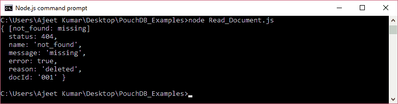
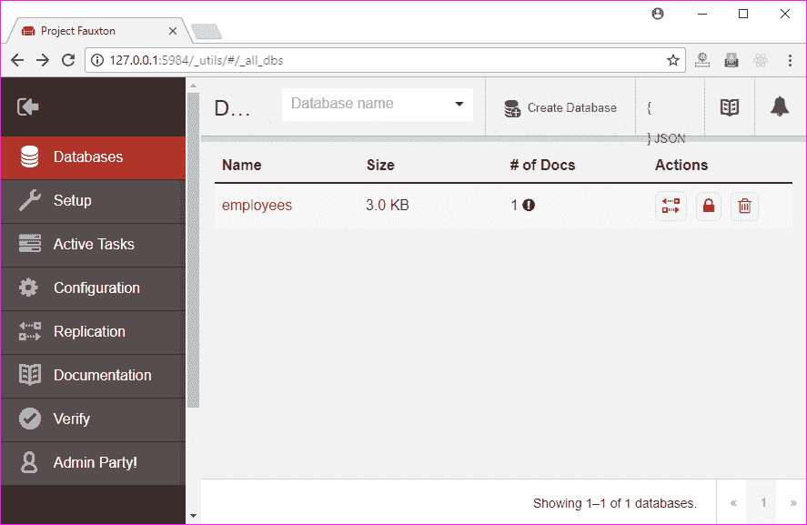
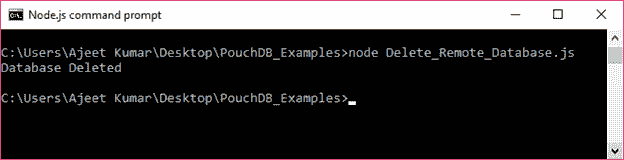
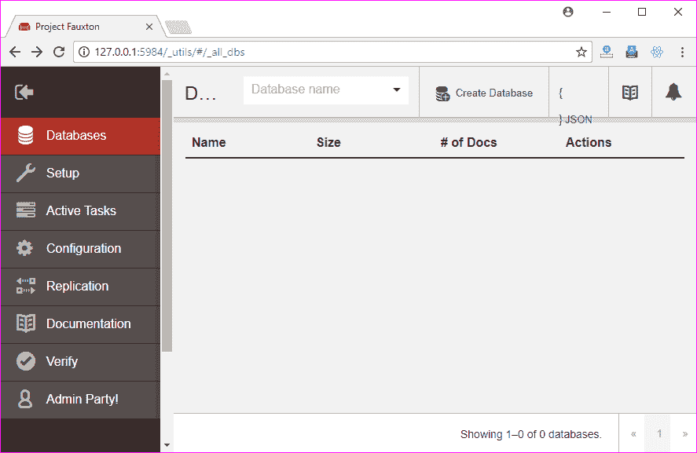

# 删除数据库

> 原文：<https://www.javatpoint.com/pouchdb-delete-database>

db.destroy()方法用于删除 PouchDB 中的数据库。此方法接受回调函数作为参数。

**语法:**

```js

db.destroy()

```

* * *

## 删除数据库示例

让我们使用 destroy()方法删除 PouchDB 中名为“First_Database”的数据库。

```js

//Requiring the package
var PouchDB = require('PouchDB');
//Creating the database object
var db = new PouchDB('First_Database');
//deleting database
db.destroy(function (err, response) {
   if (err) {
      return console.log(err);
   } else {
      console.log ("Database Deleted");
   }
});

```

将上述代码保存在一个名为“删除数据库. js”的文件中，该文件位于一个名为“PouchDB_Examples”的文件夹中。打开命令提示符，并使用节点执行 JavaScript 文件:

```js

node Delete_Database.js

```



* * *

## 删除远程数据库

您可以删除远程存储在服务器(CouchDB)上的数据库。您只需要传递您想要删除的 CouchDB 数据库的路径，而不是数据库名称。

* * *

## 删除远程数据库示例

以下示例将删除保存在 CouchDB 服务器中的数据库。下面的代码将删除名为“employees”的数据库。



```js

//Requiring the package
var PouchDB = require('pouchdb');
//Creating the database object
var db = new PouchDB('http://localhost:5984/employees');
//deleting database
db.destroy(function (err, response) {
   if (err) {
      return console.log(err);
   } else {
      console.log("Database Deleted");
   }
});

```

将上述代码保存在名为“PouchDB_Examples”的文件夹中名为“Delete_Remote_Database.js”的文件中。打开命令提示符，并使用节点执行 JavaScript 文件:

```js

node Delete_Remote_Database.js

```

输出:



* * *

## 确认

数据库“雇员”现在被删除。可以在 CouchDB 服务器上验证。您可以看到“员工”在数据库列表中不可用。

