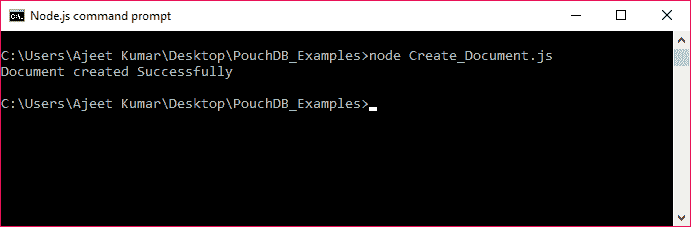
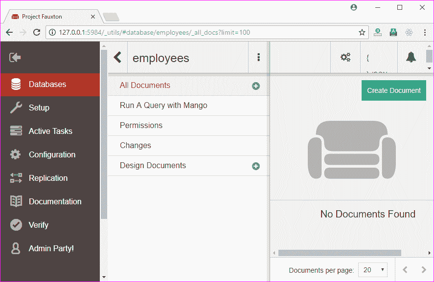
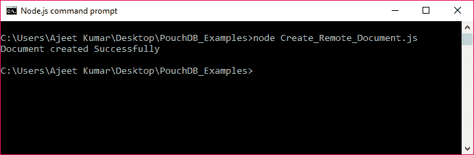
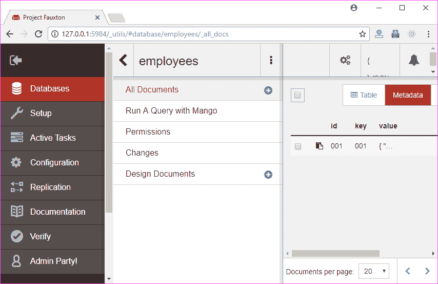
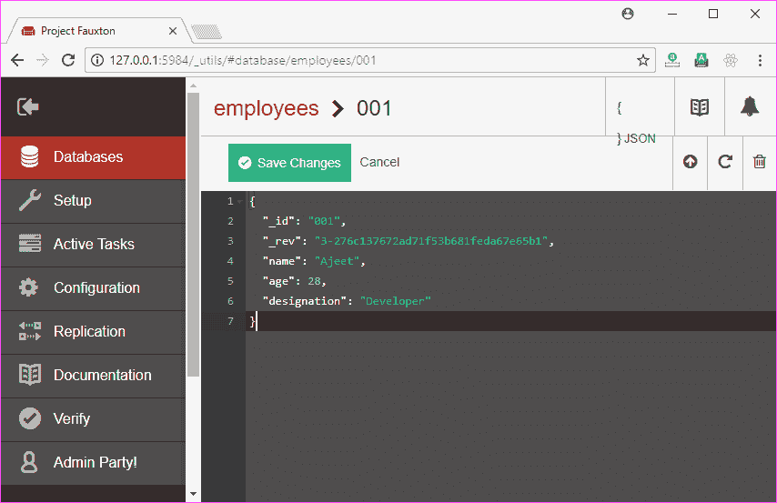

# 创建文档

> 原文：<https://www.javatpoint.com/pouchdb-create-document>

**db.put()方法**用于在 PouchDB 数据库中创建文档。在 PouchDB 数据库中创建的文档存储在变量中，并作为参数传递给此方法。此方法还可以接受回调(可选)函数作为参数。

**语法:**

```js
db.put(document, callback)

```

* * *

## 创建文档示例

让我们首先在 PouchDB 中创建一个名为“Second_Database”的数据库，因为我们已经删除了前一个数据库。

**访问:** [如何在 PouchDB](pouchdb-create-database) 中创建数据库

使用 put()方法创建文档。创建的文档应该是 JSON 格式，一组由逗号(，)分隔的键值对，并包含在大括号({})中。

```js
//Requiring the package
var PouchDB = require('PouchDB');
//Creating the database object
var db = new PouchDB('Second_Database');
//Preparing the document
doc = {
   _id : '001',
   name: 'Ajeet',
   age : 28,
   designation : 'Developer'
   }
//Inserting Document
db.put(doc, function(err, response) {
   if (err) {
      return console.log(err);
   } else {
      console.log("Document created Successfully");
   }
});

```

将上述代码保存在一个名为“创建文档”的文件中，该文件位于一个名为“PouchDB_Examples”的文件夹中。打开命令提示符，并使用节点执行 JavaScript 文件:

```js
node Create_Document.js

```



* * *

## 在远程数据库中插入文档

您也可以在远程存储的数据库(CouchDB)中插入文档。您只需传递要在 CouchDB 中创建文档的数据库路径，而不是数据库名称。

* * *

## 在远程数据库中插入文档示例

我们在 CouchDB 上有一个名为“员工”的数据库。如下图所示，该数据库中没有文档:



让我们看看如何在名为“employees”的数据库中插入一个保存在 CouchDB 服务器上的文档。

```js
//Requiring the package
var PouchDB = require('PouchDB');
//Creating the database object
var db = new PouchDB('http://localhost:5984/employees');
//Preparing the document
doc = {
   _id : '001',
   name: 'Ajeet',
   age : 28,
   designation : 'Developer'
   }
//Inserting Document
db.put(doc, function(err, response) {
   if (err) {
      return console.log(err);
   } else {
      console.log("Document created Successfully");
   }
});

```

将上述代码保存在名为“PouchDB_Examples”的文件夹中名为“Create_Remote_Document.js”的文件中。打开命令提示符，并使用节点执行 JavaScript 文件:

```js
node Create_Remote_Document.js

```



* * *

## 确认

您可以通过访问 CouchDB 服务器上的“员工”数据库来验证该文档是否已创建。


