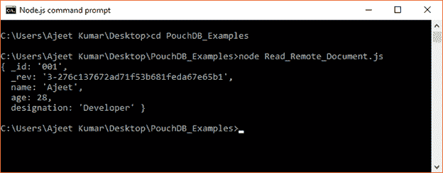

# 读取/检索文档

> 原文：<https://www.javatpoint.com/pouchdb-read-document>

db.get()方法用于读取或检索在数据库中创建的文档。这个方法也接受文档 id 和可选的回调函数。

**语法:**

```

db.get(document, callback)

```

* * *

## PouchDB 读取文档示例

```

//Requiring the package
var PouchDB = require('PouchDB');
//Creating the database object
var db = new PouchDB('Second_Database');
//Reading the contents of a Document
db.get('001', function(err, doc) {
   if (err) {
      return console.log(err);
   } else {
      console.log(doc);
   }
});

```

将上述代码保存在一个名为“PouchDB_Examples”的文件夹中的一个名为“Read_Document.js”的文件中。打开命令提示符，并使用节点执行 JavaScript 文件:

```

node Read_Document.js

```

它将读取存储在 PouchDB 服务器上的“第二数据库”中的文档。

```

{ name: 'Ajeet',
  age: 28,
  designation: 'Developer',
  _id: '001',
  _rev: '1-99a7a80ec2a74959885037a16d57924f' }

```


* * *

## 从远程数据库读取文档

您可以从远程数据库中读取或检索文档。为此，您必须在 CouchDB 中传递数据库的路径，该路径包含您想要读取的文档，而不是数据库名称。

### 例子

在 CouchDB 服务器中有一个名为“雇员”的数据库。


通过点击“员工”，您可以看到一个文档:


让我们获取该文档的数据:

```

//Requiring the package
var PouchDB = require('PouchDB');
//Creating the database object
var db = new PouchDB('http://localhost:5984/employees');
//Reading the contents of a document
db.get('001', function(err, doc) {
   if (err) {
      return console.log(err);
   } else {
      console.log(doc);
   }
});

```

将上述代码保存在一个名为“PouchDB_Examples”的文件夹中，该文件名为“Read_Remote_Document.js”。打开命令提示符，并使用节点执行 JavaScript 文件:

```

node Read_Remote_Document.js

```

它将读取存储在 CouchDB 服务器上“员工”数据库中的文档。

输出:

```
{ _id: '001',
  _rev: '3-276c137672ad71f53b681feda67e65b1',
  name: 'Ajeet',
  age: 28,
  designation: 'Developer' }

```

